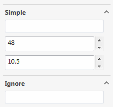

 SwEx.PMPage框架用于在SOLIDWORKS API中构建属性管理器页面的一般方法概述
image: data-model-pmpage.png
toc-group-name: labs-solidworks-swex
sidebar_position: 0
---
{ width=250 }

## 数据模型

首先定义属性管理器页面需要填充的数据模型。

~~~vb
Public Class DataModelSimple
	Public Property Text As String
	Public Property Size As Integer = 48
	Public Property Number As Double = 10.5
End Class
~~~

~~~cs
public class DataModelSimple
{
    public string Text { get; set; }
    public int Size { get; set; } = 48;
    public double Number { get; set; } = 10.5;
}
~~~

使用具有公共的getter和setter的属性。

## 事件处理程序

通过从[PropertyManagerPageHandlerEx](https://docs.codestack.net/swex/pmpage/html/T_CodeStack_SwEx_PMPage_PropertyManagerPageHandlerEx.htm)类继承，创建属性管理器页面的处理程序。

该类将由框架实例化，并允许处理插件中的属性管理器特定事件。

~~~vb
<ComVisible(True)>
Public Class MyPMPageHandler
    Inherits PropertyManagerPageHandlerEx
End Class
~~~

~~~cs
[ComVisible(true)]
public class MyPMPageHandler : PropertyManagerPageHandlerEx
{
}
~~~

> 类必须是com可见的，并且必须具有公共的无参数构造函数。

## 忽略成员

如果需要从控件生成中排除数据模型中的成员，则应该使用[IgnoreBindingAttribute](https://docs.codestack.net/swex/pmpage/html/T_CodeStack_SwEx_PMPage_Attributes_IgnoreBindingAttribute.htm)对这些成员进行修饰。

~~~vb
Public Class DataModelIgnore
	Public Property Text As String

	<IgnoreBinding>
	Public Property CalculatedField As Integer '不会为此字段生成控件
End Class
~~~

~~~cs
public class DataModelIgnore
{
    public string Text { get; set; }

    [IgnoreBinding]
    public int CalculatedField { get; set; } //不会为此字段生成控件
}
~~~

## 创建实例

通过将处理程序的类型和数据模型实例传递给泛型参数来创建属性管理器页面的实例。

> 数据模型可以包含预定义（默认）值。框架将自动在相应的控件中使用这些值。

~~~vb
Private m_Page As PropertyManagerPageEx(Of MyPMPageHandler, DataModel)
Private m_Data As DataModel = New DataModel()

Private Enum Commands_e
	ShowPmpPage
End Enum

Public Overrides Function OnConnect() As Boolean
	m_Page = New PropertyManagerPageEx(Of MyPMPageHandler, DataModel)(App)
	AddCommandGroup(Of Commands_e)(AddressOf ShowPmpPage)
	Return True
End Function

Private Sub ShowPmpPage(cmd As Commands_e)
	AddHandler m_Page.Handler.Closed, AddressOf OnPageClosed
	m_Page.Show(m_Data)
End Sub

Private Sub OnPageClosed(ByVal reason As swPropertyManagerPageCloseReasons_e)
	Debug.Print($"Text: {m_Data.Simple.Text}")
	Debug.Print($"Size: {m_Data.Simple.Size}")
	Debug.Print($"Number: {m_Data.Simple.Number}")
End Sub
~~~

~~~cs
private PropertyManagerPageEx<MyPMPageHandler, DataModel> m_Page;
private DataModel m_Data = new DataModel();

private enum Commands_e
{
    ShowPmpPage
}

public override bool OnConnect()
{
    m_Page = new PropertyManagerPageEx<MyPMPageHandler, DataModel>(App);
    AddCommandGroup<Commands_e>(ShowPmpPage);
    return true;
}

private void ShowPmpPage(Commands_e cmd)
{
    m_Page.Handler.Closed += OnPageClosed;
    m_Page.Show(m_Data);
}

private void OnPageClosed(swPropertyManagerPageCloseReasons_e reason)
{
    Debug.Print($"Text: {m_Data.Simple.Text}");
    Debug.Print($"Size: {m_Data.Simple.Size}");
    Debug.Print($"Number: {m_Data.Simple.Number}");
}
~~~

> 将数据模型和属性页面的实例存储在类变量中。这将允许在不同的页面实例中重用数据模型。