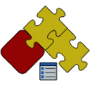

 用于高级开发SOLIDWORKS属性管理器页面的实用工具，实现了数据驱动开发和数据绑定
toc-group-name: labs-solidworks-swex
sidebar_position: 0
redirect-from:
  - /labs/solidworks/vpages/
  - /labs/solidworks/swex/pmp/
---

受.NET Framework中的[PropertyGrid Control](https://msdn.microsoft.com/en-us/library/aa302326.aspx)启发，SwEx.PMPage将数据模型驱动的用户界面的灵活性引入到SOLIDWORKS API中。

该框架允许使用数据模型结构作为用户界面的驱动程序。框架将自动生成所需的界面并实现模型的绑定。

这将大大减少实现时间，并使属性页面具有可扩展性、易于维护和扩展。

## 视频教程

### 介绍



### 详细指南

