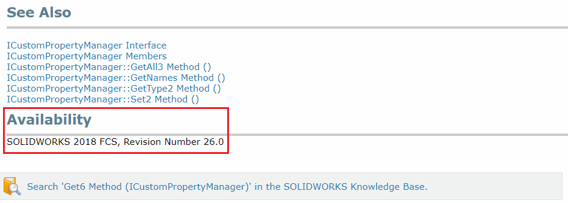

 如何使用SwEx框架在同一代码库中针对多个SOLIDWORKS版本
image: get6-api-availability.png
toc-group-name: labs-solidworks-swex
sidebar_position: 0
---
当通过nuget包安装SwEx.Framework库时，SOLIDWORKS互操作库也会被安装。框架在其项目中引用最新的互操作库，允许用户在较新的SOLIDWORKS版本中使用最新的API。

尽管引用了最新的互操作库，但框架与旧版本的SOLIDWORKS兼容。**最低支持版本为SOLIDWORKS 2012**。为了实现向前兼容性，同时又能够利用较新版本SOLIDWORKS中的新API，框架在其内部实现了回退机制。这意味着，如果框架使用的某个API在目标版本的SOLIDWORKS中不可用，将使用旧版本的API。

如果您的插件需要针对多个SOLIDWORKS版本进行定位，建议使用类似的技术并实现回退API。

可以通过在SOLIDWORKS API帮助文档（Web版和本地版）中探索相应部分来查找特定方法的可用性。



使用框架提供的[ISldWorks::IsVersionNewerOrEqual](https://docs.codestack.net/swex/common/html/M_SolidWorks_Interop_sldworks_SldWorksCommonEx_IsVersionNewerOrEqual.htm)扩展方法来决定使用哪个API。例如，[ICustomPropertyManager::Get6](https://help.solidworks.com/2019/english/api/sldworksapi/SolidWorks.Interop.sldworks~SolidWorks.Interop.sldworks.ICustomPropertyManager~Get6.html)方法仅在SOLIDWORKS 2018 SP0中可用，而[SOLIDWORKS.Interop.sldworks.ICustomPropertyManager~Get5](https://help.solidworks.com/2019/english/api/sldworksapi/SolidWorks.Interop.sldworks~SolidWorks.Interop.sldworks.ICustomPropertyManager~Get5.html)方法在SOLIDWORKS 2014 SP0中可用，而旧版本的[SOLIDWORKS.Interop.sldworks.ICustomPropertyManager~Get4](https://help.solidworks.com/2019/english/api/sldworksapi/SolidWorks.Interop.sldworks~SolidWorks.Interop.sldworks.ICustomPropertyManager~Get4.html)方法从SOLIDWORKS 2011 SP4开始可用。

这意味着，如果我们想在插件中提取自定义属性并针对从SOLIDWORKS 2012开始的所有SOLIDWORKS版本进行定位，我们需要编写以下代码：

```vb
Public Sub ReadDescriptionProperty()

    Dim prpMgr = App.IActiveDoc2.Extension.CustomPropertyManager("")
    Dim prpName = "Description"
    Dim val As String = ""
    Dim resVal As String = ""

    If App.IsVersionNewerOrEqual(SwVersion_e.Sw2018) Then

        Dim wasRes As Boolean
        Dim linkToPrp As Boolean
        prpMgr.Get6(prpName, False, val, resVal, wasRes, linkToPrp)

    ElseIf App.IsVersionNewerOrEqual(SwVersion_e.Sw2014) Then

        Dim wasRes As Boolean
        prpMgr.Get5(prpName, False, val, resVal, wasRes)

    Else
        prpMgr.Get4(prpName, False, val, resVal)
    End If

    Logger.Log($"{prpName} = {resVal} [{val}]")
End Sub
```

```cs
public void GetTolerance(IDimension dim)
{
    var dimTol = dim.Tolerance;

    double maxTol;
    double minTol;

    if (App.IsVersionNewerOrEqual(SwVersion_e.Sw2015, 3))
    {
        dimTol.GetMinValue2(out minTol);
        dimTol.GetMaxValue2(out maxTol);
    }
    else
    {
        minTol = dimTol.GetMinValue();
        maxTol = dimTol.GetMaxValue();
    }
}
```

> 注意。虽然可以简单地使用与所需的最低SOLIDWORKS版本相对应的最旧版本的方法，因为SOLIDWORKS支持向后兼容，但不推荐这种做法，因为更新版本的方法可能包含关键的错误修复。

[ISldWorks::IsVersionNewerOrEqual](https://docs.codestack.net/swex/common/html/M_SolidWorks_Interop_sldworks_SldWorksCommonEx_IsVersionNewerOrEqual.htm)方法还允许检查次要版本（例如，Service Pack）。

例如，[IDimensionTolerance::GetMinValue2](https://help.solidworks.com/2019/english/api/sldworksapi/solidworks.interop.sldworks~solidworks.interop.sldworks.idimensiontolerance~getminvalue2.html)和[IDimensionTolerance::GetMaxValue2](https://help.solidworks.com/2019/english/api/sldworksapi/solidworks.interop.sldworks~solidworks.interop.sldworks.idimensiontolerance~getmaxvalue2.html)方法是在SOLIDWORKS 2015 SP3中添加的，而此方法的先前实现自SOLIDWORKS 2006起可用。

> 注意，我们不能简单地检查当前的SOLIDWORKS版本是否为2015，因为该方法仅适用于SP3，我们需要明确指定服务包。

```vb
Public Sub GetTolerance(ByVal [dim] As IDimension)
    Dim dimTol = [dim].Tolerance
    Dim maxTol As Double
    Dim minTol As Double

    If App.IsVersionNewerOrEqual(SwVersion_e.Sw2015, 3) Then
        dimTol.GetMinValue2(minTol)
        dimTol.GetMaxValue2(maxTol)
    Else
        minTol = dimTol.GetMinValue
        maxTol = dimTol.GetMaxValue
    End If
End Sub
```

```cs
public void GetTolerance(IDimension dim)
{
    var dimTol = dim.Tolerance;

    double maxTol;
    double minTol;

    if (App.IsVersionNewerOrEqual(SwVersion_e.Sw2015, 3))
    {
        dimTol.GetMinValue2(out minTol);
        dimTol.GetMaxValue2(out maxTol);
    }
    else
    {
        minTol = dimTol.GetMinValue();
        maxTol = dimTol.GetMaxValue();
    }
}
```