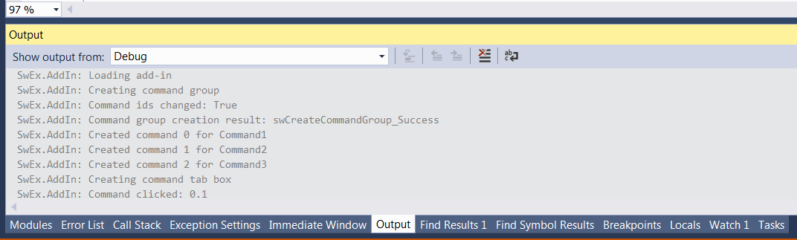
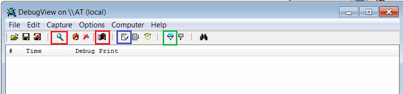
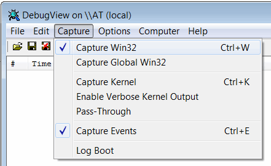
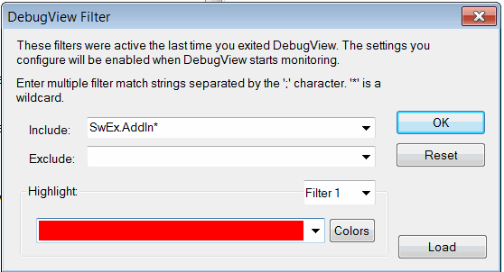
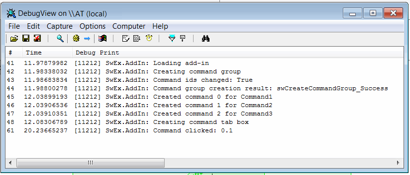

SwEx 框架会输出跟踪消息，简化故障排除过程。这些消息会输出到默认的跟踪侦听器。

如果在 Visual Studio 中调试插件，则消息会输出到 Visual Studio 的输出选项卡中，如下所示：

{ width=450 }

否则，可以通过 Microsoft 的 [DebugView](https://docs.microsoft.com/en-us/sysinternals/downloads/debugview) 实用程序跟踪消息。

* 从上面的链接下载该实用程序
* 解压缩包并运行 *Dbgview.exe*
* 根据下面的标记设置选项：

从工具栏启用 *Capture Win32* 和 *Capture Events* 选项（标记为红色）

{ width=450 }

或者通过菜单设置捕获选项，如下所示：

{ width=350 }

通过单击过滤器按钮（标记为绿色）设置过滤器以过滤 SwEx 消息

{ width=350 }

消息将输出到跟踪窗口

{ width=450 }

使用 *eraser* 按钮清除消息（标记为蓝色）

## 注意事项
* 跟踪输出是在客户计算机上排除插件故障的强大工具
* DebugView 工具是轻量级的，无需安装，由 Microsoft 提供
* 在发布模式下，跟踪消息也会输出
* 如果加载插件时发生异常，SwEx 框架将输出异常详细信息，这有助于解决无法加载插件的问题

可以从 SwEx 模块记录自定义消息和异常。请参阅[此链接](logging)获取更多信息。