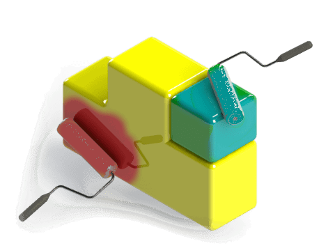

本节包含了一系列文章和代码示例，解释了使用API自定义SOLIDWORKS模型和应用程序框架视图的不同方法。

这包括但不限于以下内容：

* 添加[标注](/docs/codestack/solidworks-api/adornment/callouts/)对象。这些对象可以用于显示附加信息，如特定实体的标签或属性。标注还支持数据值输入。
* 通过OpenGL向模型视图注入自定义3D图形。当需要在SOLIDWORKS模型中直接渲染复杂图形而不修改其几何形状时，这非常有用。最常见的用途场景是预览或有限元分析（FEA）渲染。
* 在图形视图上添加2D图像
* 将[OLE对象](/docs/codestack/solidworks-api/adornment/ole-objects/)嵌入到模型中