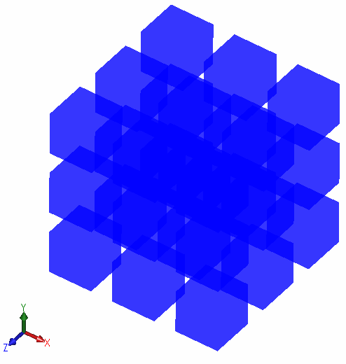

{ width=250 }

此示例演示了如何使用OpenGL和SOLIDWORKS API在预定义网格中渲染具有透明度的盒子。

盒子会自动渲染在所有打开的3D模型（零件或装配）上。

可以通过更改插件中声明的常量来配置参数：

~~~ cs
private const int INST_COUNT = 27;
private const int ROWS_COUNT = 3;
private const int COLUMNS_COUNT = 3;
private const double DIST = 0.05;
private const double WIDTH = 0.1;
private const double HEIGHT = 0.1;
private const double LENGTH = 0.1;
private readonly Color COLOR = Color.FromArgb(200, Color.Blue);
~~~

注意，这种方法是渲染OpenGL对象的简单方法，但它不能提供最佳性能优势。请参考[导入XAML文件并使用VBO进行渲染](/docs/codestack/solidworks-api/adornment/opengl/vbo-xaml-importer/)，了解使用OpenGL顶点缓冲对象（VBO）进行高性能图形渲染的代码示例。

源代码可以从[GitHub](https://github.com/codestackdev/solidworks-api-examples/tree/master/swex/add-in/opengl/OpenGlBoxGrid)下载。

## AddIn.cs

这是插件的入口点。使用[SwEx.AddIn](/docs/codestack/labs/solidworks/swex/add-in/)框架通过提供包装类来管理文档的生命周期。

~~~ cs
using CodeStack.SwEx.AddIn;
using CodeStack.SwEx.AddIn.Attributes;
using System;
using System.Runtime.InteropServices;

namespace CodeStack.OpenGlBoxGrid
{
    [ComVisible(true), Guid("FAB0F03B-785E-4113-B120-E18E7C73B9EB")]
    [AutoRegister("OpenGL Box Grid")]
    public class AddIn : SwAddInEx
    {
        public override bool OnConnect()
        {
            CreateDocumentsHandler<OpenGlDocumentHandler>();
            return true;
        }
    }
}

~~~

## OpenGlDocumentHandler.cs

这是每个模型文档的处理程序类，它订阅SOLIDWORKS提供的OpenGL缓冲区交换通知，并根据输入参数计算盒子的坐标并在模型的图形视图中进行渲染。

~~~ cs
using CodeStack.SwEx.AddIn.Base;
using SolidWorks.Interop.sldworks;
using System.Drawing;
using static CodeStack.OpenGlBoxGrid.OpenGL;

namespace CodeStack.OpenGlBoxGrid
{
    public class OpenGlDocumentHandler : IDocumentHandler
    {
        private const int INST_COUNT = 27;
        private const int ROWS_COUNT = 3;
        private const int COLUMNS_COUNT = 3;
        private const double DIST = 0.05;
        private const double WIDTH = 0.1;
        private const double HEIGHT = 0.1;
        private const double LENGTH = 0.1;
        private readonly Color COLOR = Color.FromArgb(200, Color.Blue);

        private ModelView m_View;

        public void Init(ISldWorks app, IModelDoc2 model)
        {
            m_View = model.IActiveView;

            if (m_View != null)
            {
                m_View.BufferSwapNotify += OnBufferSwapNotify;
            }
        }

        private int OnBufferSwapNotify()
        {
            int level = 0;
            int row = 0;
            int column = 0;

            for (int i = 0; i < INST_COUNT; i++)
            {
                if (row == ROWS_COUNT)
                {
                    row = 0;
                    column++;

                    if (column == COLUMNS_COUNT)
                    {
                        column = 0;
                        level++;
                    }
                }

                RenderBox(new double[] 
                {
                    row * (WIDTH + DIST),
                    column * (LENGTH + DIST),
                    level * (HEIGHT + DIST)
                },
                WIDTH, LENGTH, HEIGHT,
                COLOR);

                row++;
            }
            
            return 0;
        }

        private void RenderBox(double[] pt, double width, double length, double height, Color color)
        {
            var vertices = new double[][]
            {
                new double[] { pt[0] - width / 2, pt[1] + length / 2, pt[2] + height / 2 },
                new double[] { pt[0] - width / 2, pt[1] - length / 2, pt[2] + height / 2 },
                new double[] { pt[0] + width / 2, pt[1] + length / 2, pt[2] + height / 2 },
                new double[] { pt[0] + width / 2, pt[1] - length / 2, pt[2] + height / 2 },
                new double[] { pt[0] + width / 2, pt[1] + length / 2, pt[2] - height / 2 },
                new double[] { pt[0] + width / 2, pt[1] - length / 2, pt[2] - height / 2 },
                new double[] { pt[0] - width / 2, pt[1] + length / 2, pt[2] - height / 2 },
                new double[] { pt[0] - width / 2, pt[1] - length / 2, pt[2] - height / 2 },
                new double[] { pt[0] - width / 2, pt[1] + length / 2, pt[2] + height / 2 },
                new double[] { pt[0] - width / 2, pt[1] - length / 2, pt[2] + height / 2 }
            };
            
            RenderTriangleStrip(vertices, color);

            RenderTriangleStrip(new double[][]
            {
                vertices[1], vertices[7], vertices[3], vertices[5]
            }, color);

            RenderTriangleStrip(new double[][]
            {
                vertices[0], vertices[2], vertices[6], vertices[4]
            }, color);
        }
        
        private void RenderTriangleStrip(double[][] vertices, Color color)
        {
            glDisable(GL_LIGHTING);
            glEnable(GL_BLEND);

            glBlendFunc(GL_SRC_ALPHA, GL_ONE_MINUS_SRC_ALPHA);

            glBegin(GL_TRIANGLE_STRIP);

            glColor4f(color.R / 255f, color.G / 255f, color.B / 255f, color.A / 255f);

            foreach (var vertex in vertices)
            {
                glVertex3d(vertex[0], vertex[1], vertex[2]);
            }

            glEnd();
        }

        public void Dispose()
        {
            if (m_View != null)
            {
                m_View.BufferSwapNotify -= OnBufferSwapNotify;
            }
        }
    }
}

~~~

## OpenGL.cs

OpenGL函数的导入列表。

~~~ cs
using System.Runtime.InteropServices;

namespace CodeStack.OpenGlBoxGrid
{
    public static class OpenGL
    {
        [DllImport("opengl32")]
        public static extern void glBegin(uint mode);

        [DllImport("opengl32")]
        public static extern void glEnd();

        [DllImport("opengl32")]
        public static extern void glVertex3d(double x, double y, double z);

        [DllImport("opengl32.dll")]
        public static extern void glDisable(uint cap);

        [DllImport("opengl32.dll")]
        public static extern void glColor4f(float R, float G, float B, float A);

        [DllImport("opengl32.dll")]
        public static extern void glEnable(uint cap);

        [DllImport("opengl32.dll")]
        public static extern void glBlendFunc(uint sfactor, uint dfactor);

        public const int GL_TRIANGLE_STRIP = 0x0005;
        public const uint GL_LIGHTING = 0x0B50;
        public const int GL_BLEND = 0x0BE2;
        public const int GL_SRC_ALPHA = 0x0302;
        public const int GL_ONE_MINUS_SRC_ALPHA = 0x0303;
    }
}

~~~