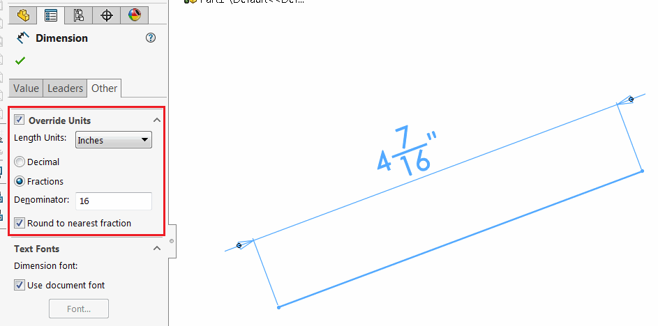

这个VBA宏将在系统单位（米）中指定的值转换为指定分母的分数英寸。

例如，带有分母16的值0.112713将被转换为4 7/16英寸。

根据以下设置配置参数：

~~~ vb
Const DENOMINATOR As Integer = 16 '分母值
Const ROUND_TO_NEAREST_FRACTION As Boolean = True 'True表示四舍五入到最近的分数，False表示不进行四舍五入
~~~

结果和SOLIDWORKS中的尺寸属性管理器页面的可用选项相同。

~~~ vb
Const DENOMINATOR As Integer = 16
Const ROUND_TO_NEAREST_FRACTION As Boolean = True

Dim swApp As SldWorks.SldWorks

Sub main()

    Set swApp = Application.SldWorks
    
    Debug.Print ConvertMetersToFractionInches(0.112713, DENOMINATOR, ROUND_TO_NEAREST_FRACTION)
    
End Sub

Function ConvertMetersToFractionInches(value As Double, denom As Integer, round As Boolean) As String
    
    Dim swUserUnits As SldWorks.UserUnit
    Set swUserUnits = swApp.GetUserUnit(swUserUnitsType_e.swLengthUnit)
    
    swUserUnits.FractionBase = swFractionDisplay_e.swFRACTION
    swUserUnits.SpecificUnitType = swLengthUnit_e.swINCHES
    
    swUserUnits.RoundToFraction = round
    swUserUnits.FractionValue = denom

    ConvertMetersToFractionInches = swUserUnits.ConvertToUserUnit(value, True, True)
    
End Function
~~~