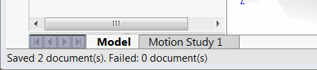

This VBA macro allows to save all documents currently opened and modified in SOLIDWORKS silently using SOLIDWORKS API. Unlike default save as command where the various warning messages can be displayed while saving the files this macro will save documents without showing any popup messages.

{ width=350 }

Macro can be configured to either display the error (in case some of the files were not saved properly) or to keep it silent.

~~~ vb
Const SHOW_ERROR As Boolean = False 'True to show message box in case of an error, False to keep it silent
~~~

The result of the operation is displayed in the status bar.

This macro can be used as a part of background integration where modal dialogs should not be displayed.

~~~ vb
Const SHOW_ERROR As Boolean = False

Dim swApp As SldWorks.SldWorks

Sub main()

    Set swApp = Application.SldWorks
    
    Dim swFrame As SldWorks.Frame
    Set swFrame = swApp.Frame()
    
    Dim vModelWnds As Variant
    vModelWnds = swFrame.ModelWindows
    
    If Not IsEmpty(vModelWnds) Then
        
        Dim i As Integer
        
        Dim savedCount As Integer
        Dim failedCount As Integer
        savedCount = 0
        failedCount = 0
        
        For i = 0 To UBound(vModelWnds)
            
            Dim swModelWnd As SldWorks.ModelWindow
            Set swModelWnd = vModelWnds(i)
            Dim swModel As SldWorks.ModelDoc2
            Set swModel = swModelWnd.ModelDoc
            
            If swModel.GetSaveFlag() Then
                
                Dim errs As Long
                Dim warns As Long
                
                If False = swModel.Save3(swSaveAsOptions_e.swSaveAsOptions_Silent, errs, warns) Then
                    failedCount = failedCount + 1
                    Debug.Print "Failed to save " & swModel.GetTitle() & ": " & errs
                Else
                    savedCount = savedCount + 1
                    Debug.Print "Saved " & swModel.GetTitle
                End If
                
            End If
            
        Next
        
        swFrame.SetStatusBarText "Saved " & savedCount & " document(s). Failed: " & failedCount & " document(s)"
        
        If failedCount > 0 And SHOW_ERROR Then
            swApp.SendMsgToUser2 "Some of the files failed to save automatically", swMessageBoxIcon_e.swMbWarning, swMessageBoxBtn_e.swMbOk
        End If
        
    End If
    
End Sub
~~~

