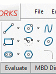

这个VBA宏演示了如何在SOLIDWORKS工具栏中闪烁标准工具栏按钮，类似于SOLIDWORKS教程文件。

要闪烁工具栏，需要找到它的id。请参考博客文章中的[调用Windows命令](https://blog.codestack.net/missing-solidworks-api-command#calling-windows-command)部分，了解如何获取此id的说明。

> 注意，命令的id在SOLIDWORKS会话和版本之间是持久的。

与标准命令不同，使用[SOLIDWORKS插件](/docs/codestack/solidworks-api/getting-started/add-ins/)添加的自定义命令在不同的安装中是不持久的。为了动态获取自定义命令的id，请使用[ISldWorks::GetCommandID](https://help.solidworks.com/2017/english/api/sldworksapi/SolidWorks.Interop.sldworks~SolidWorks.Interop.sldworks.ISldWorks~GetCommandID.html) API，并传递持久的**命令用户id**和插件的guid。

~~~ vb
Dim swApp As SldWorks.SldWorks

Sub main()

    Set swApp = Application.SldWorks
    
    '闪烁线按钮并显示工具提示
    FlashToolbarButton 32873
    
    '只显示新文件按钮的工具提示
    FlashToolbarButton 57600, True
    
End Sub

Sub FlashToolbarButton(buttonId As Long, Optional tooltipOnly As Boolean = False)
    
    swApp.ShowBubbleTooltip buttonId, IIf(tooltipOnly, "", CStr(buttonId)), 0, "", ""
    
End Sub
~~~