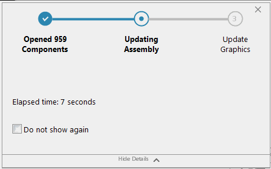

{ width=450 }

This VBA macro will listen for SOLIDWORKS commands (e.g. opening, rebuilding, suppressing, resolving etc.) using SOLIDWORKS API and identify the long running ones by matching the execution time to the user assigned delay period. If the command is running longer then this period, the beep signal is played notifying the user that the command is completed. If command is executed faster than no sound is played.

This can be useful when working with large models as it is possible to switch the screens or perform another activity while command is being executed and be notified once the operation is completed without the need to constantly monitor the progress.

## Running instructions

* Create new macro and add the following code

~~~ vb
Const MIN_DELAY As Integer = 5

Dim swCmdsListener As CommandsListener

Sub main()

    Set swCmdsListener = New CommandsListener
    swCmdsListener.MinimumDelay = MIN_DELAY
    
End Sub
~~~

* Specify the command minimum delay in seconds by changing the value of *MIN_DELAY* constant
* Create new class module and name it *CommandsListener*. Paste the following code into the class module:
* Start the macro. To automatically start the macro with every SOLIDWORKS session follow the [Run SOLIDWORKS macro automatically on application start](/docs/codestack/solidworks-api/getting-started/macros/run-macro-on-solidworks-start/) article.

~~~ vb
Dim WithEvents swApp As SldWorks.SldWorks

Dim IsCommandStarted As Boolean
Dim StartCommand As Long
Dim StartCommandTimeStamp As Date

Public MinimumDelay As Double

Private Sub Class_Initialize()
    Set swApp = Application.SldWorks
End Sub

Private Function swApp_CommandOpenPreNotify(ByVal Command As Long, ByVal UserCommand As Long) As Long
    IsCommandStarted = True
    StartCommand = Command
    StartCommandTimeStamp = Now
    swApp_CommandOpenPreNotify = 0
End Function

Private Function swApp_CommandCloseNotify(ByVal Command As Long, ByVal reason As Long) As Long
    
    If IsCommandStarted And Command = StartCommand Then
    
        IsCommandStarted = False
    
        Dim diff As Integer
        diff = CInt(DateDiff("s", StartCommandTimeStamp, Now))
        
        Debug.Print diff
        
        If diff >= MinimumDelay Then
            Beep
        End If
        
    End If
    
    swApp_CommandCloseNotify = 0
    
End Function
~~~

