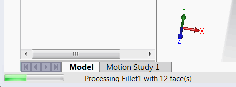

To improve the user experience of macros or add-ins, it is recommended to display and update a progress bar when performing long operations in the SOLIDWORKS API.

The SOLIDWORKS API provides a built-in method to display progress when the main thread is locked (i.e., when the operation is being executed in the process). The progress value and message can be handled using the [IUserProgressBar](https://help.solidworks.com/2017/English/api/sldworksapi/SolidWorks.Interop.sldworks~SolidWorks.Interop.sldworks.IUserProgressBar.html) SOLIDWORKS API interface.

The message and progress are displayed in the standard SOLIDWORKS progress bar at the bottom left corner of the application.

The progress is also reflected in the SOLIDWORKS icon in the taskbar.

## Notes and Limitations

* The progress value and message can be overridden by SOLIDWORKS' standard progress messages (e.g., rebuild operations, file loading, etc.).

## Running the Macro

* Open a part document with entities.
* The macro iterates through all the faces of the entities and performs data extraction on each face.
* The operation is repeated based on the *ITERATIONS_COUNT* constant.
* The progress bar is displayed.
* Pressing the ESC key allows the operation to be canceled.

~~~ vb
Const ITERATIONS_COUNT As Integer = 1000

Dim swApp As SldWorks.SldWorks

Sub main()

    Set swApp = Application.SldWorks
    
    Dim swModel As SldWorks.ModelDoc2
    
    Set swModel = swApp.ActiveDoc
    
    If TypeOf swModel Is SldWorks.PartDoc Then
        
        Dim swPart As SldWorks.PartDoc
        Set swPart = swModel
        Dim vBodies As Variant
        vBodies = swPart.GetBodies2(swBodyType_e.swAllBodies, False)
            
        If Not IsEmpty(vBodies) Then
            PerformOperation vBodies
        Else
            MsgBox "No bodies in this part"
        End If
            
    Else
        MsgBox "Please open a part document"
    End If
    
End Sub

Sub PerformOperation(bodies As Variant)
    
    Dim swPrgBar As SldWorks.UserProgressBar
    swApp.GetUserProgressBar swPrgBar
    
    swPrgBar.Start 0, GetProgressBarUpperBound(bodies), "Processing face operations"
    
    Dim i As Integer
    
    Dim pos As Long
    pos = 0
    
    For i = 0 To UBound(bodies)
        
        Dim swBody As SldWorks.Body2
        Set swBody = bodies(i)
        
        Dim vFaces As Variant
        vFaces = swBody.GetFaces()
        
        swPrgBar.UpdateTitle "Processing " & swBody.Name & ", " & UBound(vFaces) + 1 & " faces in total"
        
        Dim j As Integer
        
        For j = 0 To UBound(vFaces)
            
            Dim k As Integer
            
            For k = 0 To ITERATIONS_COUNT
                
                pos = pos + 1
                
                Dim swFace As SldWorks.Face2
                Set swFace = vFaces(j)
                
                Dim swSurf As SldWorks.Surface
                Set swSurf = swFace.GetSurface()
                    
                swSurf.EvaluateAtPoint 0, 0, 0
                swSurf.GetClosestPointOn 0, 0, 0
                
                If swUpdateProgressError_e.swUpdateProgressError_UserCancel = swPrgBar.UpdateProgress(pos) Then
                    If swApp.SendMsgToUser2("Cancel the operation?", swMessageBoxIcon_e.swMbWarning, swMessageBoxBtn_e.swMbYesNo) = swMessageBoxResult_e.swMbHitYes Then
                        swPrgBar.End
                    End If
                End If
                
            Next
        Next
        
    Next
    
End Sub

Function GetProgressBarUpperBound(bodies As Variant) As Long
    
    Dim totalFaceCount As Long
    
    Dim i As Integer
    
    For i = 0 To UBound(bodies)
        Dim swBody As SldWorks.Body2
        Set swBody = bodies(i)
        totalFaceCount = swBody.GetFaceCount()
    Next
    
    GetProgressBarUpperBound = totalFaceCount * ITERATIONS_COUNT
    
End Function
~~~