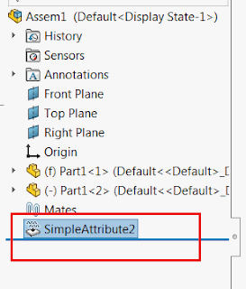

该示例创建一个不可见属性并将其附加到所选对象（实体或组件）。

可以通过在[SOLIDWORKS API方法IAttributeDef::CreateInstance5](https://help.solidworks.com/2018/english/api/sldworksapi/solidworks.interop.sldworks~solidworks.interop.sldworks.iattributedef~createinstance5.html)中设置相应的标志来隐藏属性。

{ width=272 height=320 }

一旦创建了属性，宏就会停止执行。此时，属性特征是不可见的。
当宏继续执行（按下F5或点击运行）时，该特征将变为可见。

~~~ vb
Enum CreateAtttributeOptions_e
    Visible = 0
    Hidden = 1
End Enum

Dim swApp As SldWorks.SldWorks
Dim swAttDef As SldWorks.AttributeDef
Dim swModel As SldWorks.ModelDoc2
Dim swSelMgr As SldWorks.SelectionMgr

Const ATT_DEF_NAME As String = "SimpleAttribute"

Sub main()

    Set swApp = Application.SldWorks
    
    Set swAttDef = swApp.DefineAttribute(ATT_DEF_NAME)
    
    swAttDef.Register
    
    Set swModel = swApp.ActiveDoc
    
    If Not swModel Is Nothing Then
    
        Set swSelMgr = swModel.SelectionManager
        
        Dim swAtt As SldWorks.Attribute
        Dim swSelObject As Object
        
        Set swSelObject = swSelMgr.GetSelectedObject6(1, -1)
        
        '获取属性的唯一名称
        Dim index As Integer
        index = 1
        
        Dim attName As String
        attName = ATT_DEF_NAME & index
        
        While swModel.FeatureManager.IsNameUsed(swNameType_e.swFeatureName, attName)
            attName = ATT_DEF_NAME & index
            index = index + 1
        Wend
        
        Set swAtt = swAttDef.CreateInstance5(swModel, swSelObject, attName, CreateAtttributeOptions_e.Hidden, swInConfigurationOpts_e.swAllConfiguration)
        
        '属性特征在树中是隐藏的
        Debug.Assert Not swAtt Is Nothing
        
        Dim swAttFeat As SldWorks.Feature
        Set swAttFeat = swModel.FeatureByName(swAtt.GetName())
        
        Stop
        
        '显示属性特征
        swAttFeat.SetUIState swUIStates_e.swIsHiddenInFeatureMgr, False
        swModel.EditRebuild3
        
    Else
        MsgBox "请打开模型"
    End If
    
End Sub

~~~