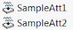

Attributes are special features inserted using the [SOLIDWORKS API method IAttributeDef::CreateInstance5](https://help.solidworks.com/2012/english/api/sldworksapi/solidworks.interop.sldworks~solidworks.interop.sldworks.iattributedef~createinstance5.html). While attributes are native features and can be visible in the FeatureManager tree (optional), they cannot be inserted or edited through the regular user interface (only deleted) and can only be accessed through the API.

Attribute instances are created from attribute definitions. Software using attributes should define their definitions using the [SOLIDWORKS API method ISldWorks::DefineAttribute](https://help.solidworks.com/2012/english/api/sldworksapi/solidworks.interop.sldworks~solidworks.interop.sldworks.isldworks~defineattribute.html).

### Notes

* Attributes can be associated with selectable objects (bodies, components, faces, edges, vertices, loops, or features)
* Attributes can store parameters
* Attributes can be hidden in the FeatureManager tree

For more information on using attributes, see the examples in the **Attributes** section below.