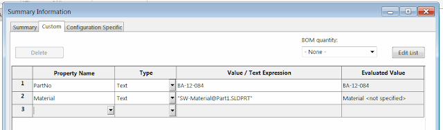

## 概述

该宏使用SOLIDWORKS API将所有文件特定的自定义属性复制到活动配置的属性中。

{ width=640 }

## 代码

```vb
Dim swApp As SldWorks.SldWorks
Dim swModel As SldWorks.ModelDoc2
Dim swCustPrpMgr As SldWorks.CustomPropertyManager
Dim swConfCustPrpMgr As SldWorks.CustomPropertyManager
 
Sub main()
 
    Set swApp = Application.SldWorks
 
    Set swModel = swApp.ActiveDoc

    If Not swModel Is Nothing Then
   
        Set swCustPrpMgr = swModel.Extension.CustomPropertyManager("")
       
        Dim vNames As Variant
        Dim vTypes As Variant
        Dim vValues As Variant
        swCustPrpMgr.GetAll vNames, vTypes, vValues
   
        Dim activeConfName As String
        activeConfName = swModel.ConfigurationManager.ActiveConfiguration.Name

        Set swConfCustPrpMgr = swModel.Extension.CustomPropertyManager(activeConfName)
 
        Dim i As Integer
   
        For i = 0 To UBound(vNames)
            swConfCustPrpMgr.Add2 vNames(i), vTypes(i), vValues(i)
            swConfCustPrpMgr.Set vNames(i), vValues(i)
        Next

    Else

        MsgBox "请打开零件或装配体"

    End If
   
End Sub
```

## 示例

```vb
Sub main()
 
    Set swApp = Application.SldWorks
 
    Set swModel = swApp.ActiveDoc

    If Not swModel Is Nothing Then
   
        Set swCustPrpMgr = swModel.Extension.CustomPropertyManager("")
       
        Dim vNames As Variant
        Dim vTypes As Variant
        Dim vValues As Variant
        swCustPrpMgr.GetAll vNames, vTypes, vValues
   
        Dim activeConfName As String
        activeConfName = swModel.ConfigurationManager.ActiveConfiguration.Name

        Set swConfCustPrpMgr = swModel.Extension.CustomPropertyManager(activeConfName)
 
        Dim i As Integer
   
        For i = 0 To UBound(vNames)
            swConfCustPrpMgr.Add2 vNames(i), vTypes(i), vValues(i)
            swConfCustPrpMgr.Set vNames(i), vValues(i)
        Next

    Else

        MsgBox "请打开零件或装配体"

    End If
   
End Sub
```

## 说明

1. 首先，我们需要获取SOLIDWORKS应用程序对象和活动文档对象。
2. 然后，我们使用`CustomPropertyManager`对象获取文件特定的自定义属性。
3. 接下来，我们获取活动配置的名称。
4. 然后，我们使用`CustomPropertyManager`对象获取活动配置的自定义属性。
5. 最后，我们使用`Add2`方法将文件特定的自定义属性添加到活动配置的自定义属性中，并使用`Set`方法设置属性值。

## 注意事项

- 请确保在运行宏之前打开零件或装配体。
- 请注意，该宏将文件特定的自定义属性复制到活动配置的属性中，如果活动配置中已存在相同名称的属性，则会覆盖原有的属性值。