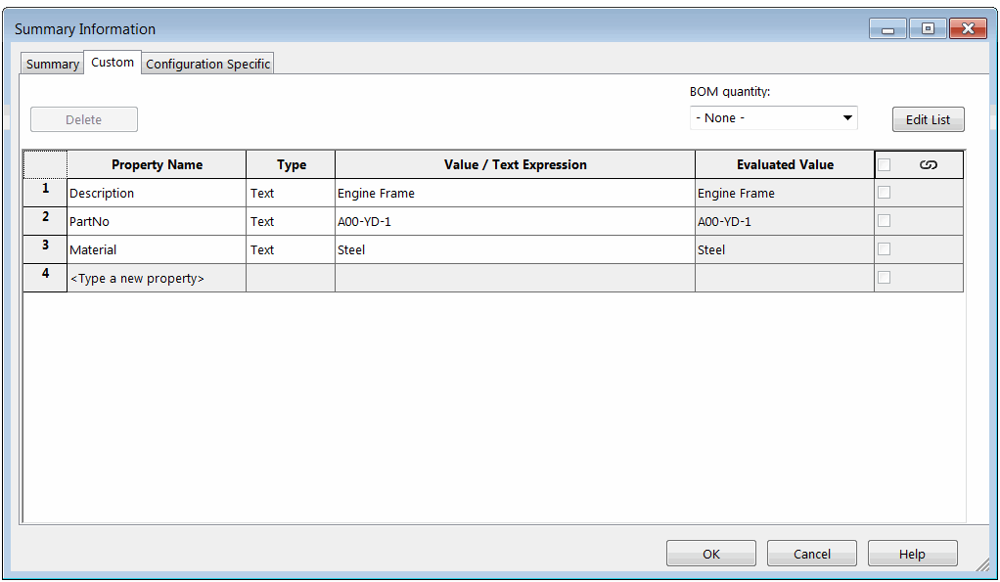
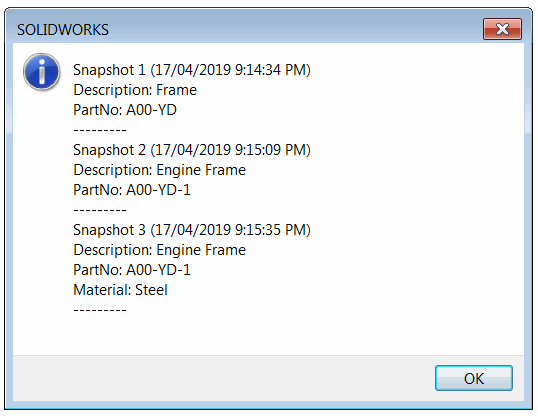

{ width=450 }

此示例演示了如何使用SOLIDWORKS API利用第三方存储库保存文件的自定义属性修订。

此插件使用[SwEx.AddIn](/docs/codestack/labs/solidworks/swex/add-in/)框架构建，但也可以与其他创建插件的方法一起使用。

插件在菜单和工具栏中添加了两个按钮，并相应地提供了两个处理程序：

* TakeCustomPropertiesSnapshot - 读取自定义属性的当前状态并将其序列化到第三方存储库中
* LoadSnapshots - 加载所有修订版本并显示消息框

每个修订版本的快照存储在第三方子存储库的存储（流）中，而有关所有可用快照的信息保存在第三方存储的子流中。

## 使用说明

* 打开任何现有的SOLIDWORKS模型（零件、装配或绘图）
* 在“自定义”选项卡中添加一些自定义属性
* 单击“工具\自定义属性修订”菜单中的“TakeCustomPropertiesSnapshot”
* 修改属性并再次单击“TakeCustomPropertiesSnapshot”。如有需要，重复此步骤
* 您可以关闭并重新打开模型和SOLIDWORKS。单击“LoadSnapshots”命令。所有属性修订都会显示在消息框中

{ width=450 }

### PropertiesSnapshot.cs

用于序列化属性和信息的结构

~~~ cs
using System;
using System.Collections.Generic;
using System.Runtime.Serialization;

namespace CodeStack
{
    [DataContract]
    public class SnapshotInfo
    {
        [DataMember]
        public int Revision { get; set; }
        
        [DataMember]
        public DateTime TimeStamp { get; set; }
    }

    [DataContract]
    public class PropertiesSnapshot
    {
        [DataMember]
        public Dictionary<string, string> Properties { get; set; }
    }
}

~~~

### CustomPropertiesRevisionsAddIn.cs

处理菜单命令并读取和输出数据的插件类

~~~ cs
using CodeStack.SwEx.AddIn;
using CodeStack.SwEx.AddIn.Attributes;
using SolidWorks.Interop.sldworks;
using SolidWorks.Interop.swconst;
using System;
using System.Collections.Generic;
using System.Linq;
using System.Runtime.InteropServices;
using System.Text;
using System.Threading.Tasks;

namespace CodeStack
{
    [ComVisible(true), Guid("46919A47-EE80-445B-A87D-0C831B4B7E44")]
    [AutoRegister("Custom Properties Revisions", "Sample Demonstrating use of 3rd party storage store")]
    public partial class CustomPropertiesRevisions : SwAddInEx
    {
        private const string STORAGE_NAME = "CustPrpRevisions";
        private const string SNAPSHOT_INFO_STREAM_NAME = "SnapshotInfos";
        private const string SNAPSHOT_STREAM_NAME_TEMPLATE = "Snapshots\\{0}";

        [SwEx.Common.Attributes.Title("Custom Properties Revisions")]
        public enum Commands_e
        {
            TakeCustomPropertiesSnapshot,
            LoadSnapshots
        }

        public override bool OnConnect()
        {
            AddCommandGroup<Commands_e>(OnButtonClick);

            return true;
        }

        private async void OnButtonClick(Commands_e cmd)
        {
            switch (cmd)
            {
                case Commands_e.TakeCustomPropertiesSnapshot:
                    await TakeCustomPropertiesSnapshot();
                    break;

                case Commands_e.LoadSnapshots:
                    LoadSnapshots();
                    break;
            }
        }

        private async Task TakeCustomPropertiesSnapshot()
        {
            try
            {
                var snapshot = GetSnapshot(App.IActiveDoc2);
                
                await SaveSnapshotToDocument(App.IActiveDoc2, snapshot);

                App.SendMsgToUser2("Snapshot is saved",
                    (int)swMessageBoxIcon_e.swMbInformation,
                    (int)swMessageBoxBtn_e.swMbOk);
            }
            catch (Exception ex)
            {
                App.SendMsgToUser2(ex.Message,
                    (int)swMessageBoxIcon_e.swMbStop,
                    (int)swMessageBoxBtn_e.swMbOk);
            }
        }
        
        private void LoadSnapshots()
        {
            try
            {
                var snapshotsInfo = GetSnapshotInfos(App.IActiveDoc2);

                var msg = new StringBuilder();

                foreach (var snapshotInfo in snapshotsInfo)
                {   
                    var snapshot = ReadSnapshotFromDocument(App.IActiveDoc2,
                        string.Format(SNAPSHOT_STREAM_NAME_TEMPLATE, snapshotInfo.Revision));

                    msg.AppendLine($"Snapshot {snapshotInfo.Revision} ({snapshotInfo.TimeStamp})");
                    msg.AppendLine(string.Join(System.Environment.NewLine, snapshot.Properties.Select(p => $"{p.Key}: {p.Value}").ToArray()));
                    msg.AppendLine("---------");
                }

                App.SendMsgToUser2(msg.ToString(),
                    (int)swMessageBoxIcon_e.swMbInformation,
                    (int)swMessageBoxBtn_e.swMbOk);
            }
            catch (Exception ex)
            {
                App.SendMsgToUser2(ex.Message,
                    (int)swMessageBoxIcon_e.swMbStop,
                    (int)swMessageBoxBtn_e.swMbOk);
            }
        }

        private PropertiesSnapshot GetSnapshot(IModelDoc2 model)
        {
            var snaphot = new PropertiesSnapshot()
            {
                Properties = new Dictionary<string, string>()
            };

            var prpMgr = model.Extension.CustomPropertyManager[""];

            var prpNames = prpMgr.GetNames() as string[];

            if (prpNames != null)
            {
                foreach (var prpName in prpNames)
                {
                    string val;
                    string resVal;
                    bool wasRes;
                    prpMgr.Get5(prpName, false, out val, out resVal, out wasRes);
                    snaphot.Properties.Add(prpName, resVal);
                }
            }

            return snaphot;
        }
    }
}

~~~

### CustomPropertiesRevisions.cs

用于访问存储和序列化和反序列化数据的函数

~~~ cs
using SolidWorks.Interop.sldworks;
using SolidWorks.Interop.swconst;
using System;
using System.Collections.Generic;
using System.Linq;
using System.Runtime.InteropServices.ComTypes;
using System.Runtime.Serialization;
using System.Text;
using System.Threading.Tasks;
using System.Xml.Serialization;
using ThirdPartyStorage;

namespace CodeStack
{
    public partial class CustomPropertiesRevisions
    {
        public class ThirdPartyStoreNotFoundException : Exception
        {
        }

        private async Task SaveSnapshotToDocument(IModelDoc2 model, PropertiesSnapshot data)
        {
            int err = -1;
            int warn = -1;

            model.SetSaveFlag();

            const int S_OK = 0;

            bool? result = null; ;

            var onSaveToStorageStoreNotifyFunc = new Func<int>(() =>
            {
                try
                {
                    StoreData(model, data, STORAGE_NAME, storage =>
                    {
                        string snapshotName = "";

                        AccessStreamFromPath(storage, SNAPSHOT_INFO_STREAM_NAME, true, true, stream =>
                        {
                            var ser = new DataContractSerializer(typeof(List<SnapshotInfo>));

                            List<SnapshotInfo> snapshotInfos = null;

                            if (stream.Length > 0)
                            {
                                snapshotInfos = ser.ReadObject(stream) as List<SnapshotInfo>;
                            }
                            else
                            {
                                snapshotInfos = new List<SnapshotInfo>();
                            }

                            var info = new SnapshotInfo()
                            {
                                Revision = snapshotInfos.Count + 1,
                                TimeStamp = DateTime.Now
                            };

                            snapshotInfos.Add(info);

                            snapshotName = string.Format(SNAPSHOT_STREAM_NAME_TEMPLATE, info.Revision);

                            stream.Seek(0, System.IO.SeekOrigin.Begin);

                            ser.WriteObject(stream, snapshotInfos);
                        }, STGM.STGM_READWRITE | STGM.STGM_SHARE_EXCLUSIVE);

                        AccessStreamFromPath(storage, snapshotName, true, true, stream =>
                        {
                            var ser = new DataContractSerializer(typeof(PropertiesSnapshot));
                            ser.WriteObject(stream, data);
                        }, STGM.STGM_READWRITE | STGM.STGM_SHARE_EXCLUSIVE);

                        result = true;
                    });
                }
                catch
                {
                    result = false;
                }
                return S_OK;
            });

            var partSaveToStorageNotify = new DPartDocEvents_SaveToStorageStoreNotifyEventHandler(onSaveToStorageStoreNotifyFunc);
            var assmSaveToStorageNotify = new DAssemblyDocEvents_SaveToStorageStoreNotifyEventHandler(onSaveToStorageStoreNotifyFunc);
            var drwSaveToStorageNotify = new DDrawingDocEvents_SaveToStorageStoreNotifyEventHandler(onSaveToStorageStoreNotifyFunc);

            #region Attach Event Handlers

            switch ((swDocumentTypes_e)model.GetType())
            {
                case swDocumentTypes_e.swDocPART:
                    (model as PartDoc).SaveToStorageStoreNotify += partSaveToStorageNotify;
                    break;

                case swDocumentTypes_e.swDocASSEMBLY:
                    (model as AssemblyDoc).SaveToStorageStoreNotify += assmSaveToStorageNotify;
                    break;

                case swDocumentTypes_e.swDocDRAWING:
                    (model as DrawingDoc).SaveToStorageStoreNotify += drwSaveToStorageNotify;
                    break;
            }

            #endregion

            if (!model.Save3((int)swSaveAsOptions_e.swSaveAsOptions_Silent, ref err, ref warn))
            {
                throw new InvalidOperationException($"Failed to save the model: {(swFileSaveError_e)err}");
            }

            await Task.Run(() =>
            {
                while (!result.HasValue)
                {
                    System.Threading.Thread.Sleep(10);
                }
            });

            #region Detach Event Handlers

            switch ((swDocumentTypes_e)model.GetType())
            {
                case swDocumentTypes_e.swDocPART:
                    (model as PartDoc).SaveToStorageStoreNotify -= partSaveToStorageNotify;
                    break;

                case swDocumentTypes_e.swDocASSEMBLY:
                    (model as AssemblyDoc).SaveToStorageStoreNotify -= assmSaveToStorageNotify;
                    break;

                case swDocumentTypes_e.swDocDRAWING:
                    (model as DrawingDoc).SaveToStorageStoreNotify -= drwSaveToStorageNotify;
                    break;
            }

            #endregion

            if (!result.Value)
            {
                throw new Exception("Failed to store the data");
            }
        }

        private PropertiesSnapshot ReadSnapshotFromDocument(IModelDoc2 model, string revName)
        {
            return ReadData<PropertiesSnapshot>(model, STORAGE_NAME, revName);
        }

        private SnapshotInfo[] GetSnapshotInfos(IModelDoc2 model)
        {
            return ReadData<SnapshotInfo[]>(model, STORAGE_NAME, SNAPSHOT_INFO_STREAM_NAME);
        }

        private void StoreData<T>(IModelDoc2 model, T data, string storageName, Action<ComStorage> action)
        {
            try
            {
                var storage = model.Extension.IGet3rdPartyStorageStore(storageName, true) as IStorage;

                using (var comStorage = new ComStorage(storage, true))
                {
                    action.Invoke(comStorage);
                }
            }
            catch
            {
                throw;
            }
            finally
            {
                model.Extension.IRelease3rdPartyStorageStore(storageName);
            }
        }

        private T ReadData<T>(IModelDoc2 model, string storageName, string streamName)
        {
            T data = default(T);

            ReadStorage(model, storageName, storage => 
            {
                AccessStreamFromPath(storage, streamName, false, false, stream=> 
                {
                    var ser = new DataContractSerializer(typeof(T));
                    data = (T)ser.ReadObject(stream);
                });
            });

            return data;
        }

        private void AccessStreamFromPath(ComStorage storage, string path, bool writable,
            bool createIfNotExist, Action<ComStream> action, STGM mode = STGM.STGM_SHARE_EXCLUSIVE)
        {
            var parentIndex = path.IndexOf('\\');

            if (parentIndex == -1)
            {
                IStream stream = null;

                try
                {
                    stream = storage.OpenStream(path, mode);
                }
                catch
                {
                    if (createIfNotExist)
                    {
                        stream = storage.CreateStream(path);
                    }
                    else
                    {
                        throw;
                    }
                }

                using (var comStream = new ComStream(stream, writable))
                {
                    action.Invoke(comStream);
                }
            }
            else
            {
                var subStorageName = path.Substring(0, parentIndex);

                IStorage subStorage;

                try
                {
                    subStorage = storage.OpenStorage(subStorageName, mode);
                }
                catch
                {
                    if (createIfNotExist)
                    {
                        subStorage = storage.CreateStorage(subStorageName);
                    }
                    else
                    {
                        throw;
                    }
                }
                
                using (var subComStorage = new ComStorage(subStorage, false))
                {
                    var nextLevelPath = path.Substring(parentIndex + 1);
                    AccessStreamFromPath(subComStorage, nextLevelPath, writable, createIfNotExist, action);
                }
            }
        }

        private void ReadStorage(IModelDoc2 model, string storageName, Action<ComStorage> action)
        {
            try
            {
                var storage = model.Extension.IGet3rdPartyStorageStore(storageName, false) as IStorage;

                if (storage != null)
                {
                    using (var comStorage = new ComStorage(storage, false))
                    {
                        action.Invoke(comStorage);
                    }
                }
                else
                {
                    throw new ThirdPartyStoreNotFoundException();
                }
            }
            catch
            {
                throw;
            }
            finally
            {
                model.Extension.IRelease3rdPartyStorageStore(storageName);
            }
        }
    }
}

~~~

### ComStorage.cs

在.NET语言中简化对[IStorage](https://docs.microsoft.com/en-us/windows/desktop/api/objidl/nn-objidl-istorage)接口的访问的包装器

~~~ cs
using System;
using System.Collections.Generic;
using System.Runtime.InteropServices;
using System.Diagnostics;
using System.IO;
using System.Runtime.InteropServices.ComTypes;

namespace ThirdPartyStorage
{
    #region WinAPI

    [Flags]
    public enum STGM : int
    {
        STGM_READ = 0x0,
        STGM_WRITE = 0x1,
        STGM_READWRITE = 0x2,
        STGM_SHARE_DENY_NONE = 0x40,
        STGM_SHARE_DENY_READ = 0x30,
        STGM_SHARE_DENY_WRITE = 0x20,
        STGM_SHARE_EXCLUSIVE = 0x10,
        STGM_PRIORITY = 0x40000,
        STGM_CREATE = 0x1000,
        STGM_CONVERT = 0x20000,
        STGM_FAILIFTHERE = 0x0,
        STGM_DIRECT = 0x0,
        STGM_TRANSACTED = 0x10000,
        STGM_NOSCRATCH = 0x100000,
        STGM_NOSNAPSHOT = 0x200000,
        STGM_SIMPLE = 0x8000000,
        STGM_DIRECT_SWMR = 0x400000,
        STGM_DELETEONRELEASE = 0x4000000
    }

    public enum STGTY : int
    {
        STGTY_STORAGE = 1,
        STGTY_STREAM = 2,
        STGTY_LOCKBYTES = 3,
        STGTY_PROPERTY = 4
    };

    [ComImport]
    [Guid("0000000d-0000-0000-C000-000000000046")]
    [InterfaceType(ComInterfaceType.InterfaceIsIUnknown)]
    public interface IEnumSTATSTG
    {
        [PreserveSig]
        uint Next(uint celt,
        [MarshalAs(UnmanagedType.LPArray), Out]
        System.Runtime.InteropServices.ComTypes.STATSTG[] rgelt,
        out uint pceltFetched
        );

        void Skip(uint celt);

        void Reset();

        [return: MarshalAs(UnmanagedType.Interface)]
        IEnumSTATSTG Clone();
    }

    [ComImport]
    [Guid("0000000b-0000-0000-C000-000000000046")]
    [InterfaceType(ComInterfaceType.InterfaceIsIUnknown)]
    public interface IStorage
    {
        void CreateStream(string pwcsName, uint grfMode, uint reserved1, uint reserved2, out IStream ppstm);
        void OpenStream(string pwcsName, IntPtr reserved1, uint grfMode, uint reserved2, out IStream ppstm);
        void CreateStorage(string pwcsName, uint grfMode, uint reserved1, uint reserved2, out IStorage ppstg);
        void OpenStorage(string pwcsName, IStorage pstgPriority, uint grfMode, IntPtr snbExclude, uint reserved, out IStorage ppstg);
        void CopyTo(uint ciidExclude, Guid rgiidExclude, IntPtr snbExclude, IStorage pstgDest);
        void MoveElementTo(string pwcsName, IStorage pstgDest, string pwcsNewName, uint grfFlags);
        void Commit(uint grfCommitFlags);
        void Revert();
        void EnumElements(uint reserved1, IntPtr reserved2, uint reserved3, out IEnumSTATSTG ppenum);
        void DestroyElement(string pwcsName);
        void RenameElement(string pwcsOldName, string pwcsNewName);
        void SetElementTimes(string pwcsName, System.Runtime.InteropServices.ComTypes.FILETIME pctime, System.Runtime.InteropServices.ComTypes.FILETIME patime, System.Runtime.InteropServices.ComTypes.FILETIME pmtime);
        void SetClass(Guid clsid);
        void SetStateBits(uint grfStateBits, uint grfMask);
        void Stat(out System.Runtime.InteropServices.ComTypes.STATSTG pstatstg, uint grfStatFlag);
    }

    #endregion

    public class ComStorage : IDisposable
    {
        [DllImport("ole32.dll")]
        public static extern int StgOpenStorage(
            [MarshalAs(UnmanagedType.LPWStr)] string pwcsName,
            IStorage pstgPriority,
            int grfMode,
            IntPtr snbExclude,
            uint reserved,
            out IStorage ppstgOpen);

        private IStorage m_Storage;
        private bool m_IsWritable;

        public ComStorage(IStorage storage, bool writable)
        {
            if (storage == null)
            {
                throw new ArgumentNullException(nameof(storage));
            }

            m_IsWritable = writable;
            m_Storage = storage;
        }

        public IStorage OpenStorage(string storageName, STGM mode = STGM.STGM_SHARE_EXCLUSIVE)
        {
            IStorage storage;

            m_Storage.OpenStorage(storageName, null,
                (uint)mode, IntPtr.Zero, 0, out storage);

            return storage;
        }

        public IStream OpenStream(string streamName, STGM mode = STGM.STGM_SHARE_EXCLUSIVE)
        {
            IStream stream = null;

            m_Storage.OpenStream(streamName,
                IntPtr.Zero, (uint)mode, 0, out stream);

            return stream;
        }

        public IStream CreateStream(string streamName)
        {
            IStream stream = null;

            m_Storage.CreateStream(streamName,
                (uint)STGM.STGM_CREATE | (uint)STGM.STGM_SHARE_EXCLUSIVE | (uint)STGM.STGM_WRITE,
                0, 0, out stream);

            return stream;
        }

        public IStorage CreateStorage(string streamName)
        {
            IStorage storage = null;

            m_Storage.CreateStorage(streamName,
                (uint)STGM.STGM_CREATE | (uint)STGM.STGM_SHARE_EXCLUSIVE | (uint)STGM.STGM_WRITE,
                0, 0, out storage);

            return storage;
        }

        public IEnumerable<System.Runtime.InteropServices.ComTypes.STATSTG> EnumElements()
        {
            IEnumSTATSTG ssenum = null;

            m_Storage.EnumElements(0, IntPtr.Zero, 0, out ssenum);

            var ssstruct = new System.Runtime.InteropServices.ComTypes.STATSTG[1];

            uint numReturned;

            do
            {
                ssenum.Next(1, ssstruct, out numReturned);

                if (numReturned != 0)
                {
                    yield return ssstruct[0];
                }
            } while (numReturned > 0);
        }

        public void Close()
        {
            if (m_Storage != null)
            {
                if (m_IsWritable)
                {
                    m_Storage.Commit(0);
                }

                Marshal.ReleaseComObject(m_Storage);
                m_Storage = null;
                GC.SuppressFinalize(this);
            }
        }

        public void Dispose()
        {
            Close();
        }
    }
}

~~~

### ComStream.cs

在.NET语言中简化对[IStream](https://docs.microsoft.com/en-us/windows/desktop/api/objidl/nn-objidl-istream)接口的访问的包装器

~~~ cs
using System;
using System.IO;
using System.Runtime.InteropServices.ComTypes;

namespace ThirdPartyStorage
{
    public class ComStream : Stream
    {
        private readonly IStream m_ComStream;
        private readonly bool m_Commit;

        private bool m_IsWritable;

        public override bool CanRead
        {
            get
            {
                return true;
            }
        }

        public override bool CanSeek
        {
            get
            {
                return true;
            }
        }

        public override bool CanWrite
        {
            get
            {
                return m_IsWritable;
            }
        }

        public override long Length
        {
            get
            {
                const int STATSFLAG_NONAME = 1;

                STATSTG statstg;

                m_ComStream.Stat(out statstg, STATSFLAG_NONAME);

                return statstg.cbSize;
            }
        }

        public override long Position
        {
            get
            {
                return Seek(0, SeekOrigin.Current);
            }
            set
            {
                Seek(value, SeekOrigin.Begin);
            }
        }

        public ComStream(IStream comStream, bool writable, bool commit = true)
        {
            if (comStream == null)
            {
                throw new ArgumentNullException(nameof(comStream));
            }
            
            m_ComStream = comStream;
            m_Commit = commit;
            m_IsWritable = writable;
        }

        public override void Flush()
        {
            if (m_Commit)
            {
                const int STGC_DEFAULT = 0;

                m_ComStream.Commit(STGC_DEFAULT);
            }
        }

        public unsafe override int Read(byte[] buffer, int offset, int count)
        {
            if (offset != 0)
            {
                throw new NotSupportedException("Offset is not supported");
            }

            int bytesRead;

            var address = new IntPtr(&bytesRead);

            m_ComStream.Read(buffer, count, address);

            return bytesRead;
        }

        public unsafe override long Seek(long offset, SeekOrigin origin)
        {
            long position = 0;

            var address = new IntPtr(&position);

            m_ComStream.Seek(offset, (int)origin, address);

            return position;
        }

        public override void SetLength(long value)
        {
            m_ComStream.SetSize(value);
        }
        
        public override void Write(byte[] buffer, int offset, int count)
        {
            if (offset != 0)
            {
                throw new NotSupportedException("Offset is not supported");
            }

            m_ComStream.Write(buffer, count, IntPtr.Zero);
        }

        protected override void Dispose(bool disposing)
        {
            try
            {
                if (disposing)
                {
                    m_IsWritable = false;
                }
            }
            finally
            {
                base.Dispose(disposing);
            }
        }

        ~ComStream()
        {
            Dispose(false);
        }
    }
}

~~~