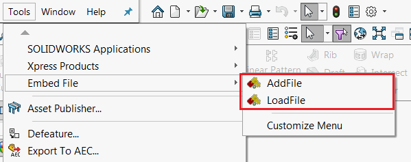
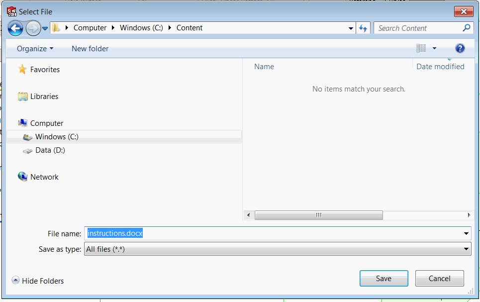

This example demonstrates how to use third-party storage in the SOLIDWORKS API to directly embed and extract file content into a model stream.

The example SOLIDWORKS add-in is built using the [SwEx.AddIn](/docs/codestack/labs/solidworks/swex/add-in/) framework, but it can also be used with other methods of creating add-ins.

The add-in adds two buttons in the menu and toolbar and provides two corresponding handlers:

{ width=400 }

* AddFile - An asynchronous method for storing embedded file data into a stream. This method prompts the user to select a file, reads its content, and serializes it into a file stream.
* LoadFile - Loads the embedded file from the stream and prompts the user to select a file path to store the content. The file name is pre-filled based on the embedded file name.

{ width=550 }

## Instructions

* Open any model (the model must be saved to disk).
* Click the "AddFile" button. A file browse dialog will appear. Select any file. The file data will be serialized into the model and a message box will be displayed.
* You can close the model and SOLIDWORKS.
* Reopen the model and click "LoadFile". The file data will be deserialized from the model and a "Save As" dialog will be displayed (pre-filled based on the embedded file name). The file will be saved to the selected location.

**EmbedFileAddIn.vb**

```vb
Imports System.IO
Imports System.Runtime.InteropServices
Imports System.Windows.Forms
Imports CodeStack.SwEx.AddIn
Imports CodeStack.SwEx.AddIn.Attributes
Imports SolidWorks.Interop.swconst

<ComVisible(True), Guid("E54E85ED-B8AE-434D-B616-7D691527A429")>
<AutoRegister("EmbedFileAddIn", "Sample Demonstrating use of 3rd party store")>
Partial Public Class EmbedFile
    Inherits SwAddInEx

    Private Const STREAM_NAME As String = "CodeStack.EmbedFile"

    <CodeStack.SwEx.Common.Attributes.Title("Embed File")>
    Public Enum Commands_e
        AddFile
        LoadFile
    End Enum

    Public Overrides Function OnConnect() As Boolean
        AddCommandGroup(Of Commands_e)(AddressOf OnButtonClick)
        Return True
    End Function

    Private Async Sub OnButtonClick(ByVal cmd As Commands_e)
        Select Case cmd
            Case Commands_e.AddFile
                Await SaveFile()
            Case Commands_e.LoadFile
                LoadFile()
        End Select
    End Sub

    Private Async Function SaveFile() As Task

        Try
            Dim fileToSave As String = BrowseFile(True)

            If Not String.IsNullOrEmpty(fileToSave) Then

                Dim embedData As New EmbedFileData()
                embedData.FileName = Path.GetFileName(fileToSave)
                embedData.Content = File.ReadAllBytes(fileToSave)

                Await SaveDataToDocument(App.IActiveDoc2, embedData)
                App.SendMsgToUser2("Data saved", swMessageBoxIcon_e.swMbInformation, swMessageBoxBtn_e.swMbOk)

            End If
        Catch ex As Exception
            App.SendMsgToUser2(ex.Message, swMessageBoxIcon_e.swMbStop, swMessageBoxBtn_e.swMbOk)
        End Try

    End Function

    Private Sub LoadFile()

        Try
            Dim embedData = ReadDataFromDocument(App.IActiveDoc2)

            Dim fileToSave As String = BrowseFile(False, embedData.FileName)

            If Not String.IsNullOrEmpty(fileToSave) Then
                File.WriteAllBytes(fileToSave, embedData.Content)
            End If

        Catch ex As Exception
            App.SendMsgToUser2(ex.Message, swMessageBoxIcon_e.swMbStop, swMessageBoxBtn_e.swMbOk)
        End Try

    End Sub

    Function BrowseFile(isOpen As Boolean, Optional fileName As String = "") As String

        Dim fileDlg As FileDialog

        If isOpen Then
            fileDlg = New OpenFileDialog()
        Else
            fileDlg = New SaveFileDialog()
        End If

        fileDlg.Title = "Select File"
        fileDlg.Filter = "All files (*.*)|*.*"
        fileDlg.FileName = fileName

        If fileDlg.ShowDialog() = DialogResult.OK Then
            Return fileDlg.FileName
        Else
            Return ""
        End If

    End Function

End Class

```


The structure used for serialization contains the content and file name of the file.

**EmbedFileData.vb**

```vb
Public Class EmbedFileData
    Public Property FileName As String
    Public Property Content As Byte()
End Class

```


To simplify the operation, the [ComStream](https://docs.microsoft.com/en-us/windows/desktop/api/objidl/nn-objidl-istream) COM stream is wrapped into the [System.IO.Stream](https://docs.microsoft.com/en-us/dotnet/api/system.io.stream?view=netframework-4.7.2) type.

**ComStream.vb**

```vb
Imports System.IO
Imports System.Runtime.InteropServices
Imports System.Runtime.InteropServices.ComTypes

Public Class ComStream
    Inherits Stream

    Private ReadOnly m_ComStream As IStream
    Private ReadOnly m_Commit As Boolean
    Private m_IsWritable As Boolean

    Public Sub New(ByRef comStream As IStream, writable As Boolean, Optional commit As Boolean = True)

        If comStream Is Nothing Then
            Throw New ArgumentNullException(NameOf(comStream))
        End If

        m_ComStream = comStream
        m_IsWritable = writable
        m_Commit = commit

    End Sub

    Public Overrides ReadOnly Property CanRead() As Boolean
        Get
            Return True
        End Get
    End Property

    Public Overrides ReadOnly Property CanSeek() As Boolean
        Get
            Return True
        End Get
    End Property

    Public Overrides ReadOnly Property CanWrite() As Boolean
        Get
            Return m_IsWritable
        End Get
    End Property

    Public Overrides ReadOnly Property Length As Long
        Get
            Const STATSFLAG_NONAME As Integer = 1

            Dim stats As ComTypes.STATSTG = Nothing
            m_ComStream.Stat(stats, STATSFLAG_NONAME)

            Return stats.cbSize
        End Get
    End Property

    Public Overrides Property Position() As Long
        Get
            Return Seek(0, SeekOrigin.Current)
        End Get
        Set(ByVal Value As Long)
            Seek(Value, SeekOrigin.Begin)
        End Set
    End Property

    Public Overrides Sub Flush()
        If m_Commit Then
            Const STGC_DEFAULT As Integer = 0
            m_ComStream.Commit(STGC_DEFAULT)
        End If
    End Sub

    Public Overrides Sub SetLength(ByVal Value As Long)
        m_ComStream.SetSize(Value)
    End Sub

    Public Overrides Sub Write(buffer() As Byte, offset As Integer, count As Integer)
        If offset <> 0 Then
            Dim bufferSize As Integer
            bufferSize = buffer.Length - offset
            Dim tmpBuffer(bufferSize) As Byte
            Array.Copy(buffer, offset, tmpBuffer, 0, bufferSize)
            m_ComStream.Write(tmpBuffer, bufferSize, Nothing)
        Else
            m_ComStream.Write(buffer, count, Nothing)
        End If
    End Sub

    Public Overrides Function Read(buffer() As Byte, offset As Integer, count As Integer) As Integer

        Dim bytesRead As Integer = 0
        Dim boxBytesRead As Object = bytesRead
        Dim hObject As GCHandle

        Try
            hObject = GCHandle.Alloc(boxBytesRead, GCHandleType.Pinned)
            Dim pBytesRead As IntPtr = hObject.AddrOfPinnedObject()

            If offset <> 0 Then
                Dim tmpBuffer(count - 1) As Byte
                m_ComStream.Read(tmpBuffer, count, pBytesRead)
                bytesRead = CInt(boxBytesRead)
                Array.Copy(tmpBuffer, 0, buffer, offset, bytesRead)
            Else
                m_ComStream.Read(buffer, count, pBytesRead)
                bytesRead = CInt(boxBytesRead)
            End If

        Finally
            If hObject.IsAllocated Then
                hObject.Free()
            End If
        End Try

        Return bytesRead

    End Function

    Public Overrides Function Seek(offset As Long, origin As SeekOrigin) As Long

        Dim curPosition As Long = 0
        Dim boxCurPosition As Object = curPosition
        Dim hObject As GCHandle

        Try
            hObject = GCHandle.Alloc(boxCurPosition, GCHandleType.Pinned)
            Dim pCurPosition As IntPtr = hObject.AddrOfPinnedObject()

            m_ComStream.Seek(offset, origin, pCurPosition)
            curPosition = CLng(boxCurPosition)
        Finally
            If hObject.IsAllocated Then
                hObject.Free()
            End If
        End Try

        Return curPosition
    End Function

    Protected Overrides Sub Dispose(ByVal disposing As Boolean)
        Try
            If disposing Then
                m_IsWritable = False
            End If
        Finally
            MyBase.Dispose(disposing)
        End Try
    End Sub

    Protected Overrides Sub Finalize()
        Dispose(False)
    End Sub

End Class

```


Serialization and deserialization are performed using the [XmlSerializer](https://docs.microsoft.com/en-us/dotnet/api/system.xml.serialization.xmlserializer?view=netframework-4.7.2) class, but other serialization methods can also be used.

**EmbedFile.vb**

```vb
Imports System.Runtime.InteropServices.ComTypes
Imports System.Xml.Serialization
Imports SolidWorks.Interop.sldworks
Imports SolidWorks.Interop.swconst

Partial Public Class EmbedFile
    Public Class ThirdPartyStreamNotFoundException
        Inherits Exception
    End Class

    Private Async Function SaveDataToDocument(ByVal model As IModelDoc2, ByVal data As EmbedFileData) As Task

        Dim err As Integer = -1
        Dim warn As Integer = -1
        model.SetSaveFlag()
        Const S_OK As Integer = 0
        Dim result As Boolean? = Nothing
        Dim onSaveToStorageNotifyFunc = Function()
                                            Try
                                                StoreData(model, data, STREAM_NAME)
                                                result = True
                                            Catch
                                                result = False
                                            End Try

                                            Return S_OK
                                        End Function

        Select Case CType(model.[GetType](), swDocumentTypes_e)
            Case swDocumentTypes_e.swDocPART
                AddHandler TryCast(model, PartDoc).SaveToStorageNotify, onSaveToStorageNotifyFunc
            Case swDocumentTypes_e.swDocASSEMBLY
                AddHandler TryCast(model, AssemblyDoc).SaveToStorageNotify, onSaveToStorageNotifyFunc
            Case swDocumentTypes_e.swDocDRAWING
                AddHandler TryCast(model, DrawingDoc).SaveToStorageNotify, onSaveToStorageNotifyFunc
        End Select

        If Not model.Save3(CInt(swSaveAsOptions_e.swSaveAsOptions_Silent), err, warn) Then
            Throw New InvalidOperationException($"Failed to save the model: {CType(err, swFileSaveError_e)}")
        End If

        Await Task.Run(Sub()
                           While Not result.HasValue
                               Threading.Thread.Sleep(10)
                           End While
                       End Sub)

        Select Case CType(model.GetType(), swDocumentTypes_e)
            Case swDocumentTypes_e.swDocPART
                RemoveHandler TryCast(model, PartDoc).SaveToStorageNotify, onSaveToStorageNotifyFunc
            Case swDocumentTypes_e.swDocASSEMBLY
                RemoveHandler TryCast(model, AssemblyDoc).SaveToStorageNotify, onSaveToStorageNotifyFunc
            Case swDocumentTypes_e.swDocDRAWING
                RemoveHandler TryCast(model, DrawingDoc).SaveToStorageNotify, onSaveToStorageNotifyFunc
        End Select

        If Not result.Value Then
            Throw New Exception("Failed to store the data")
        End If
    End Function

    Private Function ReadDataFromDocument(ByVal model As IModelDoc2) As EmbedFileData
        Return ReadData(Of EmbedFileData)(model, STREAM_NAME)
    End Function

    Private Sub StoreData(Of T)(ByVal model As IModelDoc2, ByVal data As T, ByVal streamName As String)
        Try
            Dim stream = TryCast(model.IGet3rdPartyStorage(streamName, True), IStream)

            Using comStr = New ComStream(stream, True, False)
                comStr.Seek(0, IO.SeekOrigin.Begin)
                Dim ser = New XmlSerializer(GetType(T))
                ser.Serialize(comStr, data)
            End Using

        Catch
            Throw
        Finally
            model.IRelease3rdPartyStorage(streamName)
        End Try
    End Sub

    Private Function ReadData(Of T)(ByVal model As IModelDoc2, ByVal streamName As String) As T
        Try
            Dim stream = TryCast(model.IGet3rdPartyStorage(streamName, False), IStream)

            If stream IsNot Nothing Then

                Using comStr = New ComStream(stream, False)
                    comStr.Seek(0, IO.SeekOrigin.Begin)
                    Dim ser = New XmlSerializer(GetType(T))
                    Return CType(ser.Deserialize(comStr), T)
                End Using
            Else
                Throw New ThirdPartyStreamNotFoundException()
            End If

        Catch
            Throw
        Finally
            model.IRelease3rdPartyStorage(streamName)
        End Try
    End Function

End Class

```