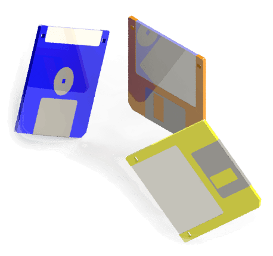

{ width=250 }

This section contains guides and examples for deploying SOLIDWORKS add-ins, macros, and standalone applications to user machines.

Deployment can be done manually using the [manual method](manual). In this case, all binary files and registration processes need to be done manually or through command-line scripts.

Deployment using an [MSI installer](installer) provides a better user experience as customers will be guided through the installation process. Additionally, the upgrade and uninstallation processes are controlled by the Windows Control Panel.