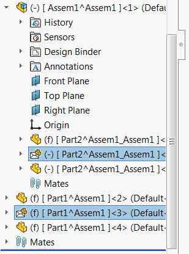

 该宏使用SOLIDWORKS API来扩展SOLIDWORKS装配中“高级选择”工具中可用的选择条件列表。
image: filtered-components-selection.png
labels: [选择, 固定, 包络]
---
{ width=250 }

该宏使用SOLIDWORKS API来扩展SOLIDWORKS装配中“高级选择”工具中可用的选择条件列表。

该宏允许选择以下组件（或组合）：

* Float - 未完全约束的组件（其名称中带有减号（-）的组件）
* ExcludedFromBom - 从BOM中排除的组件（包括包络组件）
* Envelope - 标记为包络的组件
* NoMates - 不包含任何装配关系的组件

要配置该宏，请修改宏的开头处的*CRITERIA*和*TOP_LEVEL_ONLY*常量。

~~~ vb
Const CRITERIA As Integer = Criteria_e.Float + Criteria_e.NoMates
Const TOP_LEVEL_ONLY As Boolean = False
~~~

*TOP_LEVEL_ONLY*指示是否仅使用顶层组件进行过滤。将此选项设置为*True*以选择嵌套组件。

~~~ vb
Const TOP_LEVEL_ONLY As Boolean = True
~~~

*CRITERIA*是一组过滤器的组合，其中应用*Or*运算符。

例如：

~~~ vb
Const CRITERIA As Integer = Criteria_e.Float + Criteria_e.NoMates '将选择所有浮动组件或没有装配关系的组件
~~~

~~~ vb
Const CRITERIA As Integer = Criteria_e.Envelope '将选择仅包络组件
~~~

根据需要修改宏中的过滤器。

~~~ vb
Enum Criteria_e
    Float = 1
    ExcludedFromBom = 2
    Envelope = 4
    NoMates = 8
End Enum

Const CRITERIA As Integer = Criteria_e.Float + Criteria_e.NoMates
Const TOP_LEVEL_ONLY As Boolean = False

Dim swApp As SldWorks.SldWorks

Sub main()

    Set swApp = Application.SldWorks
    
    Dim swAssy As SldWorks.AssemblyDoc
    
    Set swAssy = swApp.ActiveDoc
    
    If Not swAssy Is Nothing Then
    
        SelectComponents swAssy, CRITERIA, TOP_LEVEL_ONLY
    
    Else
        MsgBox "请打开装配体"
    End If
    
    Dim val As Criteria_e
    val = Envelope + ExcludedFromBom + Float
    
    Debug.Print (val And Envelope) = Envelope
    Debug.Print (val And ExcludedFromBom) = ExcludedFromBom
    Debug.Print (val And Float) = Float
    
End Sub

Function SelectComponents(assy As SldWorks.AssemblyDoc, crit As Criteria_e, topLevelOnly As Boolean)
    
    Dim vComps As Variant
    vComps = assy.GetComponents(topLevelOnly)
    
    Dim swFilteredComps() As SldWorks.Component2
    Dim isArrInit As Boolean
    isArrInit = False
    
    Dim i As Integer
    
    For i = 0 To UBound(vComps)
        
        Dim swComp As SldWorks.Component2
        Set swComp = vComps(i)
        
        Debug.Print swComp.Name2
        
        Dim isFiltered As Boolean
        isFiltered = False
        
        If IsFlagSet(crit, Criteria_e.Float) And swComp.GetConstrainedStatus() <> swConstrainedStatus_e.swFullyConstrained Then
            isFiltered = True
        ElseIf IsFlagSet(crit, Criteria_e.ExcludedFromBom) And swComp.ExcludeFromBOM Then
            isFiltered = True
        ElseIf IsFlagSet(crit, Criteria_e.Envelope) And swComp.IsEnvelope() Then
            isFiltered = True
        ElseIf IsFlagSet(crit, Criteria_e.NoMates) And IsEmpty(swComp.GetMates()) Then
            isFiltered = True
        End If
        
        If True = isFiltered Then
            If False = isArrInit Then
                isArrInit = True
                ReDim swFilteredComps(0)
            Else
                ReDim Preserve swFilteredComps(UBound(swFilteredComps) + 1)
            End If
            
            Set swFilteredComps(UBound(swFilteredComps)) = swComp
            
        End If
        
    Next
    
    If True = isArrInit Then
        Dim swModel As SldWorks.ModelDoc2
        Set swModel = assy
        If UBound(swFilteredComps) + 1 <> swModel.Extension.MultiSelect2(swFilteredComps, False, Nothing) Then
            Err.Raise vbError, , "选择组件失败"
        End If
    End If
    
End Function

Function IsFlagSet(val As Criteria_e, flag As Criteria_e) As Boolean
    IsFlagSet = (val And flag) = flag
End Function
~~~