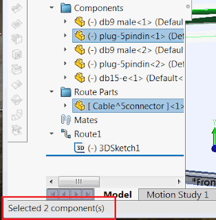

这个宏使用SOLIDWORKS API来计算在装配体中选择的所有唯一组件的数量。组件可以在特征管理树或图形区域中选择。

如果只选择了组件的实体（例如面或边），宏也会计算组件的数量，使用的是[ISelectionMgr](https://help.solidworks.com/2018/english/api/sldworksapi/SolidWorks.Interop.sldworks~SolidWorks.Interop.sldworks.ISelectionMgr.html) SOLIDWORKS API接口。

{ width=320 }

~~~ vb
Dim swApp As SldWorks.SldWorks
Dim swAssy As SldWorks.AssemblyDoc

Sub main()

    Set swApp = Application.SldWorks
    
    Set swAssy = swApp.ActiveDoc
    
    If Not swAssy Is Nothing Then
            
        Dim swSelMgr As SldWorks.SelectionMgr
        Set swSelMgr = swAssy.SelectionManager
        
        Dim swCompsColl As Collection
        Set swCompsColl = New Collection
        
        Dim i As Integer
        
        For i = 0 To swSelMgr.GetSelectedObjectCount2(-1)
            
            Dim swComp As SldWorks.Component2
            Set swComp = swSelMgr.GetSelectedObjectsComponent2(i)
            
            If Not swComp Is Nothing Then
                If Not Contains(swCompsColl, swComp) Then '只获取唯一的组件
                    swCompsColl.Add swComp
                End If
            End If
            
        Next
        
        Dim swFrame As SldWorks.Frame
        Set swFrame = swApp.Frame
        swFrame.SetStatusBarText "已选择 " & swCompsColl.Count() & " 个组件"
    
    Else
        MsgBox "请打开装配体"
    End If
    
End Sub

Function Contains(coll As Collection, item As Object) As Boolean
    
    Dim i As Integer
    
    For i = 1 To coll.Count
        If coll.item(i) Is item Then
            Contains = True
            Exit Function
        End If
    Next
    
    Contains = False
    
End Function

~~~