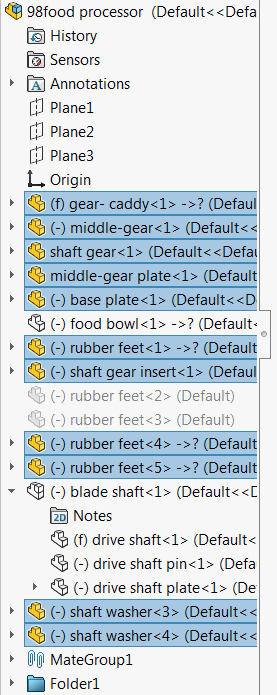

 使用SOLIDWORKS API获取并选择所有可见部件（未抑制和未隐藏）的VBA宏示例
image: components-tree.png
labels: [components,suppressed,hidden,select]
---
{ width=350 }

这个VBA宏获取活动装配中所有可见（未抑制和未隐藏）部件的指针。使用多选SOLIDWORKS API选择所有部件。

~~~ vb
Dim swApp As SldWorks.SldWorks

Sub main()

    Set swApp = Application.SldWorks
    
    Dim swAssy As SldWorks.AssemblyDoc
    
    Set swAssy = swApp.ActiveDoc
    
    If Not swAssy Is Nothing Then
        Dim vComps As Variant
        vComps = GetVisibleComponents(swAssy, False)
        swAssy.Extension.MultiSelect2 vComps, False, Nothing
    Else
        MsgBox "请打开装配文档"
    End If
    
End Sub

Function GetVisibleComponents(assy As SldWorks.AssemblyDoc, topLevelOnly As Boolean) As Variant
    
    Dim swVisComps() As SldWorks.Component2
    Dim isInit As Boolean
    isInit = False
    
    Dim vComps As Variant
    vComps = assy.GetComponents(topLevelOnly)
    
    Dim i As Integer
    
    For i = 0 To UBound(vComps)
        
        Dim swComp As SldWorks.Component2
        Set swComp = vComps(i)
        
        If False = swComp.IsSuppressed() And IsVisible(swComp) Then
            
            If Not isInit Then
                ReDim swVisComps(0)
                isInit = True
            Else
                ReDim Preserve swVisComps(UBound(swVisComps) + 1)
            End If
            
            Set swVisComps(UBound(swVisComps)) = swComp
        
        End If
        
    Next
    
    GetVisibleComponents = swVisComps
    
End Function

Function IsVisible(comp As SldWorks.Component2) As Boolean
    
    Dim swThisComp As SldWorks.Component2
    Set swThisComp = comp
    
    While Not swThisComp Is Nothing
        If swThisComp.Visible = swComponentVisibilityState_e.swComponentHidden Then
            IsVisible = False
            Exit Function
        End If
        Set swThisComp = swThisComp.GetParent
    Wend
    
    IsVisible = True
    
End Function
~~~