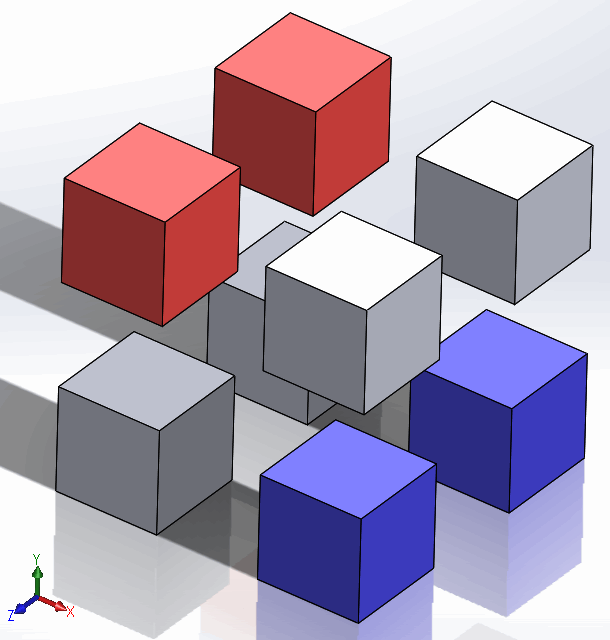

 VBA示例演示了如何使用SOLIDWORKS API批量插入组件并将它们自动定位在3D网格中的方法，通过提供行数、列数和组件之间的距离
image: positioned-components.png
labels: [components,positions]
---
{ width=250 }

本示例演示了使用SOLIDWORKS API将一批组件批量插入装配体并自动将它们定位在3D网格中的高效方法。

组件是使用[SOLIDWORKS API的IAssemblyDoc::AddComponents3](https://help.solidworks.com/2011/English/api/sldworksapi/SolidWorks.Interop.sldworks~SolidWorks.Interop.sldworks.IAssemblyDoc~AddComponents3.html)方法插入的。该方法允许预先分配要插入的组件的变换。

可以通过在宏的开头设置常量来指定网格的边界。

~~~ vb
Const ROWS_COUNT As Integer = 2 '每行（与X轴平行）中的最大组件数
Const COLUMNS_COUNT As Integer = 2 '每列（与Y轴平行）中的最大组件数
Const DISTANCE As Double = 0.1 '行、列和层之间的距离
~~~

通过分配*compsPaths*数组的值来指定要插入的组件列表。支持在不同位置插入相同的组件路径。

~~~ vb
Dim compsPaths(N) As String
    
compsPaths(0) = "部件或装配体的完整路径"
compsPaths(1) = "部件或装配体的完整路径"
...
compsPaths(N) = "部件或装配体的完整路径"
~~~

~~~ vb
Const ROWS_COUNT As Integer = 2
Const COLUMNS_COUNT As Integer = 2
Const DISTANCE As Double = 0.1

Dim swApp As SldWorks.SldWorks

Sub main()

    Set swApp = Application.SldWorks
    
    Dim compsPaths(7) As String
    
    compsPaths(0) = "D:\models\box1.sldprt"
    compsPaths(1) = "D:\models\box2.sldprt"
    compsPaths(2) = "D:\models\box3.sldprt"
    compsPaths(3) = "D:\models\box1.sldprt"
    compsPaths(4) = "D:\models\box1.sldprt"
    compsPaths(5) = "D:\models\box2.sldprt"
    compsPaths(6) = "D:\models\box3.sldprt"
    compsPaths(7) = "D:\models\box1.sldprt"
    
    Dim swAssy As SldWorks.AssemblyDoc
    
    Set swAssy = swApp.ActiveDoc
    
    If Not swAssy Is Nothing Then
        InsertComponents swAssy, compsPaths, ROWS_COUNT, COLUMNS_COUNT, DISTANCE
    Else
        MsgBox "请打开装配体"
    End If
    
End Sub

Sub InsertComponents(assy As SldWorks.AssemblyDoc, vPaths As Variant, rows As Integer, columns As Integer, dist As Double)
    
    Dim transforms() As Double
    ReDim transforms((UBound(vPaths) + 1) * 16 - 1)
    
    Dim coordSys() As String
    ReDim coordSys(UBound(vPaths))
    
    Dim level As Integer
    Dim row As Integer
    Dim column As Integer
    
    Dim i As Integer
    
    For i = 0 To UBound(vPaths)
        
        If row = rows Then
            
            row = 0
            column = column + 1
            
            If column = columns Then
                column = 0
                level = level + 1
            End If
        
        End If
        
        Dim vTransform As Variant
        vTransform = ComposeTransform(row * dist, column * dist, level * dist)
        
        Dim j As Integer
        
        For j = 0 To UBound(vTransform)
            transforms(i * (UBound(vTransform) + 1) + j) = vTransform(j)
        Next
        
        row = row + 1
        
    Next
    
    assy.AddComponents3 vPaths, transforms, coordSys
    
End Sub

Function ComposeTransform(x As Double, y As Double, z As Double) As Variant
    
    Dim dMatrix(15) As Double
    dMatrix(0) = 1: dMatrix(1) = 0: dMatrix(2) = 0: dMatrix(3) = 0
    dMatrix(4) = 1: dMatrix(5) = 0: dMatrix(6) = 0: dMatrix(7) = 0
    dMatrix(8) = 1: dMatrix(9) = x: dMatrix(10) = y: dMatrix(11) = z
    dMatrix(12) = 1: dMatrix(13) = 0: dMatrix(14) = 0: dMatrix(15) = 0
    
    ComposeTransform = dMatrix
    
End Function
~~~