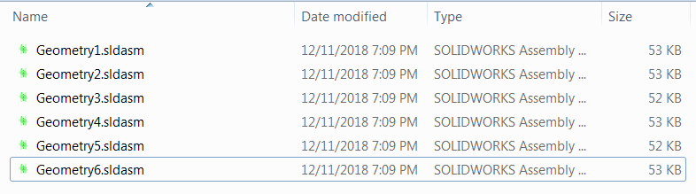

This macro generates the assemblies for each combination of top level components configurations (permutation) using SOLIDWORKS API.

{ width=450 }

Resulting combinations are saved to the external assemblies (one file per combination).

{ width=350 }

## Options
* *OUT_FOLDER* - Full path to output folder where the resulting files need to be saved

~~~ vb
Const OUT_FOLDER As String = "OUTPUT FOLDER PATH"
~~~

* *PERMUTE_ASSEMBLY_CONF* option allows to specify if the configurations of assembly need to be used in permutation or only components

~~~ vb
Const PERMUTE_ASSEMBLY_CONF As Boolean = True 'True to include assembly configurations, false to only include components
~~~

## Notes

* Original states of the components will not be restored as the result of running the macro. It is recommended to open the assembly as read only
* Total number of files equals to {number of configuration of component 1}x{number of configuration of component 2}x...x{number of configuration of component n}

~~~ vb
Const PERMUTE_ASSEMBLY_CONF As Boolean = True
Const OUT_FOLDER As String = "OUTPUT FOLDER PATH"

Dim swApp As SldWorks.SldWorks

Sub main()
       
    Set swApp = Application.SldWorks
    
    Dim swAssy As SldWorks.AssemblyDoc
    Set swAssy = GetActiveAssembly(swApp)
    
    If Not swAssy Is Nothing Then
        
        If swAssy.ResolveAllLightWeightComponents(True) = swComponentResolveStatus_e.swResolveOk Then
        
            PermuteAssembly swAssy, PERMUTE_ASSEMBLY_CONF
            
        Else
            MsgBox "Components must be resolved"
        End If
        
    Else
        MsgBox "Please open assembly"
    End If
    
End Sub

Sub PermuteAssembly(assy As SldWorks.AssemblyDoc, permuteAssemblyConfs As Boolean)
    
    Dim vComps As Variant
    
    If permuteAssemblyConfs Then
        
        Dim vAssyConfs As Variant
        vAssyConfs = assy.GetConfigurationNames()
        Dim i As Integer
        
        For i = 0 To UBound(vAssyConfs)
            assy.ShowConfiguration CStr(vAssyConfs(i))
            vComps = assy.GetComponents(True)
            PermuteComponents assy, vComps
        Next
        
    Else
        vComps = swAssy.GetComponents(True)
        PermuteComponents assy, vComps
    End If
    
End Sub

Sub PermuteComponents(assy As SldWorks.AssemblyDoc, vComps As Variant)
    
    If Not IsEmpty(vComps) And UBound(vComps) > -1 Then
        
        Dim swComp As SldWorks.Component2
        Set swComp = vComps(0)
        
        If Not swComp.IsSuppressed() Then
            
            Dim vNextComps() As SldWorks.Component2
            
            If UBound(vComps) > 0 Then
                ReDim vNextComps(UBound(vComps) - 1)
                Dim k As Integer
                For k = 1 To UBound(vComps)
                    Set vNextComps(k - 1) = vComps(k)
                Next
            End If
        
            Dim swCompModel As SldWorks.ModelDoc2
            Set swCompModel = swComp.GetModelDoc2
            Dim vConfNames As Variant
            vConfNames = swCompModel.GetConfigurationNames
            
            Dim i As Integer
            
            For i = 0 To UBound(vConfNames)
                
                swComp.ReferencedConfiguration = CStr(vConfNames(i))
                PermuteComponents assy, vNextComps
                
            Next
            
        End If
    Else
        assy.EditRebuild
        ExportCurrentAssemblySnapshot assy, OUT_FOLDER
    End If
    
End Sub

Function ExportCurrentAssemblySnapshot(assy As SldWorks.AssemblyDoc, outFolder As String) As Boolean
    
    Dim fso As Object
    Set fso = CreateObject("Scripting.FileSystemObject")

    Dim filePath As String
    Dim index As Integer
    index = 1
    Const EXT As String = ".sldasm"
    
    Do
        filePath = TrimEnd(outFolder, "\") & "\" & TrimEnd(assy.GetTitle(), EXT) & index & EXT
        index = index + 1
    Loop While fso.FileExists(filePath)
    
    Dim swAssyModel As SldWorks.ModelDoc2
    Set swAssyModel = assy
    
    ExportCurrentAssemblySnapshot = swAssyModel.Extension.SaveAs(filePath, swSaveAsVersion_e.swSaveAsCurrentVersion, swSaveAsOptions_e.swSaveAsOptions_Silent + swSaveAsOptions_e.swSaveAsOptions_Copy, Nothing, 0, 0)
    
End Function

Function GetActiveAssembly(app As SldWorks.SldWorks) As SldWorks.AssemblyDoc
    
    On Error Resume Next
    
    Dim swAssy As SldWorks.AssemblyDoc
    Set swAssy = app.ActiveDoc
    
    Set GetActiveAssembly = swAssy
    
End Function

Function TrimEnd(inputText As String, text As String) As String
    
    Dim textLen As Integer
    textLen = Len(text)
    
    If LCase(Right(inputText, textLen)) = LCase(text) Then
        inputText = Left(inputText, Len(inputText) - textLen)
    End If
    
    TrimEnd = inputText
    
End Function
~~~

