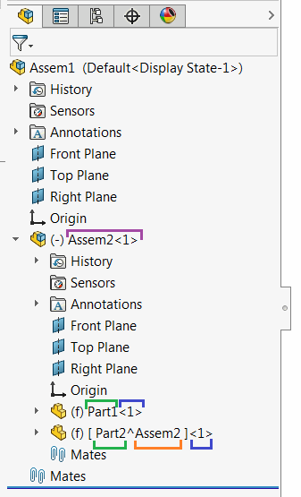

 此代码示例解释了更改组件名称（包括虚拟组件或子装配中的组件）的正确方法。
image: component-name.png
labels: [装配, 组件, 名称]
---
[IComponent2::Name2](https://help.solidworks.com/2012/english/api/sldworksapi/solidworks.interop.sldworks~solidworks.interop.sldworks.icomponent2~name2.html) SOLIDWORKS API属性提供了读取和更改组件名称的访问器。

该函数在设置或获取时返回不同的名称结构。这意味着如果需要使用原始名称重命名组件（即添加后缀或前缀），则需要修改从获取访问器返回的值。

当调用**获取**访问器时，将返回组件的完整名称，而**设置**访问器只需要短名称。

组件的完整名称由以下部分组成：

* 组件名称
* 组件索引（在完整名称中的**-**符号后指定）
* 虚拟组件的上下文名称（在完整名称中的**^**符号后指定）
* 父装配的完整名称（在完整名称中的**/**符号之前指定）

上图中结构中的组件名称将返回如下（图片中的颜色与名称中的零件匹配）：

Assem2-1 *根组件*

Assem2-1/Part1-1 *子装配中的组件*

Assem2-1/Part2^Assem2-1  *子装配中的虚拟组件*

下面的示例使用SOLIDWORKS API通过为其名称添加后缀来重命名任何选定的组件（根级别、子装配中的组件和虚拟组件）。

~~~ vb
Const SUFFIX As String = "_Renamed"

Dim swApp As SldWorks.SldWorks

Sub main()
    
    Set swApp = Application.SldWorks
    
    Dim swModel As SldWorks.ModelDoc2
    Dim swSelMgr As SldWorks.SelectionMgr

    Set swModel = swApp.ActiveDoc
    
    If Not swModel Is Nothing Then
    
        Set swSelMgr = swModel.SelectionManager
        
        Dim swComp As SldWorks.Component2
        
        Set swComp = swSelMgr.GetSelectedObject6(1, -1)
        
        If Not swComp Is Nothing Then
        
            Dim compName As String
            
            compName = swComp.Name2
            
            If Not swComp.GetParent() Is Nothing Then
                '如果不是根组件，则删除子装配的名称
                compName = Right(compName, Len(compName) - InStrRev(compName, "/"))
            End If
            
            If swComp.IsVirtual() Then
                '如果是虚拟组件，则删除上下文装配的名称
                compName = Left(compName, InStr(compName, "^") - 1)
            Else
                '删除索引名称
                compName = Left(compName, InStrRev(compName, "-") - 1)
            End If
            
            Dim newCompName As String
            newCompName = compName & SUFFIX
            
            swComp.Name2 = newCompName
            
        Else
            MsgBox "请选择要重命名的组件"
        End If
    
    Else
        MsgBox "请打开装配文档"
    End If
    
End Sub
~~~