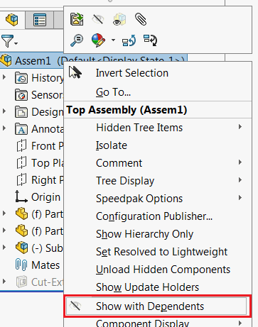

{ width=250 }

该示例演示了如何使用SOLIDWORKS API和Windows API调用“显示依赖项”命令来一次性显示所有组件或装配体。

宏将为所选组件或装配体调用该命令（如果没有选择组件）。

~~~ vb
#If VBA7 Then
     Private Declare PtrSafe Function SendMessage Lib "User32" Alias "SendMessageA" (ByVal hWnd As Long, ByVal wMsg As Long, ByVal wParam As Long, lParam As Any) As Long
#Else
     Private Declare Function SendMessage Lib "User32" Alias "SendMessageA" (ByVal hWnd As Long, ByVal wMsg As Long, ByVal wParam As Long, lParam As Any) As Long
#End If
 
Dim swApp As SldWorks.SldWorks
 
Sub main()
 
     Set swApp = Application.SldWorks
     
     Dim swAssy As SldWorks.AssemblyDoc
     Set swAssy = swApp.ActiveDoc
     
     If Not swAssy Is Nothing Then
     
        Dim swComp As SldWorks.Component2
        Set swComp = swAssy.SelectionManager.GetSelectedObjectsComponent3(1, -1)
        
        If swComp Is Nothing Then
            Set swComp = swAssy.ConfigurationManager.ActiveConfiguration.GetRootComponent3(False)
        End If
        
        ShowWithDependents swComp
        
     Else
        MsgBox "请打开装配体"
     End If
     
 End Sub
 
Sub ShowWithDependents(comp As SldWorks.Component2)
    
    comp.Select4 False, Nothing, False
    
    Const WM_COMMAND As Long = &H111
    Const SHOW_WITH_DEPENDENTS_CMD As Long = 33227
    
    Dim swFrame As SldWorks.Frame
    
    Set swFrame = swApp.Frame
    
    SendMessage swFrame.GetHWnd(), WM_COMMAND, SHOW_WITH_DEPENDENTS_CMD, 0
     
End Sub
~~~