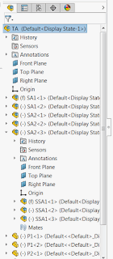

该示例演示了如何使用SOLIDWORKS API遍历装配体中的组件树，并使用指定的缩进符号输出结果。

{ width=150 }

``` vb
Dim swApp As SldWorks.SldWorks
Dim swModel As SldWorks.ModelDoc2

Const INDENT_SYMBOL As String = "    "

Sub main()

    Set swApp = Application.SldWorks
    
    Set swModel = swApp.ActiveDoc
    
    If Not swModel Is Nothing Then

        Dim swRootComp As SldWorks.Component2

        Set swRootComp = swModel.ConfigurationManager.ActiveConfiguration.GetRootComponent
    
        TraverseComponent swRootComp, ""

    Else

        MsgBox "请打开装配体"

    End If
    
End Sub

Sub TraverseComponent(comp As SldWorks.Component2, indent As String)
    
    Dim vChildComps As Variant
    
    vChildComps = comp.GetChildren
    
    Dim i As Integer
    
    For i = 0 To UBound(vChildComps)
    
        Dim swChildComp As SldWorks.Component2
        Set swChildComp = vChildComps(i)
            
        Debug.Print indent & swChildComp.Name2 & " (" & swChildComp.GetPathName() & ")"
        
        TraverseComponent swChildComp, indent & INDENT_SYMBOL
        
    Next
    
End Sub
```
