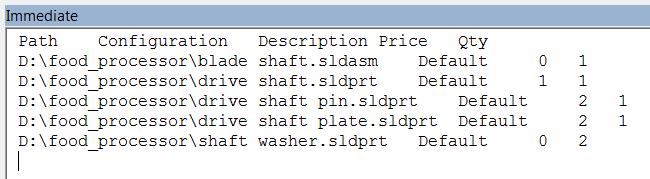

{ width=250 }

该示例演示了如何使用SOLIDWORKS API从装配树中组成平面（仅顶层）BOM表。

BOM位置包括以下列：

* 模型路径
* 模型配置
* 描述（自定义属性）
* 价格（自定义属性）
* 数量（计算得出）

组成的BOM将输出到VBA编辑器的即时窗口中：

{ width=250 }

此宏不需要插入BOM表即可工作。

~~~ vb
Type BomPosition
    ModelPath As String
    Configuration As String
    Quantity As Double
    Description As String
    Price As Double
End Type

Dim swApp As SldWorks.SldWorks

Sub Main()

    Set swApp = Application.SldWorks
    
    Dim swAssy As SldWorks.AssemblyDoc
    
    Set swAssy = swApp.ActiveDoc
    
    If Not swAssy Is Nothing Then
        
        swAssy.ResolveAllLightWeightComponents True

        Dim bom() As BomPosition
        bom = GetFlatBom(swAssy)
        
        Dim i As Integer
        Debug.Print "Path" & vbTab & "Configuration" & vbTab & "Description" & vbTab & "Price" & vbTab & "Qty"
        
        For i = 0 To UBound(bom)
            Debug.Print bom(i).ModelPath & vbTab & bom(i).Configuration & vbTab & bom(i).Description & vbTab & bom(i).Price & vbTab & bom(i).Quantity
        Next
        
    Else
        MsgBox "请打开装配体"
    End If
    
End Sub

Function GetFlatBom(assy As SldWorks.AssemblyDoc) As BomPosition()
    
    Dim bom() As BomPosition
        
    Dim vComps As Variant
    vComps = assy.GetComponents(False)
    
    Dim i As Integer
    
    For i = 0 To UBound(vComps)
        
        Dim swComp As SldWorks.Component2
        Set swComp = vComps(i)
        
        If swComp.GetSuppression() <> swComponentSuppressionState_e.swComponentSuppressed And Not swComp.ExcludeFromBOM Then
            
            Dim bomPos As Integer
            bomPos = FindBomPosition(bom, swComp)
            
            If bomPos = -1 Then
                
                If (Not bom) = -1 Then
                    ReDim bom(0)
                Else
                    ReDim Preserve bom(UBound(bom) + 1)
                End If
                                
                bomPos = UBound(bom)

                bom(bomPos).ModelPath = swComp.GetPathName()
                bom(bomPos).Configuration = swComp.ReferencedConfiguration
                bom(bomPos).Quantity = 1
                
                GetProperties swComp, bom(bomPos).Description, bom(bomPos).Price
                
            Else
                bom(bomPos).Quantity = bom(bomPos).Quantity + 1
            End If
            
        End If
        
    Next
    
    GetFlatBom = bom
    
End Function

Function FindBomPosition(bom() As BomPosition, comp As SldWorks.Component2) As Integer
    
    FindBomPosition = -1
    
    If (Not bom) <> -1 Then
        Dim i As Integer
    
        For i = 0 To UBound(bom)
            If LCase(bom(i).ModelPath) = LCase(comp.GetPathName()) And LCase(bom(i).Configuration) = LCase(comp.ReferencedConfiguration) Then
                FindBomPosition = i
                Exit Function
            End If
        Next
    End If
    
End Function

Sub GetProperties(comp As SldWorks.Component2, ByRef desc As String, ByRef prc As Double)
    
    Dim swCompModel As SldWorks.ModelDoc2
    Set swCompModel = comp.GetModelDoc2()
    
    If swCompModel Is Nothing Then
        Err.Raise vbError, "", "无法从组件中获取模型"
    End If
    
    desc = GetPropertyValue(swCompModel, comp.ReferencedConfiguration, "Description")
        
    Dim prcTxt As String
    prcTxt = GetPropertyValue(swCompModel, comp.ReferencedConfiguration, "Price")
    
    If prcTxt <> "" Then
        prc = CDbl(prcTxt)
    End If
    
End Sub

Function GetPropertyValue(model As SldWorks.ModelDoc2, conf As String, prpName As String) As String
    
    Dim confSpecPrpMgr As SldWorks.CustomPropertyManager
    Dim genPrpMgr As SldWorks.CustomPropertyManager
    
    Set confSpecPrpMgr = model.Extension.CustomPropertyManager(conf)
    Set genPrpMgr = model.Extension.CustomPropertyManager("")
    
    Dim prpVal As String
    Dim prpResVal As String
    
    confSpecPrpMgr.Get3 prpName, False, "", prpVal
    
    If prpVal = "" Then
        genPrpMgr.Get3 prpName, False, prpVal, prpResVal
    End If
    
    GetPropertyValue = prpResVal
    
End Function
~~~