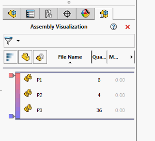

 该示例显示使用SOLIDWORKS API的装配体可视化页面。
image: sw-assembly-visualization.png
labels: [装配体, 示例, solidworks api, 可视化]
redirect-from:
  - /2018/03/solidworks-api-assembly-display-assm-visual-tool.html
---

该示例使用SOLIDWORKS API显示装配体可视化页面的特征树页面。

{ width=320 height=291 }

```vb
Dim swApp As SldWorks.SldWorks

Sub main()

    Set swApp = Application.SldWorks
        
    Dim swAssy As SldWorks.AssemblyDoc
    Set swAssy = TryGetActiveAssembly
    
    If Not swAssy Is Nothing Then
        swApp.RunCommand swCommands_VisualizationTool, ""
    Else
        MsgBox "请打开装配体"
    End If
    
End Sub

Function TryGetActiveAssembly() As SldWorks.AssemblyDoc
    
    Dim swModel As SldWorks.ModelDoc2
    
    Set swModel = swApp.ActiveDoc
    
    If Not swModel Is Nothing Then
        
        If swModel.GetType() = swDocumentTypes_e.swDocASSEMBLY Then
            Set TryGetActiveAssembly = swApp.ActiveDoc
        End If
        
    End If
    
End Function
```

<!---*{Note}*
The `swCommands_VisualizationTool` constant is used to run the command for opening the Assembly Visualization page.
The `TryGetActiveAssembly` function is used to get the active assembly document.
--->