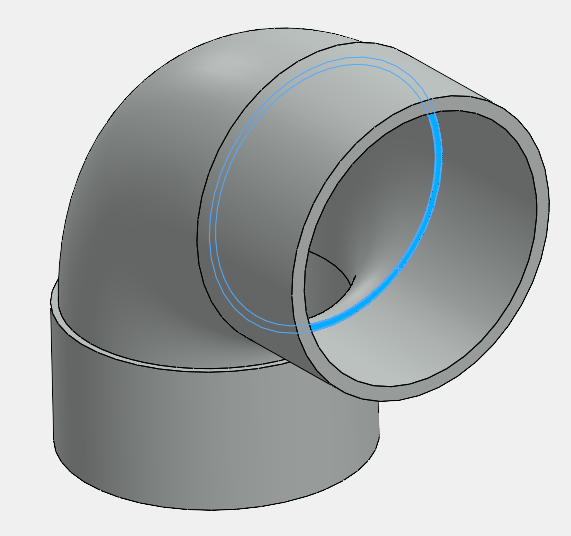
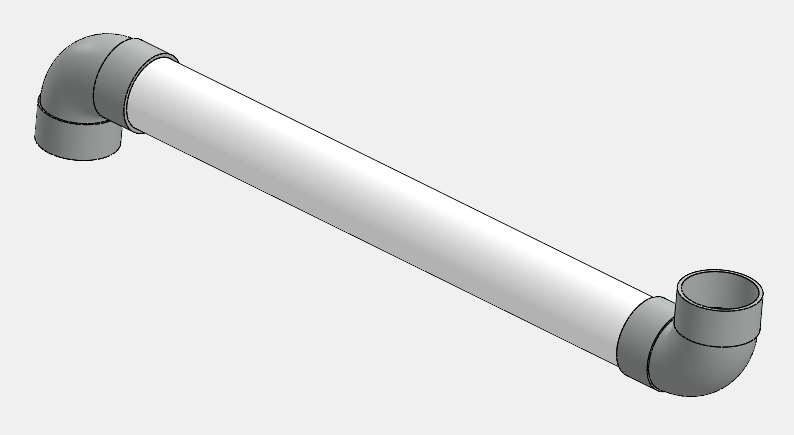

 该VBA宏基于配件的停止面在SOLIDWORKS装配中插入新的虚拟组件
image: pipe.svg
labels: [pipe, fitting, assembly, plumbing]
---

这个VBA宏在两个选定的配件的停止面之间插入新的虚拟组件。

{ width=400 }

停止面必须是平面的，具有2个圆形边缘。两个配件之间的边缘必须同心。

宏将执行以下步骤：

* 基于第一个停止面创建新的虚拟组件。
* 在第一个停止面上创建新的草图。
* 将停止面的两个边缘转换为草图。
* 将草图挤压到第二个停止面。
* 根据**MATERIAL_NAME**变量分配材料。
* 关闭虚拟组件。

{ width=400 }

结果将创建一个具有可调节内外直径和长度的管道。更改配件的位置或尺寸将自动更改管道的几何形状。

~~~ vb
Const MATERIAL_NAME As String = "PVC 0.007 Plasticized"

Dim swApp As SldWorks.SldWorks

Sub main()

    Set swApp = Application.SldWorks
    
    Dim swModel As SldWorks.ModelDoc2
    
    Set swModel = swApp.ActiveDoc
    
    If Not swModel Is Nothing Then
    
        If swModel.GetType() <> swDocumentTypes_e.swDocASSEMBLY Then
            err.Raise vbError, "", "仅支持装配文档"
        End If
        
        Dim swAssy As SldWorks.AssemblyDoc
        
        Set swAssy = swModel
        
        Dim swSelMgr As SldWorks.SelectionMgr
        
        Set swSelMgr = swModel.SelectionManager
        
        Dim swStopFace1 As SldWorks.Entity
        Dim swStopFace2 As SldWorks.Entity
        
        Set swStopFace1 = swSelMgr.GetSelectedObject6(1, -1)
        Set swStopFace2 = swSelMgr.GetSelectedObject6(2, -1)
    
        ValidateFace swStopFace1
        ValidateFace swStopFace2
        
        Dim swComp As SldWorks.Component2
        
        Dim insErr As Long
        insErr = swAssy.InsertNewVirtualPart(swStopFace1, swComp)
        
        If swComp Is Nothing Then
            err.Raise vbError, "", "无法创建虚拟组件。错误代码：" & insErr
        End If
        
        If Not swAssy.GetEditTargetComponent() Is swComp Then
            
            swComp.Select4 False, Nothing, False
            
            Dim info As Long
            swAssy.EditPart2 True, False, info
            
            If info <> swEditPartCommandStatus_e.swEditPartSuccessful Then
                err.Raise vbError, "", "无法编辑零件。错误代码：" & info
            End If
            
        End If
        
        Dim swProfileSketch As SldWorks.Feature
        
        If False <> swStopFace1.Select4(False, Nothing) Then
            
            swModel.SketchManager.InsertSketch True
            swModel.SketchManager.AddToDB = True
            
            Dim vEdges As Variant
            vEdges = swStopFace1.GetEdges
            
            If swModel.Extension.MultiSelect2(vEdges, False, Nothing) <> 2 Then
                err.Raise vbError, "", "无法选择要转换的边缘"
            End If
            
            If False = swModel.SketchManager.SketchUseEdge2(False) Then
                err.Raise vbError, "", "无法转换草图实体"
            End If
            
            Set swProfileSketch = swModel.SketchManager.ActiveSketch
            
            swModel.SketchManager.AddToDB = False
            swModel.SketchManager.InsertSketch True
        Else
            err.Raise vbError, "无法选择第一个停止面"
        End If
        
        swProfileSketch.Select2 False, 0
        swStopFace2.SelectByMark True, 1
        
        Dim swPipeFeat As SldWorks.Feature
        Set swPipeFeat = swModel.FeatureManager.FeatureExtrusion2(True, False, False, swEndConditions_e.swEndCondUpToSurface, 0, 0, 0, False, False, False, False, 0, 0, False, False, False, False, True, True, True, 0, 0, False)
        
        If swPipeFeat Is Nothing Then
            err.Raise vbError, "", "无法创建挤压特征"
        End If
        
        Dim swCompPart As SldWorks.PartDoc
        Set swCompPart = swComp.GetModelDoc2
        
        swCompPart.SetMaterialPropertyName2 "", "", MATERIAL_NAME
        
        swModel.ClearSelection2 True
        swAssy.EditAssembly
        
    Else
        err.Raise vbError, "", "打开装配文档"
    End If
    
End Sub

Sub ValidateFace(face As SldWorks.Face2)
    
    If Not face Is Nothing Then
        
        Dim swSurf As SldWorks.Surface
        Set swSurf = face.GetSurface()
        
        If False = swSurf.IsPlane() Then
            err.Raise vbError, "", "仅支持平面面"
        End If
        
        Dim vEdges As Variant
        vEdges = face.GetEdges
        
        If Not UBound(vEdges) = 1 Then
            err.Raise vbError, "", "面必须包含2个圆形边缘"
        End If
        
        Dim swEdge As SldWorks.Edge
        Dim swCurve As SldWorks.Curve
        
        Set swEdge = vEdges(0)
        Set swCurve = swEdge.GetCurve
        
        If False = swCurve.IsCircle() Then
            err.Raise vberr, "", "仅支持圆形边缘"
        End If
        
        Set swEdge = vEdges(1)
        Set swCurve = swEdge.GetCurve
        
        If False = swCurve.IsCircle() Then
            err.Raise vberr, "", "仅支持圆形边缘"
        End If
        
    Else
        err.Raise vbError, "", "请选择2个停止面"
    End If

End Sub
~~~