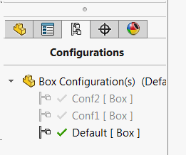

此VBA宏允许查看SOLIDWORKS零件或装配中的所有配置以及绘图文档中的所有工作表。

宏将逐个激活每个工作表或配置，并在激活下一个配置之前等待指定的秒数。

通过更改*WAIT_TIME*常量的值来指定激活下一个配置之前等待的时间（以秒为单位）。

~~~vb
Const WAIT_TIME As Single = 10 ' 在激活下一个配置或工作表之前等待10秒
~~~

主窗口不会被阻塞，因此可以在图形视图中操作模型。

~~~ vb
Const WAIT_TIME As Single = 5

Dim swApp As SldWorks.SldWorks

Sub main()

    Set swApp = Application.SldWorks
    
    Dim swModel As SldWorks.ModelDoc2
    
    Set swModel = swApp.ActiveDoc
    
    If Not swModel Is Nothing Then
        
        If swModel.GetType() <> swDocumentTypes_e.swDocDRAWING Then
            ReviewConfigurations swModel, WAIT_TIME
        Else
            ReviewDrawingSheets swModel, WAIT_TIME
        End If
        
        MsgBox "Review Completed"
        
    Else
        MsgBox "Please open model"
    End If
    
End Sub

Sub ReviewConfigurations(model As SldWorks.ModelDoc2, waitTime As Single)
    
    Dim vConfNames As Variant
    vConfNames = model.GetConfigurationNames()
    
    Dim curConfName As String
    curConfName = model.ConfigurationManager.ActiveConfiguration.Name
    
    Dim i As Integer
    
    For i = 0 To UBound(vConfNames)
        model.ShowConfiguration2 CStr(vConfNames(i))
        SleepAsync waitTime
    Next
    
    model.ShowConfiguration2 curConfName
    
End Sub

Sub ReviewDrawingSheets(draw As SldWorks.DrawingDoc, waitTime As Single)

    Dim vSheetNames As Variant
    vSheetNames = draw.GetSheetNames
    
    Dim curSheetName As String
    curSheetName = draw.GetCurrentSheet().Name
    
    Dim i As Integer
    
    For i = 0 To UBound(vSheetNames)
        draw.ActivateSheet CStr(vSheetNames(i))
        SleepAsync waitTime
    Next
    
    draw.ActivateSheet curSheetName
    
End Sub

Sub SleepAsync(sec As Single)
    
    Dim startTime As Single
    startTime = Timer
    
    While Timer() - startTime < sec
        DoEvents
    Wend
    
End Sub
~~~