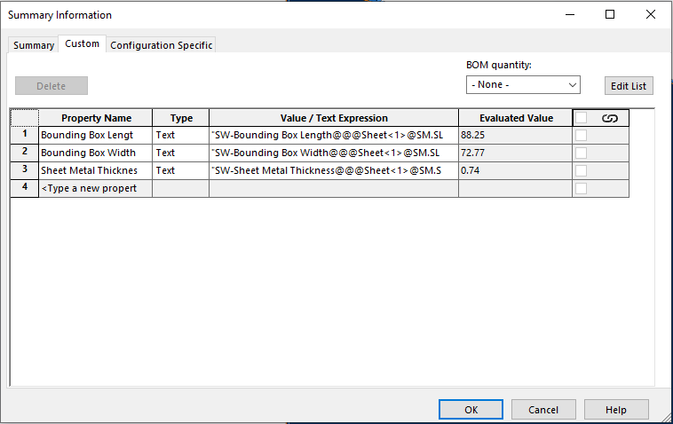

这个VBA宏将指定或所有SOLIDWORKS切割清单项的自定义属性复制到模型或配置。

将复制第一个找到的切割清单的属性。

~~~ vb
Const CONF_SPEC_PRP As Boolean = False
Const COPY_RES_VAL As Boolean = True

Dim PROPERTIES As Variant

Dim swApp As SldWorks.SldWorks

Sub Init(Optional dummy As Variant = Empty)
    PROPERTIES = Array("Bounding Box Length", "Bounding Box Width", "Sheet Metal Thickness") '要复制的自定义属性列表，或者为空以复制所有属性
End Sub

Sub main()
    
try_:
    
    On Error GoTo catch_
    
    Init
    
    Set swApp = Application.SldWorks
    
    Dim swModel As SldWorks.ModelDoc2
    Set swModel = swApp.ActiveDoc
    
    Dim swCutListPrpMgr As SldWorks.CustomPropertyManager
    Set swCutListPrpMgr = GetCutListPropertyManager(swModel)
    
    If Not swCutListPrpMgr Is Nothing Then
        
        Dim swTargetPrpMgr As SldWorks.CustomPropertyManager
        
        If CONF_SPEC_PRP Then
            Set swTargetPrpMgr = swModel.ConfigurationManager.ActiveConfiguration.CustomPropertyManager
        Else
            Set swTargetPrpMgr = swModel.Extension.CustomPropertyManager("")
        End If
        
        CopyProperties swCutListPrpMgr, swTargetPrpMgr, PROPERTIES
        
    Else
        Err.Raise vbError, "", "未找到切割清单"
    End If
    
    GoTo finally_
    
catch_:
    swApp.SendMsgToUser2 Err.Description, swMessageBoxIcon_e.swMbStop, swMessageBoxBtn_e.swMbOk
finally_:

End Sub

Function GetCutListPropertyManager(model As SldWorks.ModelDoc2) As SldWorks.CustomPropertyManager

    Dim swFeat As SldWorks.Feature
    
    Set swFeat = model.FirstFeature
    
    While Not swFeat Is Nothing
        
        If swFeat.GetTypeName2() = "CutListFolder" Then
            Set GetCutListPropertyManager = swFeat.CustomPropertyManager
            Exit Function
        End If

        Set swFeat = swFeat.GetNextFeature
        
    Wend
    
End Function

Sub CopyProperties(srcPrpMgr As SldWorks.CustomPropertyManager, targPrpMgr As SldWorks.CustomPropertyManager, vPrpNames As Variant)

    If IsEmpty(vPrpNames) Then
        vPrpNames = srcPrpMgr.GetNames()
    End If
    
    If Not IsEmpty(vPrpNames) Then
    
        For i = 0 To UBound(vPrpNames)
                        
            prpName = vPrpNames(i)

            Dim prpVal As String
            Dim prpResVal As String
                        
            srcPrpMgr.Get5 prpName, False, prpVal, prpResVal, False
            
            Dim targVal As String
            targVal = IIf(COPY_RES_VAL, prpResVal, prpVal)
            
            targPrpMgr.Add2 prpName, swCustomInfoType_e.swCustomInfoText, targVal
            targPrpMgr.Set prpName, targVal
            
        Next
        
    Else
        Err.Raise vbError, "", "没有要复制的属性"
    End If
    
End Sub
~~~

## 配置

可以通过更改常量来配置宏

### 属性范围

*CONF_SPEC_PRP* 常量设置目标属性的范围。

* True：将属性复制到配置特定选项卡
* False：复制到自定义选项卡

### 属性来源

*COPY_RES_VAL* 常量设置属性来源

* True：复制解析值
    
 { width=500 }

* False：复制表达式

 { width=500 }

### 属性列表

*PROPERTIES* 数组包含要复制的属性列表
    
复制指定的属性

~~~ vb
Sub Init(Optional dummy As Variant = Empty)
    PROPERTIES = Array("Prp1", "Prp2", "Prp3") '复制 Prp1, Prp2, Prp3
End Sub
~~~

复制所有属性

~~~ vb
Sub Init(Optional dummy As Variant = Empty)
    PROPERTIES = Empty
End Sub
~~~