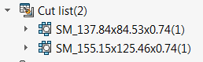
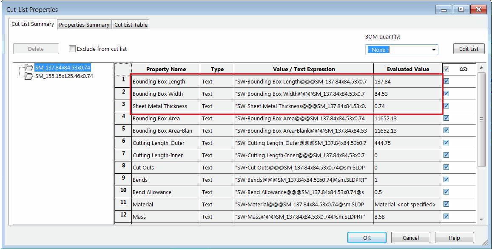

 使用SOLIDWORKS API根据自定义属性为焊接件和钣金零件重命名所有切割列表特征的VBA宏
image: cut-list-table.svg
labels: [切割列表,钣金,焊接件,重命名]
group: 切割列表
---
{ width=250 }

此VBA宏允许根据名称模板重命名焊接件和钣金零件的所有切割列表特征，名称模板可以包含文件和切割列表自定义属性的值、文件名、配置名和自由文本。

{ width=550 }

要配置宏，请修改*NAME_TEMPLATE*、*INDEX_FORMAT*和*ALWAYS_ADD_INDEX*常量的值。

*NAME_TEMPLATE*可以包含自由文本和占位符，占位符将被相应的自定义属性值动态替换。

支持以下占位符：

* <\_FileName\_> - 零件文件的名称（不包括扩展名），切割列表所在的文件
* <\_ConfName\_> - 零件文件的活动配置的名称
* <$CLPRP:[属性名]> - 任何切割列表属性的名称，用于读取值，例如<$CLPRP:Thickness>将被替换为切割列表自定义属性Thickness的值
* <$PRP:[属性名]> - 零件的任何自定义属性的名称，用于读取值，例如<$PRP:PartNo>将被替换为切割列表自定义属性PartNo的值

占位符将在运行时为每个切割列表解析。

*INDEX_FORMAT*常量允许指定特征名称的索引填充。默认情况下，解析为相同值的特征名称将具有第二个特征的索引，依此类推，除非将*ALWAYS_ADD_INDEX*常量设置为true。在这种情况下，第一个特征也将具有索引。

例如，以下设置（如果零件PartNo等于ABC）将将切割列表特征解析为*ABC_001*、*ABC_002*、*ABC_003*等。

~~~ vb
Const NAME_TEMPLATE = "<$PRP:PartNo>_"
Const INDEX_FORMAT As String = "000"
Const ALWAYS_ADD_INDEX As Boolean = True
~~~

观看[视频演示](https://youtu.be/jsjN8zNRTuc?t=200)

~~~ vb
Const NAME_TEMPLATE = "<_FileName_>_<$CLPRP:Description>_<$PRP:PartNo>"
Const INDEX_FORMAT As String = "0"
Const ALWAYS_ADD_INDEX As Boolean = False

Dim swApp As SldWorks.SldWorks

Sub main()

try_:
    On Error GoTo catch_
        
    Set swApp = Application.SldWorks
    
    Dim swModel As SldWorks.ModelDoc2
    
    Set swModel = swApp.ActiveDoc
    
    If Not swModel Is Nothing Then
        
        Dim vCutLists As Variant
        vCutLists = GetCutLists(swModel)
        
        Dim i As Integer
        
        For i = 0 To UBound(vCutLists)
            
            Dim swCutListFeat As SldWorks.Feature
            Set swCutListFeat = vCutLists(i)
            
            Dim featBaseName As String
            
            featBaseName = ComposeFeatureName(NAME_TEMPLATE, swModel, swCutListFeat)
            
            Dim featName As String
            featName = ResolveFeatureName(swModel, featBaseName)
            
            If featName <> "" Then
                If swCutListFeat.Name <> featName Then
                    swCutListFeat.Name = featName
                End If
            Else
                Debug.Print "Empty name for " & swCutListFeat.Name
            End If
        Next
        
    Else
        MsgBox "Please open the document"
    End If
    
    GoTo finally_

catch_:
    swApp.SendMsgToUser2 Err.Description, swMessageBoxIcon_e.swMbStop, swMessageBoxBtn_e.swMbOk
finally_:

End Sub

Function ResolveFeatureName(model As ModelDoc2, baseName As String) As String
    
    Dim featName As String
    
    If baseName <> "" Then
                
        Dim index As Integer
        
        If ALWAYS_ADD_INDEX Then
            index = 1
            featName = baseName + Format$(index, INDEX_FORMAT)
        Else
            index = 0
            featName = baseName
        End If
        
        While model.FeatureManager.IsNameUsed(swNameType_e.swFeatureName, featName)
            index = index + 1
            featName = baseName + Format$(index, INDEX_FORMAT)
        Wend
        
    Else
        featName = ""
    End If
    
    ResolveFeatureName = featName
    
End Function

Function GetCutLists(model As SldWorks.ModelDoc2) As Variant
    
    GetCutLists = GetFeaturesByType(model, "CutListFolder")

End Function

Function GetFeaturesByType(model As SldWorks.ModelDoc2, typeName As String) As Variant
    
    Dim swFeats() As SldWorks.Feature
    
    Dim swFeat As SldWorks.Feature
    
    Set swFeat = model.FirstFeature
    
    Do While Not swFeat Is Nothing
        
        ProcessFeature swFeat, swFeats, typeName

        Set swFeat = swFeat.GetNextFeature
        
    Loop
    
    If (Not swFeats) = -1 Then
        GetFeaturesByType = Empty
    Else
        GetFeaturesByType = swFeats
    End If
    
End Function

Sub ProcessFeature(thisFeat As SldWorks.Feature, featsArr() As SldWorks.Feature, typeName As String)
    
    If thisFeat.GetTypeName2() = typeName Then
    
        If (Not featsArr) = -1 Then
            ReDim featsArr(0)
            Set featsArr(0) = thisFeat
        Else
            Dim i As Integer
            
            For i = 0 To UBound(featsArr)
                If swApp.IsSame(featsArr(i), thisFeat) = swObjectEquality.swObjectSame Then
                    Exit Sub
                End If
            Next
            
            ReDim Preserve featsArr(UBound(featsArr) + 1)
            Set featsArr(UBound(featsArr)) = thisFeat
        End If
    
    End If
    
    Dim swSubFeat As SldWorks.Feature
    Set swSubFeat = thisFeat.GetFirstSubFeature
        
    While Not swSubFeat Is Nothing
        ProcessFeature swSubFeat, featsArr, typeName
        Set swSubFeat = swSubFeat.GetNextSubFeature
    Wend
        
End Sub

Function ComposeFeatureName(template As String, model As SldWorks.ModelDoc2, cutListFeat As SldWorks.Feature) As String

    Dim regEx As Object
    Set regEx = CreateObject("VBScript.RegExp")
    
    regEx.Global = True
    regEx.IgnoreCase = True
    regEx.Pattern = "<[^>]*>"
    
    Dim regExMatches As Object
    Set regExMatches = regEx.Execute(template)
    
    Dim i As Integer
    
    Dim outFeatName As String
    outFeatName = template
    
    For i = regExMatches.Count - 1 To 0 Step -1
        
        Dim regExMatch As Object
        Set regExMatch = regExMatches.Item(i)
                    
        Dim tokenName As String
        tokenName = Mid(regExMatch.Value, 2, Len(regExMatch.Value) - 2)
        
        outFeatName = Left(outFeatName, regExMatch.FirstIndex) & ResolveToken(tokenName, model, cutListFeat) & Right(outFeatName, Len(outFeatName) - (regExMatch.FirstIndex + regExMatch.Length))
    Next
    
    ComposeFeatureName = outFeatName
    
End Function

Function ResolveToken(token As String, model As SldWorks.ModelDoc2, cutListFeat As SldWorks.Feature) As String
    
    Const FILE_NAME_TOKEN As String = "_FileName_"
    Const CONF_NAME_TOKEN As String = "_ConfName_"
    
    Const PRP_TOKEN As String = "$PRP:"
    Const CUT_LIST_PRP_TOKEN As String = "$CLPRP:"
    
    Select Case LCase(token)
        Case LCase(FILE_NAME_TOKEN)
            ResolveToken = GetFileNameWithoutExtension(model.GetPathName)
        Case LCase(CONF_NAME_TOKEN)
            ResolveToken = model.ConfigurationManager.ActiveConfiguration.Name
        Case Else
            
            Dim prpName As String
                        
            If Left(token, Len(PRP_TOKEN)) = PRP_TOKEN Then
                prpName = Right(token, Len(token) - Len(PRP_TOKEN))
                ResolveToken = GetModelPropertyValue(model, model.ConfigurationManager.ActiveConfiguration.Name, prpName)
            ElseIf Left(token, Len(CUT_LIST_PRP_TOKEN)) = CUT_LIST_PRP_TOKEN Then
                prpName = Right(token, Len(token) - Len(CUT_LIST_PRP_TOKEN))
                ResolveToken = GetPropertyValue(cutListFeat.CustomPropertyManager, prpName)
            Else
                Err.Raise vbError, "", "Unrecognized token: " & token
            End If
            
    End Select
    
End Function

Function GetModelPropertyValue(model As SldWorks.ModelDoc2, confName As String, prpName As String) As String
    
    Dim prpVal As String
    Dim swCustPrpMgr As SldWorks.CustomPropertyManager
    
    Set swCustPrpMgr = model.Extension.CustomPropertyManager(confName)
    prpVal = GetPropertyValue(swCustPrpMgr, prpName)
    
    If prpVal = "" Then
        Set swCustPrpMgr = model.Extension.CustomPropertyManager("")
        prpVal = GetPropertyValue(swCustPrpMgr, prpName)
    End If
    
    GetModelPropertyValue = prpVal
    
End Function

Function GetPropertyValue(custPrpMgr As SldWorks.CustomPropertyManager, prpName As String) As String
    Dim resVal As String
    custPrpMgr.Get2 prpName, "", resVal
    GetPropertyValue = resVal
End Function

Function GetFileNameWithoutExtension(path As String) As String
    GetFileNameWithoutExtension = Mid(path, InStrRev(path, "\") + 1, InStrRev(path, ".") - InStrRev(path, "\") - 1)
End Function
~~~