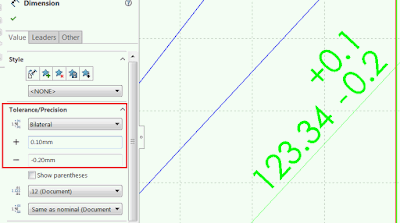

This macro will create child configuration where all the dimension will be set to average value based on the minimum and maximum values of the tolerance using SOLIDWORKS API.

{ width=400 }

~~~ vb
Dim swApp As SldWorks.SldWorks
Dim swModel As SldWorks.ModelDoc2

Sub main()

    Set swApp = Application.SldWorks
    
    Set swModel = swApp.ActiveDoc
    
    If Not swModel Is Nothing Then
        
        Dim swFeat As SldWorks.Feature
        
        Dim activeConfName As String
        activeConfName = swModel.ConfigurationManager.ActiveConfiguration.Name
        
        swModel.ConfigurationManager.AddConfiguration "Average", "", "", 0, activeConfName, ""
        
        Set swFeat = swModel.FirstFeature
        
        While Not swFeat Is Nothing
        
            Dim swDispDim As SldWorks.DisplayDimension
            Dim swDim As SldWorks.Dimension
            Dim swDimTol As SldWorks.DimensionTolerance
        
            Set swDispDim = swFeat.GetFirstDisplayDimension
            
            While Not swDispDim Is Nothing
            
                Set swDim = swDispDim.GetDimension2(0)
                Set swDimTol = swDim.Tolerance
                
                If swDimTol.Type <> swTolType_e.swTolNONE Then
                    
                    Dim averageVal As Double
                    
                    averageVal = swDim.GetSystemValue3(swInConfigurationOpts_e.swThisConfiguration, "")(0) + (swDimTol.GetMinValue + swDimTol.GetMaxValue) / 2
                    
                    swDimTol.Type = swTolType_e.swTolNONE
                    
                    swDim.SetSystemValue3 averageVal, swInConfigurationOpts_e.swThisConfiguration, ""
                    
                End If
                        
                Set swDispDim = swFeat.GetNextDisplayDimension(swDispDim)
                
            Wend
            
            Set swFeat = swFeat.GetNextFeature
            
        Wend
        
        swModel.EditRebuild3
    
    Else
        MsgBox "Please open the model"
    End If
    
End Sub

~~~

