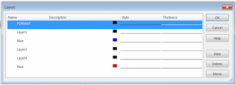

此宏将使用SOLIDWORKS API将绘图中的所有所选对象移动到指定的图层。

{ width=400 }

没有通用的::Layer SOLIDWORKS API属性来更改任何实体的图层，而是将此属性添加到支持它的每个接口中（例如[ISketchSegment::Layer](https://help.solidworks.com/2018/english/api/sldworksapi/solidworks.interop.sldworks~solidworks.interop.sldworks.isketchsegment~layer.html)属性）。此宏检查实体的类型，并调用相应的SOLIDWORKS API属性来更改图层。

~~~ vb
Dim swApp As SldWorks.SldWorks
Dim swDraw As SldWorks.DrawingDoc
Dim swSelMgr As SldWorks.SelectionMgr

Sub main()
    
    On Error Resume Next
    
    Set swApp = Application.SldWorks
    
    Set swDraw = swApp.ActiveDoc
    
    If Not swDraw Is Nothing Then
        
        Set swSelMgr = swDraw.SelectionManager
        
        If swSelMgr.GetSelectedObjectCount2(-1) > 0 Then
            
            Dim layerName As String
            layerName = InputBox("指定要将所选对象移动到的图层名称")
            
            Dim swAnn As SldWorks.Annotation
            
            Dim i As Integer
                        
            For i = 1 To swSelMgr.GetSelectedObjectCount2(-1)
                    
                Dim swSelObj As Object
                Set swSelObj = swSelMgr.GetSelectedObject6(i, -1)
                
                If TypeOf swSelObj Is SldWorks.SketchSegment Then
                    
                    Dim swSkSegment As SldWorks.SketchSegment
                    Set swSkSegment = swSelObj
                    swSkSegment.Layer = layerName
                
                ElseIf TypeOf swSelObj Is SldWorks.SketchPoint Then
                    
                    Dim swSkPoint As SldWorks.SketchPoint
                    Set swSkPoint = swSelObj
                    swSkPoint.Layer = layerName
                    
                ElseIf TypeOf swSelObj Is SldWorks.Note Then
                    
                    Dim swNote As SldWorks.Note
                    Set swNote = swSelObj
                    Set swAnn = swNote.GetAnnotation()
                    swAnn.Layer = layerName
                    
                ElseIf TypeOf swSelObj Is SldWorks.DisplayDimension Then
                    
                    Dim swDispDim As SldWorks.DisplayDimension
                    Set swDispDim = swSelObj
                    Set swAnn = swDispDim.GetAnnotation
                    swAnn.Layer = layerName
                    
                Else '尝试使用后期绑定设置图层
                    swSelObj.Layer = layerName
                End If
                    
            Next
        Else
            MsgBox "请选择注释、草图段或点以移动到新图层"
        End If
        
    Else
        MsgBox "请打开绘图"
    End If
    
End Sub

~~~