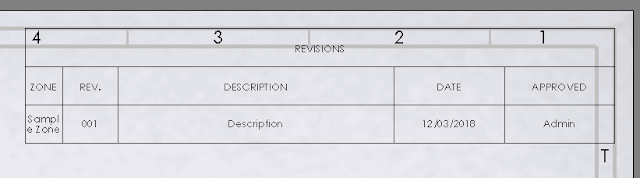

该示例使用SOLIDWORKS API找到修订表并删除所有修订，然后添加带有自定义数据的新行。

{ width=640 }

[IRevisionTableAnnotation](https://help.solidworks.com/2018/english/api/sldworksapi/solidworks.interop.sldworks~solidworks.interop.sldworks.irevisiontableannotation.html) SOLIDWORKS API接口用于管理此类型表的特定功能。

~~~ vb
Dim swApp As SldWorks.SldWorks
Dim swDraw As SldWorks.DrawingDoc
Dim swSheet As SldWorks.Sheet

Sub main()

    Set swApp = Application.SldWorks

    Set swDraw = swApp.ActiveDoc
    
    If Not swDraw Is Nothing Then
    
        Set swSheet = swDraw.GetCurrentSheet
        
        Dim swRevTable As SldWorks.RevisionTableAnnotation

        Set swRevTable = swSheet.RevisionTable
        
        If Not swRevTable Is Nothing Then
            
            ClearRevisionTable swRevTable
            
            AddRevision swRevTable, "001", Array("样本区域", "", "描述", "", "管理员")
            
        Else
            MsgBox "图纸中没有修订表"
        End If
    
    Else
        MsgBox "请打开图纸"
    End If
    
End Sub

Sub ClearRevisionTable(swRevTable As SldWorks.RevisionTableAnnotation)
    
    Dim swTableAnn As SldWorks.TableAnnotation
    
    Set swTableAnn = swRevTable
            
    Dim i As Integer
    
    For i = swTableAnn.RowCount - 1 To 0 Step -1
        
        Dim revId As Long
        revId = swRevTable.GetIdForRowNumber(i)
        
        If revId <> 0 Then
            swRevTable.DeleteRevision revId, True
        End If
        
    Next
    
End Sub

Sub AddRevision(swRevTable As SldWorks.RevisionTableAnnotation, revName As String, rowData As Variant)
    
    Dim i As Integer
    Dim swTableAnn As SldWorks.TableAnnotation
    
    Set swTableAnn = swRevTable
    
    swRevTable.AddRevision revName
            
    For i = 0 To UBound(rowData)
                
        If rowData(i) <> "" Then
            
            swTableAnn.Text(swTableAnn.RowCount - 1, i) = rowData(i)
        
        End If
                
    Next
    
End Sub

~~~