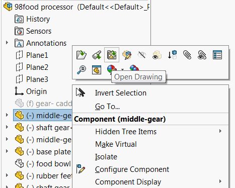
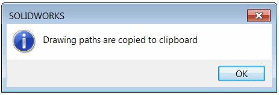

 使用SOLIDWORKS API，这个VBA宏可以找到活动装配的所有组件的引用图纸路径，并将其复制到剪贴板中。
image: assembly-drawings.png
labels: [图纸,复制路径,引用]
group: 图纸
---

这个VBA宏使用SOLIDWORKS API找到为活动装配的所有组件创建的图纸，并将路径复制到剪贴板中。

SOLIDWORKS提供了打开组件图纸的功能：



这个功能允许逐个查找图纸，但有时需要快速找到该装配的所有组件使用的所有图纸。这可以是自动化软件的一部分。此宏将遍历所有引用并找到所有图纸路径。完成后，将显示下面的确认消息。



剪贴板的内容可以粘贴到任何文本或表格编辑器中，如记事本或Excel（使用ctrl+V快捷键或粘贴命令）。


## 注意事项

* 被压制的组件将被排除在搜索范围之外
* 图纸在与输入装配相同的文件夹中搜索（包括子文件夹）
* 图纸是通过引用而不是名称进行搜索的，因此图纸可以具有任何名称
* 图纸路径使用换行符分隔

```vb
Dim swApp As SldWorks.SldWorks

Sub main()

    Set swApp = Application.SldWorks
    
    Dim swModel As SldWorks.ModelDoc2
    
try:
    
    On Error GoTo catch
    
    Set swModel = swApp.ActiveDoc
    
    If Not swModel Is Nothing Then
        
        If swModel.GetPathName() = "" Then
            Err.Raise vbError, "", "文件未保存"
        End If
        
        Dim vDrawingPaths As Variant
        
        Dim dir As String
        dir = swModel.GetPathName()
        dir = Left(dir, InStrRev(dir, "\"))
        
        If TypeOf swModel Is SldWorks.AssemblyDoc Then
            Dim swAssy As SldWorks.AssemblyDoc
            Set swAssy = swModel
            Dim vRefs As Variant
            vRefs = GetAllReferences(swAssy)
            vDrawingPaths = GetDrawingsForFiles(vRefs, dir)
        ElseIf TypeOf swModel Is SldWorks.PartDoc Then
            vDrawingPaths = GetDrawingsForFiles(Array(swModel.GetPathName()), dir)
        Else
            Err.Raise vbError, "", "仅支持零件或装配体"
        End If
            
        AddPathsToClipboard vDrawingPaths
        
        swApp.SendMsgToUser2 "图纸路径已复制到剪贴板", swMessageBoxIcon_e.swMbInformation, swMessageBoxBtn_e.swMbOk
        
    Else
        Err.Raise vbError, "", "请打开零件或装配体"
    End If
    
    GoTo finally
    
catch:
    Debug.Print Err.Number
    swApp.SendMsgToUser2 Err.Description, swMessageBoxIcon_e.swMbStop, swMessageBoxBtn_e.swMbOk
    
finally:
    
End Sub

Function GetAllReferences(assy As SldWorks.AssemblyDoc) As Variant
    
    Dim refs() As String
    Dim isInit As Boolean
    isInit = False
    
    Dim vComps As Variant
    vComps = assy.GetComponents(False)
    
    Dim i As Integer
    
    For i = 0 To UBound(vComps)
        
        Dim swComp As SldWorks.Component2
        
        Set swComp = vComps(i)
        
        Dim path As String
        path = swComp.GetPathName()
        
        If Not swComp.IsSuppressed() Then
            If Not isInit Then
                isInit = True
                ReDim refs(0)
                refs(0) = path
            Else
                If Not ContainsFilePath(refs, path) Then
                    ReDim Preserve refs(UBound(refs) + 1)
                    refs(UBound(refs)) = path
                End If
            End If
        End If
        
    Next
    
    GetAllReferences = refs
    
End Function

Function GetDrawingsForFiles(files As Variant, path As String) As Variant
    
    Dim drawingPaths() As String
    Dim isInit As Variant
    isInit = False
    
    Dim vAllDrawings As Variant
    vAllDrawings = FindAllDrawings(path)
        
    If Not IsEmpty(vAllDrawings) Then
        
        Dim i As Integer
        
        For i = 0 To UBound(vAllDrawings)
            
            Dim drawPath As String
            drawPath = vAllDrawings(i)
            
            Dim vDeps As Variant
            
            vDeps = swApp.GetDocumentDependencies2(drawPath, True, True, False)
            Dim j As Integer
            
            If Not IsEmpty(vDeps) Then
            
                For j = 1 To UBound(vDeps) Step 2
                    If ContainsFilePath(files, CStr(vDeps(j))) Then
                        If Not isInit Then
                            isInit = True
                            ReDim drawingPaths(0)
                        Else
                            ReDim Preserve drawingPaths(UBound(drawingPaths) + 1)
                        End If
                        drawingPaths(UBound(drawingPaths)) = drawPath
                        Exit For
                    End If
                Next
                
            End If
            
        Next
        
    End If
    
    GetDrawingsForFiles = drawingPaths
    
End Function

Function FindAllDrawings(path As String) As Variant
    
    Const DRAW_EXTENSION As String = "slddrw"
    FindAllDrawings = GetFiles(path, True, DRAW_EXTENSION)
    
End Function

Function GetFiles(path As String, Optional includeSubFolders As Boolean = True, Optional ext As String = "") As Variant

    Dim paths() As String
    Dim isInit As Boolean
    
    isInit = False
    
    Dim fso As Object
    Set fso = CreateObject("Scripting.FileSystemObject")
    
    Dim folder As Object
    Set folder = fso.GetFolder(path)
    
    CollectFilesFromFolder folder, includeSubFolders, ext, paths, isInit
    
    If isInit Then
        GetFiles = paths
    Else
        GetFiles = Empty
    End If
    
End Function

Sub CollectFilesFromFolder(folder As Object, includeSubFolders As Boolean, ext As String, ByRef paths() As String, ByRef isInit As Boolean)
    
    For Each file In folder.files
        Dim fileExt As String
        fileExt = Right(file.path, Len(file.path) - InStrRev(file.path, "."))
        If LCase(fileExt) = LCase(ext) Then
            If Not isInit Then
                ReDim paths(0)
                isInit = True
            Else
                ReDim Preserve paths(UBound(paths) + 1)
            End If
            paths(UBound(paths)) = file.path
        End If
    Next
    
    If includeSubFolders Then
        Dim subFolder As Object
        For Each subFolder In folder.SubFolders
            CollectFilesFromFolder subFolder, includeSubFolders, ext, paths, isInit
        Next
    End If
    
End Sub

Sub AddPathsToClipboard(vPaths As Variant)

    Dim text As String
    Dim i As Integer
    
    For i = 0 To UBound(vPaths)
        If i <> 0 Then
            text = text & vbCrLf
        End If
        text = text & CStr(vPaths(i))
    Next

    Dim dataObject As Object
    Set dataObject = CreateObject("new:{1C3B4210-F441-11CE-B9EA-00AA006B1A69}")
    dataObject.SetText text
    dataObject.PutInClipboard
    Set dataObject = Nothing
    
End Sub

Function ContainsFilePath(arr As Variant, item As String) As Boolean
    
    Dim i As Integer
    
    For i = 0 To UBound(arr)
        If LCase(arr(i)) = LCase(item) Then
            ContainsFilePath = True
            Exit Function
        End If
    Next
    
    Contains = False
    
End Function
```

