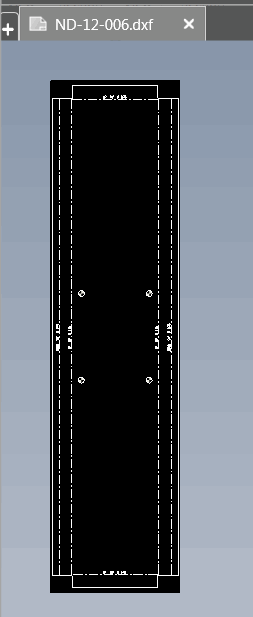

{ width=350 }

这个VBA宏使用SOLIDWORKS API将绘图活动工作表中的所有展开图视图导出为指定格式（如DXF或DWG）。宏将文件导出到与原始绘图相同的文件夹，并以绘图视图名称命名文件。

如果需要将导出的文件命名为切割清单名称，可以与[使用切割清单名称重命名展开图视图](/docs/codestack/solidworks-api/document/drawing/rename-sheet-metal-views/)宏结合使用。

在宏的开头指定输出文件扩展名：

~~~ vb
Const OUT_EXT As String = ".dxf"
~~~

## 算法

* 遍历当前绘图活动工作表的所有绘图视图
* 查找所有展开图绘图视图
* 创建新的临时绘图并复制视图
* 删除所有尺寸
* 删除所有表格
* 将视图和工作表比例设置为1:1
* 将工作表尺寸调整为视图大小
* 导出到指定文件

~~~ vb
Const OUT_EXT As String = ".dxf"

Dim swApp As SldWorks.SldWorks

Sub main()

    Set swApp = Application.SldWorks
    
    Dim swDraw As SldWorks.DrawingDoc
    
try:
    
    On Error GoTo catch
    
    Set swDraw = swApp.ActiveDoc
    
    If Not swDraw Is Nothing Then
        ExportFlatPatternViews swDraw, swDraw.GetCurrentSheet
    Else
        Err.Raise vbError, "", "请打开绘图文档"
    End If
    
    GoTo finally
    
catch:
    MsgBox Err.Description & " (" & Err.Number & ")", vbCritical
finally:
    
End Sub

Sub ExportFlatPatternViews(draw As SldWorks.DrawingDoc, sheet As SldWorks.sheet)
    
    Dim vViews As Variant
    
    vViews = sheet.GetViews()
    
    If Not IsEmpty(vViews) Then
        
        Dim i As Integer
        
        For i = 0 To UBound(vViews)
            Dim swView As SldWorks.view
            Set swView = vViews(i)
            
            If swView.IsFlatPatternView() Then
                ExportFlatPatternView draw, swView
            End If
        Next
        
    End If
    
End Sub

Sub ExportFlatPatternView(model As SldWorks.ModelDoc2, view As SldWorks.view)
    
    Dim fileName As String
    fileName = view.Name & OUT_EXT
    
    Dim saveDir As String
    saveDir = model.GetPathName()
    
    If saveDir = "" Then
        Err.Raise vbError, "", "仅支持保存的绘图"
    End If
    
    saveDir = Left(saveDir, InStrRev(saveDir, "\"))
        
    Dim swViews(0) As SldWorks.view
    Set swViews(0) = view
    
    If model.Extension.MultiSelect2(swViews, False, Nothing) = 1 Then
        
        model.EditCopy
        
        Dim swViewModel As SldWorks.ModelDoc2
        Set swViewModel = PasteViewInNewDocument()
        
        Dim errs As Long
        Dim warns As Long
        
        Dim expRes As Boolean
        expRes = swViewModel.Extension.SaveAs(saveDir & fileName, swSaveAsVersion_e.swSaveAsCurrentVersion, swSaveAsOptions_e.swSaveAsOptions_Silent, Nothing, errs, warns)
        
        swApp.CloseDoc swViewModel.GetTitle
        
        If False = expRes Then
            Err.Raise vbError, "", "导出" & view.Name & "失败。错误代码：" & errs
        End If
        
    Else
        Err.Raise vbError, "", "选择" & view.Name & "失败"
    End If
    
End Sub

Function PasteViewInNewDocument(Optional dummy As String = "") As SldWorks.ModelDoc2
    
    Dim drawTemplate As String
    drawTemplate = swApp.GetUserPreferenceStringValue(swUserPreferenceStringValue_e.swDefaultTemplateDrawing)
    
    If drawTemplate <> "" Then
        
        Dim swDraw As SldWorks.ModelDoc2
        
        Set swDraw = swApp.NewDocument(drawTemplate, swDwgPaperSizes_e.swDwgPapersUserDefined, 0.1, 0.1)
        
        If swDraw Is Nothing Then
            Err.Raise vbError, "", "创建新绘图文档失败"
        End If
try:
        On Error GoTo catch
        swDraw.Paste
        
        Dim swView As SldWorks.view
        Dim swSheet As SldWorks.sheet
        Set swSheet = swDraw.GetCurrentSheet()
        Set swView = swSheet.GetViews()(0)
        
        Dim ratio(1) As Double
        ratio(0) = 1: ratio(1) = 1
        swView.ScaleRatio = ratio
        
        swSheet.SetScale 1, 1, False, False
        
        Dim vTables As Variant
        vTables = swView.GetTableAnnotations()
        
        swDraw.ForceRebuild3 True
        
        RemoveDimensions swDraw, swView
        RemoveTables swDraw, swView
        
        FitSheetToView swSheet, swView
            
        Set PasteViewInNewDocument = swDraw
            
        GoTo finally
catch:
    swApp.CloseDoc swDraw.GetTitle
    Err.Raise Err.Number, Err.Source, Err.Description
finally:
    
    Else
        Err.Raise vbError, "", "未指定默认绘图模板"
    End If
    
End Function

Sub RemoveDimensions(model As SldWorks.ModelDoc2, view As SldWorks.view)
    
    Dim vDispDims As Variant
    vDispDims = view.GetDisplayDimensions
    
    If Not IsEmpty(vDispDims) Then
    
        Dim swAnns() As SldWorks.Annotation
        ReDim swAnns(UBound(vDispDims))
        Dim i As Integer
        
        For i = 0 To UBound(vDispDims)
            Dim swDispDim As SldWorks.DisplayDimension
            Set swDispDim = vDispDims(i)
            Set swAnns(i) = swDispDim.GetAnnotation
        Next
        
        If model.Extension.MultiSelect2(vDispDims, False, Nothing) = UBound(vDispDims) + 1 Then
            model.Extension.DeleteSelection2 swDeleteSelectionOptions_e.swDelete_Absorbed
        Else
            Err.Raise vbError, "", "选择要删除的尺寸失败"
        End If
    
    End If
    
End Sub

Sub RemoveTables(model As SldWorks.ModelDoc2, view As SldWorks.view)

    Dim vSheets As Variant
    
    vSheets = model.GetViews()

    Dim vViews As Variant
    vViews = vSheets(0)
    
    Dim swSheetView As SldWorks.view
    Set swSheetView = vViews(0)
    
    Dim vTableAnns As Variant
    vTableAnns = swSheetView.GetTableAnnotations
    
    If Not IsEmpty(vTableAnns) Then
    
        If model.Extension.MultiSelect2(vTableAnns, False, Nothing) = UBound(vTableAnns) + 1 Then
            model.Extension.DeleteSelection2 swDeleteSelectionOptions_e.swDelete_Absorbed
        Else
            Err.Raise vbError, "", "选择要删除的尺寸失败"
        End If
    
    End If
    
End Sub

Sub FitSheetToView(sheet As SldWorks.sheet, view As SldWorks.view)

    Dim vViewOutline As Variant
    vViewOutline = view.GetOutline

    sheet.SetSize swDwgPaperSizes_e.swDwgPapersUserDefined, CDbl(vViewOutline(2) - vViewOutline(0)), CDbl(vViewOutline(3) - vViewOutline(1))
    
    Dim vPos As Variant
    vPos = view.Position
    
    vViewOutline = view.GetOutline
    
    vPos(0) = vPos(0) - vViewOutline(0)
    vPos(1) = vPos(1) - vViewOutline(1)
    
    view.Position = vPos
    
End Sub
~~~