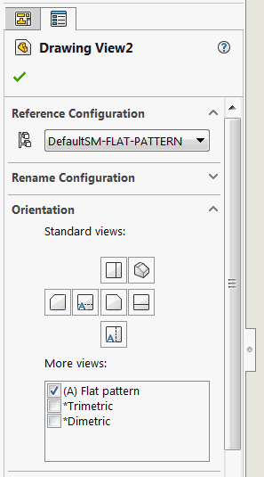

{ width=200 }

这个VBA宏使用SOLIDWORKS API查找所选绘图视图（包括钣金展开图）的所有实体，并提取它们的材料。

[IView::Bodies](https://help.solidworks.com/2017/english/api/sldworksapi/solidworks.interop.sldworks~solidworks.interop.sldworks.iview~bodies.html) 属性可以找到绘图视图的实体，但是对于从钣金展开图创建的绘图视图，这个SOLIDWORKS API属性返回的是空值。

{ width=250 }

下面的宏可以提取实体并找到它们的材料，无论是对于普通零件还是钣金图案。结果将输出到VBA编辑器的即时窗口中。

~~~ vb
Dim swApp As SldWorks.SldWorks

Sub main()

    Set swApp = Application.SldWorks
    
    Dim swModel As SldWorks.ModelDoc2
    
    Set swModel = swApp.ActiveDoc
    
    If Not swModel Is Nothing Then
        
        Dim swView As SldWorks.view
        Set swView = swModel.SelectionManager.GetSelectedObject6(1, -1)
        
        If Not swView Is Nothing Then
            
            Dim vBodies As Variant
            vBodies = GetBodies(swView)
            
            Dim i As Integer
            
            For i = 0 To UBound(vBodies)
                
                Dim swBody As SldWorks.Body2
                Set swBody = vBodies(i)
                
                Dim matDb As String
                Dim matName As String
                
                matName = swBody.GetMaterialPropertyName(swView.ReferencedConfiguration, matDb)
                
                Debug.Print swView.Name & " - " & swBody.Name & " - " & matName & " - " & matDb
                
            Next
            
        Else
            MsgBox "请选择视图"
        End If
        
    Else
        MsgBox "请打开模型"
    End If
    
End Sub

Function GetBodies(view As SldWorks.view) As Variant
    
    If view.IsFlatPatternView() Then
        
        Dim vComps As Variant
        vComps = view.GetVisibleComponents()
        
        '展开图只能针对单个实体创建（单体零件或多体零件选择实体）
        Dim swComp As SldWorks.Component2
        Set swComp = vComps(0)
        
        Dim vFaces As Variant
        vFaces = view.GetVisibleEntities2(swComp, swViewEntityType_e.swViewEntityType_Face)
        
        Dim swFace As SldWorks.Face2
        Set swFace = vFaces(0)
        
        Dim swBodies(0) As SldWorks.Body2
        Set swBodies(0) = swFace.GetBody()
        
        GetBodies = swBodies
        
    Else
        GetBodies = view.Bodies
    End If
    
End Function
~~~