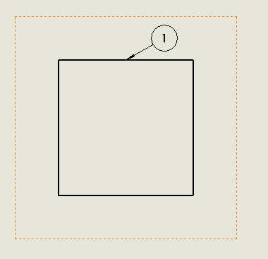

这个VBA宏演示了如何使用SOLIDWORKS API在活动绘图工作表的第一个绘图视图中为所有可见的零件插入气球。

该宏将遍历所有可见的零件和视图的所有可见实体，并将气球链接到项目编号附加到第一个可见实体。

气球引线将附加到相应边的中点。而气球本身将从边的中点沿X和Y方向偏移10毫米。

``` vb
Dim swApp As SldWorks.SldWorks

Sub main()

    Set swApp = Application.SldWorks
    
    Dim swModel As SldWorks.ModelDoc2
    Dim swDraw As SldWorks.DrawingDoc
    Dim swSelMgr As SldWorks.SelectionMgr
    
    Set swModel = swApp.ActiveDoc
        
    Set swDraw = swModel
    
    Set swSelMgr = swModel.SelectionManager
    
    Dim swSheet As SldWorks.Sheet
    
    Dim swView As SldWorks.view
    
    Set swSheet = swDraw.GetCurrentSheet()
    
    Set swView = swSheet.GetViews()(0)
        
    Dim vComps As Variant
    vComps = swView.GetVisibleComponents()
    
    Dim i As Integer
    
    For i = 0 To UBound(vComps)
        
        Dim swComp As SldWorks.Component2
        Set swComp = vComps(i)
        Dim vEdges As Variant
        vEdges = swView.GetVisibleEntities2(swComp, swViewEntityType_e.swViewEntityType_Edge)
        
        Dim swEdge As SldWorks.edge
        Set swEdge = vEdges(0)
                
        Dim swEnt As SldWorks.Entity
        Set swEnt = swEdge
        
        Dim swSelData As SldWorks.SelectData
        Set swSelData = swSelMgr.CreateSelectData
        swSelData.view = swView
        
        swEnt.Select4 False, swSelData
        
        Dim swBomBalloonParams As SldWorks.BalloonOptions

        Set swBomBalloonParams = swModel.Extension.CreateBalloonOptions()
            
        Dim swBalloonNote As SldWorks.Note
        
        Set swBalloonNote = swModel.Extension.InsertBOMBalloon2(swBomBalloonParams)
        
        Dim swAnn As SldWorks.Annotation
        Set swAnn = swBalloonNote.GetAnnotation
        
        Dim vPos As Variant
        vPos = CalculateBaloonPosition(swEdge, swView)
        
        swAnn.SetLeaderAttachmentPointAtIndex 0, vPos(0), vPos(1), 0
        
        swAnn.SetPosition2 vPos(0) + 0.01, vPos(1) + 0.01, 0
        
    Next
    
End Sub

Function CalculateBaloonPosition(edge As SldWorks.edge, view As SldWorks.view) As Variant
    
    Dim swCurve As SldWorks.Curve
    Set swCurve = edge.GetCurve
        
    Dim swMathUtils As SldWorks.MathUtility
    Set swMathUtils = swApp.GetMathUtility
    
    Dim swVertex As SldWorks.Vertex
        
    Dim vStartPt As Variant
    Dim vEndPt As Variant
    
    Set swVertex = edge.GetStartVertex()
        
    vStartPt = swVertex.GetPoint
    
    Set swVertex = edge.GetEndVertex()
    
    vEndPt = swVertex.GetPoint
    
    Dim dPt(2) As Double
    
    dPt(0) = (vEndPt(0) + vStartPt(0)) / 2
    dPt(1) = (vEndPt(1) + vStartPt(1)) / 2
    dPt(2) = (vEndPt(2) + vStartPt(2)) / 2
    
    Dim swMathPt As SldWorks.MathPoint
    Set swMathPt = swMathUtils.CreatePoint(dPt)

    Dim swTransform As SldWorks.MathTransform
    Set swTransform = view.ModelToViewTransform

    Set swMathPt = swMathPt.MultiplyTransform(swTransform)
    
    Dim vPt As Variant
    vPt = swMathPt.ArrayData
    
    vPt(0) = CDbl(vPt(0))
    vPt(1) = CDbl(vPt(1))
    vPt(2) = CDbl(vPt(2))
    
    CalculateBaloonPosition = vPt
    
End Function
```

