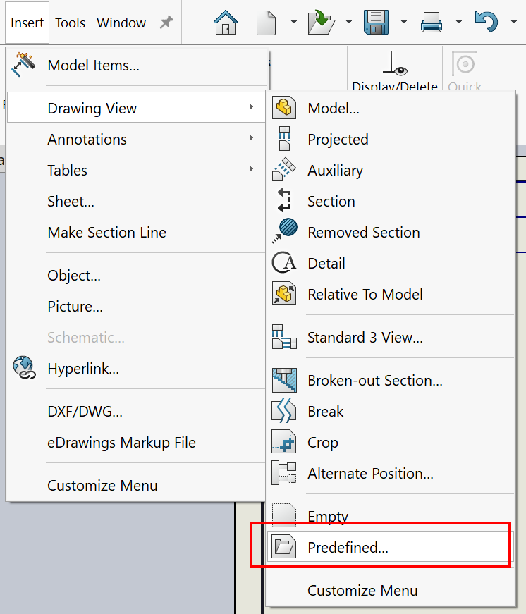

---
标题：插入预定义视图
描述：VBA宏允许将SOLIDWORKS模型插入活动绘图文档的所有或选定的预定义视图中
图片：predefined-views.png
---

{ width = 400 }

这个VBA宏允许将SOLIDWORKS零件或装配体插入活动绘图文档或绘图模板的预定义视图中。

选择要插入模型的预定义绘图视图。如果没有选择视图，则将填充所有预定义视图。

宏将显示文件浏览对话框以选择要插入的模型。

``` vb
Dim swApp As SldWorks.SldWorks

Sub main()

    Set swApp = Application.SldWorks
    
    Dim swDraw As SldWorks.DrawingDoc
    
    Set swDraw = swApp.ActiveDoc
        
    Dim filePath As String
    filePath = swApp.GetOpenFileName("选择要插入到预定义视图中的模型", "", _
        "SOLIDWORKS模型文件 (*.sldprt; *.sldasm)|*.sldprt;*.sldasm|所有文件 (*.*)|*.*|", 0, "", "")
    
    If filePath <> "" Then
    
        If False = swDraw.InsertModelInPredefinedView(filePath) Then
            Err.Raise vbError, "", "无法将模型插入到预定义视图中"
        End If
    
    End If
    
End Sub
```