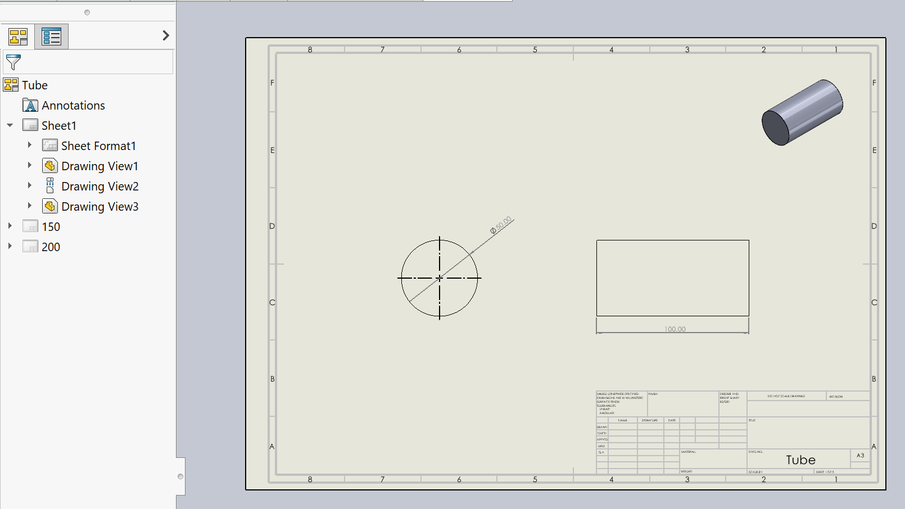

 VBA宏将复制活动工作表并将引用文档的配置设置到每个副本上
image: sheets.png
---

{ width=800 }

此VBA宏将复制活动工作表并将引用文档的配置传播到每个副本中。

宏将自动在每个新工作表上设置引用配置，并根据配置名称重命名工作表。

结果图纸将包含多体零件或装配的所有配置的工作表。

## 配置

可以通过更改宏的常量值来配置宏

~~~ vb
Const TOP_LEVEL_CONFIGS_ONLY As Boolean = False 'True表示仅处理顶级配置，False表示处理子配置
Const USE_CORRESPONDING_FLAT_PATTERN_CONF As Boolean = True 'True表示查找平面图视图的相应SM-FLAT-PATTERN配置，False表示使用配置As Is
Const GENERATE_MISSING_FLAT_PATTERN_CONF As Boolean = True 'True表示如果不存在，则自动创建新的SM-FLAT-PATTERN配置，False表示使用配置As Is
~~~

## 注意事项

* 宏将跳过处理系统配置（例如焊接配置和机加工配置、钣金平面图配置和速度包配置）
* 宏不会为在工作表的默认（第一个）视图中使用的相同配置创建另一个工作表（模板工作表）

### 钣金平面图

当从用户界面创建平面图的绘图视图时，会自动添加新的特殊配置（SM-FLAT-PATTERN）。此配置将设置为引用配置。通过SOLIDWORKS API分配引用视图时，可以强制将标准配置分配给平面图视图，这将导致显示不正确。用户需要手动重新检查**平面图**切换或重置引用配置。宏的**USE_CORRESPONDING_FLAT_PATTERN_CONF**选项允许查找平面图配置（如果存在），并将其用于平面图视图。如果找不到，可以通过设置宏的**GENERATE_MISSING_FLAT_PATTERN_CONF**选项自动创建平面图视图。

~~~ vb
Const TOP_LEVEL_CONFIGS_ONLY As Boolean = False
Const USE_CORRESPONDING_FLAT_PATTERN_CONF As Boolean = True
Const GENERATE_MISSING_FLAT_PATTERN_CONF As Boolean = True

Dim swApp As SldWorks.SldWorks

Sub main()

    Set swApp = Application.SldWorks
    
    Dim swDraw As SldWorks.DrawingDoc
    
    Set swDraw = swApp.ActiveDoc
    
    If Not swDraw Is Nothing Then
        
        Dim swSheet As SldWorks.sheet
        Set swSheet = swDraw.GetCurrentSheet
        
        Dim swDefView As SldWorks.view
        Set swDefView = GetDefaultView(swDraw, swSheet)
        
        If Not swDefView Is Nothing Then
            
            Dim swRefDoc As SldWorks.ModelDoc2
            Set swRefDoc = swDefView.ReferencedDocument
            
            If Not swRefDoc Is Nothing Then
            
                ValidateSheet swSheet, swRefDoc
                
                Dim vConfNames As Variant
                vConfNames = GetConfigurations(swRefDoc)
                
                Dim i As Integer
                
                For i = 0 To UBound(vConfNames)
                    
                    Dim confName As String
                    confName = CStr(vConfNames(i))
                    
                    If LCase(GetActualReferencedConfiguration(swDefView)) <> LCase(confName) Then
                        CopySheetWithConfiguration swDraw, swSheet, confName
                    End If
                    
                Next
                
            Else
                Err.Raise vbError, "", "默认视图没有引用文档"
            End If
            
        Else
            Err.Raise vbError, "", "未找到默认视图"
        End If
        
    Else
        Err.Raise vbError, "", "打开绘图"
    End If
    
End Sub

Function GetConfigurations(refDoc As SldWorks.ModelDoc2) As Variant
    
    Dim confNames() As String
    
    Dim vConfNames As Variant
    vConfNames = refDoc.GetConfigurationNames
    
    Dim i As Integer
    
    For i = 0 To UBound(vConfNames)
        
        Dim confName As String
        confName = CStr(vConfNames(i))
        
        Dim swConf As SldWorks.Configuration
        Set swConf = refDoc.GetConfigurationByName(confName)
        
        If (Not TOP_LEVEL_CONFIGS_ONLY Or swConf.GetParent() Is Nothing) And swConf.Type = swConfigurationType_e.swConfiguration_Standard Then
                
            If (Not confNames) = -1 Then
                ReDim confNames(0)
            Else
                ReDim Preserve confNames(UBound(confNames) + 1)
            End If
            
            confNames(UBound(confNames)) = confName
            
        End If
        
    Next
    
    GetConfigurations = confNames
    
End Function

Function GetActualReferencedConfiguration(view As SldWorks.view) As String
    
    Dim refConfName As String
    refConfName = view.ReferencedConfiguration
    
    Dim swConf As SldWorks.Configuration
    
    Set swConf = view.ReferencedDocument.GetConfigurationByName(refConfName)
    
    If swConf.Type <> swConfigurationType_e.swConfiguration_Standard Then
        Set swConf = swConf.GetParent
    End If
    
    GetActualReferencedConfiguration = swConf.Name
    
End Function

Function GetDefaultView(draw As SldWorks.DrawingDoc, sheet As SldWorks.sheet) As SldWorks.view
    
    Dim vViews As Variant
    
    vViews = GetSheetViews(draw, sheet)
    
    If Not IsEmpty(vViews) Then
        
        Dim i As Integer
        
        For i = 0 To UBound(vViews)
            
            Dim swView As SldWorks.view
            Set swView = vViews(i)
            
            If UCase(swView.Name) = UCase(sheet.CustomPropertyView) Then
                Set GetDefaultView = swView
                Exit Function
            End If
            
        Next
        
        Set GetDefaultView = vViews(0) '使用第一个
    Else
        Set GetDefaultView = Nothing
    End If
    
End Function

Sub ValidateSheet(sheet As SldWorks.sheet, refDoc As SldWorks.ModelDoc2)
    
    Dim vViews As Variant
    vViews = sheet.GetViews
    
    Dim i As Integer
    
    For i = 0 To UBound(vViews)
        
        Dim swView As SldWorks.view
        Set swView = vViews(i)
        
        If Not swView.ReferencedDocument Is refDoc Then
            Err.Raise vbError, "", "在" & sheet.GetName & "中引用了不同的模型"
        End If
        
    Next
    
End Sub

Sub CopySheetWithConfiguration(draw As SldWorks.DrawingDoc, sheet As SldWorks.sheet, baseConfName As String)
    
    Const MAX_PASTE_ATEMPTS As Integer = 3
    
    If False <> draw.Extension.SelectByID2(sheet.GetName(), "SHEET", 0, 0, 0, False, 0, Nothing, 0) Then
        
        draw.EditCopy
        
        If TryPasteSheet(draw, MAX_PASTE_ATEMPTS) Then
            
            Dim swNewSheet As SldWorks.sheet
            Set swNewSheet = draw.sheet(draw.GetSheetNames()(draw.GetSheetCount() - 1))
            
            Dim vViews As Variant
            vViews = GetSheetViews(draw, swNewSheet)
            
            Dim i As Integer
            
            For i = 0 To UBound(vViews)
                
                Dim swView As SldWorks.view
                Set swView = vViews(i)
                
                Dim confName As String
                
                If False <> swView.IsFlatPatternView() And USE_CORRESPONDING_FLAT_PATTERN_CONF Then
                    confName = GetFlatPatternConfiguration(draw, swView.ReferencedDocument, baseConfName, GENERATE_MISSING_FLAT_PATTERN_CONF)
                Else
                    confName = baseConfName
                End If
                
                swView.ReferencedConfiguration = confName
                
                RefreshView draw, swView
                
            Next
            
            swNewSheet.SetName baseConfName
                        
        Else
            Err.Raise vbError, "", "无法粘贴工作表"
        End If
    Else
        Err.Raise vbError, "", "无法选择工作表"
    End If

End Sub

Function TryPasteSheet(draw As SldWorks.DrawingDoc, attempts As Integer) As Boolean

    Dim curAttemp As Integer
    curAttemp = 1

    '观察到在某些情况下，第一次尝试粘贴工作表会失败
    While False = draw.PasteSheet(swInsertOptions_e.swInsertOption_MoveToEnd, swRenameOptions_e.swRenameOption_Yes)
        
        Debug.Print "第" & curAttemp & "次尝试粘贴工作表失败"
        
        If curAttemp >= attempts Then
            TryPasteSheet = False
            Exit Function
        End If
        
        curAttemp = curAttemp + 1
 
    Wend
    
    TryPasteSheet = True

End Function

'在某些情况下，视图的新配置在刷新之前不会更新
Sub RefreshView(draw As SldWorks.DrawingDoc, swView As SldWorks.view)
    
    If SelectDrawingView(draw, swView) Then
        
        draw.SuppressView
        
        If SelectDrawingView(draw, swView) Then
            draw.UnsuppressView
        End If
        
    End If
    
End Sub

Function GetFlatPatternConfiguration(draw As SldWorks.DrawingDoc, refDoc As SldWorks.ModelDoc2, baseConfName As String, allowCreateIfNotExist As Boolean) As String
    
    Dim swConf As SldWorks.Configuration
    Set swConf = refDoc.GetConfigurationByName(baseConfName)
    
    If swConf.Type <> swConfigurationType_e.swConfiguration_SheetMetal Then
        
        Dim vChildrenConfs As Variant
        
        vChildrenConfs = swConf.GetChildren()
        
        Dim i As Integer
        
        If Not IsEmpty(vChildrenConfs) Then
        
            For i = 0 To UBound(vChildrenConfs)
                
                Dim swChildConf As SldWorks.Configuration
                Set swChildConf = vChildrenConfs(i)
                
                If swChildConf.Type = swConfigurationType_e.swConfiguration_SheetMetal Then
                    Debug.Print "为" & baseConfName & "使用平面图配置" & swChildConf.Name
                    GetFlatPatternConfiguration = swChildConf.Name
                    Exit Function
                End If
                
            Next
        
        End If
        
        If allowCreateIfNotExist Then
            Debug.Print "为" & baseConfName & "创建平面图配置"
            GetFlatPatternConfiguration = CreateFlatPatternConfiguration(draw, refDoc, baseConfName)
        Else
            Debug.Print "未找到" & baseConfName & "的平面图配置"
            GetFlatPatternConfiguration = baseConfName
        End If
    Else
        GetFlatPatternConfiguration = baseConfName
    End If
    
End Function

Function CreateFlatPatternConfiguration(draw As SldWorks.DrawingDoc, refDoc As SldWorks.ModelDoc2, baseConfName As String) As String
    
    Dim swFlatPatternView As SldWorks.view
    Set swFlatPatternView = draw.CreateFlatPatternViewFromModelView3(refDoc.GetPathName(), baseConfName, 0, 0, 0, True, False)
    
    If Not swFlatPatternView Is Nothing Then
        CreateFlatPatternConfiguration = swFlatPatternView.ReferencedConfiguration
        
        If SelectDrawingView(draw, swFlatPatternView) Then
            If False = draw.Extension.DeleteSelection2(swDeleteSelectionOptions_e.swDelete_Absorbed) Then
                Err.Raise vbError, "", "删除临时视图失败"
            End If
        Else
            Err.Raise vbError, "", "选择临时视图以删除失败"
        End If
        
    Else
        Err.Raise vbError, "", "为" & refDoc.GetPathName() & " (" & baseConfName & ")创建临时平面图视图失败"
    End If
    
End Function

Function SelectDrawingView(draw As SldWorks.ModelDoc2, view As SldWorks.view) As Boolean
    SelectDrawingView = False <> draw.Extension.SelectByID2(view.Name, "DRAWINGVIEW", 0, 0, 0, False, -1, Nothing, swSelectOption_e.swSelectOptionDefault)
End Function

Function GetSheetViews(draw As SldWorks.DrawingDoc, sheet As SldWorks.sheet) As Variant
    
    'ISheet::GetViews还会返回视图面板中的视图
    
    Dim vSheets As Variant
    
    vSheets = draw.GetViews
    
    Dim i As Integer
    
    For i = 0 To UBound(vSheets)
        
        Dim vViews As Variant
        vViews = vSheets(i)
        
        Dim swSheetView As SldWorks.view
        Set swSheetView = vViews(0)
        
        If swSheetView.GetName2() = sheet.GetName() Then
            
            If UBound(vViews) > 0 Then
                
                Dim swViews() As SldWorks.view
                ReDim swViews(UBound(vViews) - 1)
                
                Dim j As Integer
                
                For j = 0 To UBound(swViews)
                    Set swViews(j) = vViews(j + 1)
                Next
                
                GetSheetViews = swViews
                Exit Function
                
            Else
                Err.Raise vbError, "", sheet.GetName & "中未找到绘图视图"
            End If
            
        End If
            
    Next
    
    Err.Raise vbError, "", "无法从" & sheet.GetName & "获取绘图视图"
    
End Function
~~~