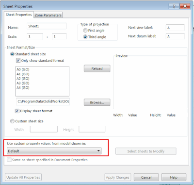

 该宏将使用SOLIDWORKS API根据指定自定义属性的值重命名所有图纸工作表。
image: drw-sheets.png
labels: [自定义属性, 图纸, 示例, 宏, 属性, 重命名, 工作表, solidworks api, vba]
group: 图纸
redirect-from:
  - /2018/03/document_8.html
---

该宏将使用SOLIDWORKS API根据指定自定义属性的值重命名所有图纸工作表。

{ width=320 }

* 打开图纸并运行宏
* 指定要读取值的属性

{ width=320 }

* 所有工作表将根据此属性的值进行重命名。宏将从工作表属性中指定的模型视图中获取该值。
不支持“与文档属性中指定的工作表相同”的选项。
如果选择了此选项，则将使用第一个视图的属性。
宏将尝试读取配置特定属性，如果未指定属性，则读取模型级属性。

{ width=400 }

~~~ vb
Dim swApp As SldWorks.SldWorks
Dim swDraw As SldWorks.DrawingDoc

Sub main()

    Set swApp = Application.SldWorks
    
    Set swDraw = swApp.ActiveDoc
    
    If swDraw Is Nothing Then
        MsgBox "请打开图纸"
        End
    End If
    
    Dim prpName As String
    prpName = InputBox("请指定要从中获取值的自定义属性名称")
    
    Dim vSheetNames As Variant
    vSheetNames = swDraw.GetSheetNames
    
    Dim i As Integer
    
    For i = 0 To UBound(vSheetNames)
        
        Dim swSheet As SldWorks.Sheet
        Set swSheet = swDraw.Sheet(vSheetNames(i))
        
        Dim custPrpViewName As String
        custPrpViewName = swSheet.CustomPropertyView
        
        Dim vViews As Variant
        vViews = swSheet.GetViews()
        
        Dim swCustPrpView As SldWorks.View
        Set swCustPrpView = Nothing
        
        Dim j As Integer
        
        For j = 0 To UBound(vViews)
            
            Dim swView As SldWorks.View
            Set swView = vViews(j)
            
            If LCase(swView.Name) = LCase(custPrpViewName) Then
                Set swCustPrpView = swView
                Exit For
            End If
            
        Next
        
        If swCustPrpView Is Nothing Then
            Set swCustPrpView = vViews(0)
        End If
        
        If Not swCustPrpView Is Nothing Then
            
            Dim swRefConfName As String
            Dim swRefDoc As SldWorks.ModelDoc2
            
            swRefConfName = swCustPrpView.ReferencedConfiguration
            Set swRefDoc = swCustPrpView.ReferencedDocument
            
            If Not swRefDoc Is Nothing Then
                
                Dim prpValue As String
                
                prpValue = GetCustomPropertyValue(swRefDoc, swRefConfName, prpName)
                
                If prpValue <> "" Then
                    swSheet.SetName (prpValue)
                End If
                
            Else
                MsgBox "无法从绘图视图中获取模型。请确保绘图不是轻量级的"
            End If
            
        Else
            MsgBox "无法获取要获取属性的视图"
        End If
        
    Next
    
End Sub

Function GetCustomPropertyValue(model as SldWorks.ModelDoc2, confName as String, prpName As String) As String
    
    Dim prpValue As String
                
    model.Extension.CustomPropertyManager(confName).Get3 prpName, False, "", prpValue
    
    If prpValue = "" Then
        model.Extension.CustomPropertyManager("").Get3 prpName, False, "", prpValue
    End If
    
    GetCustomPropertyValue = prpValue
    
End Function
~~~