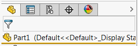

该示例演示了如何使用SOLIDWORKS API在特征管理器视图中激活标准选项卡（特征管理器树、属性管理器、配置管理器、DimXpert管理器、显示管理器）。

- 使用 *FeatMgrTab_e* 枚举指定要激活的选项卡
- 运行宏（VSTA3）
- 激活的选项卡将显示在消息框中
- 激活指定的选项卡

**ModelDocExtension.cs**
``` cs
using System;
using System.Collections.Generic;
using System.Linq;

namespace SolidWorks.Interop.sldworks
{
    public enum FeatMgrTab_e
    {
        FeatureManagerTree,
        PropertyManager,
        ConfigurationManager,
        DimXpertManager,
        DisplayManager
    }

    public static class ModelDocExtension
    {
        private static Dictionary<int, FeatMgrTab_e> GetTabsMap(IModelViewManager mdlViewMgr)
        {
            return new Dictionary<int, FeatMgrTab_e>()
            {
                { mdlViewMgr.GetFeatureManagerTreeTabIndex(), FeatMgrTab_e.FeatureManagerTree },
                { mdlViewMgr.GetPropertyManagerTabIndex(), FeatMgrTab_e.PropertyManager },
                { mdlViewMgr.GetConfigurationManagerTabIndex(), FeatMgrTab_e.ConfigurationManager },
                { mdlViewMgr.GetDimXpertManagerTabIndex(), FeatMgrTab_e.DimXpertManager },
                { mdlViewMgr.GetDisplayManagerTabIndex(), FeatMgrTab_e.DisplayManager }
            };
        }

        public static void ActivateStandardFeatureManagerTab(this IModelDoc2 model, FeatMgrTab_e tab)
        {
            var mdlViewMgr = model.ModelViewManager;

            mdlViewMgr.ActiveFeatureManagerTabIndex = GetTabsMap(mdlViewMgr).First(x => x.Value == tab).Key;
        }

        public static FeatMgrTab_e GetActiveStandardFeatureManagerTab(this IModelDoc2 model)
        {
            var mdlViewMgr = model.ModelViewManager;

            FeatMgrTab_e tab;

            if (!GetTabsMap(mdlViewMgr).TryGetValue(mdlViewMgr.ActiveFeatureManagerTabIndex, out tab))
            {
                throw new NullReferenceException("Active tab is not a standard tab");
            }

            return tab;
        }
    }
}

```


**SolidWorksMacro.cs**
``` cs
using System;
using System.Collections.Generic;
using System.Linq;
using System.Text;
using System.Threading.Tasks;
using System.Windows;
using System.Windows.Forms;

using SolidWorks.Interop.sldworks;
using SolidWorks.Interop.swconst;


namespace ActivateFeatMgrTab
{
    public partial class SolidWorksMacro
    {
        public void Main()
        {
            var model = swApp.IActiveDoc2;

            try
            {
                if (model != null)
                {
                    swApp.SendMsgToUser(string.Format("Active Feature Manager Tab: {0}", model.GetActiveStandardFeatureManagerTab()));

                    model.ActivateStandardFeatureManagerTab(FeatMgrTab_e.DisplayManager);
                }
                else
                {
                    throw new NullReferenceException("Model is not opened");
                }
            }
            catch(Exception ex)
            {
                swApp.SendMsgToUser2(ex.Message, (int)swMessageBoxIcon_e.swMbStop, (int)swMessageBoxBtn_e.swMbOk);
            }

            return;
        }

        public SldWorks swApp;

    }
}


```