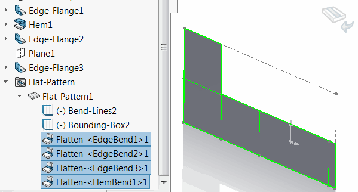

This macro create new configurations for all features selected in the feature tree and suppresses them one by one in the respective configuration using SOLIDWORKS API.

This macro can be useful if it is needed to represents some historical data of the model in the configurations.

## Notes

* Configurations created as derived configurations of the active configuration
* Each configuration named after the feature name
* Features are processed in the order they have been selected
* Each feature and all previous features will be suppressed in the respective configuration

## Use cases

### Sheet Metal Bending

This macro can be used to represent the steps of bending of the sheet metal. In this case each configuration will represent the bending step.

* Set the sheet metal part to the flattened state
* Select flatten bends in the order under the *Flat-Pattern* feature

{ width=350 }

* Run the macro

As the result sub configurations for each bend are created representing the bending step:

Refer the [Animate Configurations](/docs/codestack/solidworks-api/motion-study/animate-configurations/) for example macro to animate the configurations using SOLIDWORKS API.

~~~ vb
Dim swApp As SldWorks.SldWorks

Sub main()

    Set swApp = Application.SldWorks
    
    Dim swModel As SldWorks.ModelDoc2
    
    Set swModel = swApp.ActiveDoc
    
    If Not swModel Is Nothing Then
        
        Dim vFeats As Variant
        vFeats = GetSelectedFeatures(swModel)
        
        Dim swActiveConf As SldWorks.Configuration
        Set swActiveConf = swModel.ConfigurationManager.ActiveConfiguration
        
        Dim i As Integer
        
        Dim swFeatsList() As SldWorks.Feature
        
        For i = 0 To UBound(vFeats)
            
            ReDim Preserve swFeatsList(i)
            
            Dim swFeat As SldWorks.Feature
            Set swFeat = vFeats(i)
            
            Set swFeatsList(i) = swFeat
            
            If False = SuppressFeaturesInNewConfiguration(swModel, swFeatsList, swFeat.Name, swActiveConf.Name) Then
                MsgBox "Failed to set the feature state for " & swFeat.Name
                End
            End If
            
        Next
        
        swModel.ShowConfiguration2 swActiveConf.Name

    Else
        MsgBox "Please open document"
    End If
    
End Sub

Function GetSelectedFeatures(model As SldWorks.ModelDoc2) As Variant
    
    Dim swFeatures() As SldWorks.Feature
    
    Dim isArrInit As Boolean
    isArrInit = False
    
    Dim swSelMgr As SldWorks.SelectionMgr
    Dim i As Integer
    Set swSelMgr = model.SelectionManager
            
    For i = 1 To swSelMgr.GetSelectedObjectCount2(-1)
            
        On Error Resume Next
        
        Dim swFeat As SldWorks.Feature
        Set swFeat = swSelMgr.GetSelectedObject6(i, -1)
            
        If Not swFeat Is Nothing Then
            If isArrInit Then
                ReDim Preserve swFeatures(UBound(swFeatures) + 1)
            Else
                ReDim swFeatures(0)
                isArrInit = True
            End If
            Set swFeatures(UBound(swFeatures)) = swFeat
        End If
        
    Next
    
    GetSelectedFeatures = swFeatures
    
End Function

Function SuppressFeaturesInNewConfiguration(model As SldWorks.ModelDoc2, feats As Variant, confName As String, parentConfName As String) As Boolean
    
    Dim swFeatConf As SldWorks.Configuration
    Set swFeatConf = model.ConfigurationManager.AddConfiguration(confName, "", "", swConfigurationOptions2_e.swConfigOption_LinkToParent + swConfigurationOptions2_e.swConfigOption_DontActivate + swConfigurationOptions2_e.swConfigOption_InheritProperties, parentConfName, "")
    
    If Not swFeatConf Is Nothing Then
        
        Dim i As Integer
        
        For i = 0 To UBound(feats)
            
            Dim swFeat As SldWorks.Feature
            Set swFeat = feats(i)
            
            Dim confNames(0) As String
            confNames(0) = swFeatConf.Name
            
            If False = swFeat.SetSuppression2(swFeatureSuppressionAction_e.swSuppressFeature, swInConfigurationOpts_e.swSpecifyConfiguration, confNames) Then
                SuppressFeaturesInNewConfiguration = False
                Exit Function
            End If
        Next
        SuppressFeaturesInNewConfiguration = True
    Else
        SuppressFeaturesInNewConfiguration = False
        Exit Function
    End If
    
End Function
~~~

