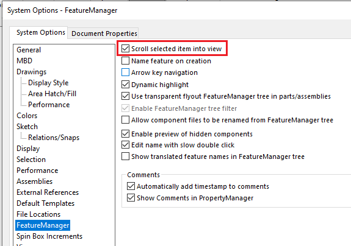
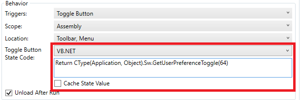

 VBA宏，用于在SOLIDWORKS FeatureManager设置中切换滚动选定项到视图选项的开启和关闭
image: scroll-into-view.svg
group: 性能
---

这个VBA宏允许在SOLIDWORKS设置的FeatureManager部分中切换滚动选定项到视图选项的开启和关闭。当使用具有大型特征树的模型（例如大型装配文档）时，这提供了性能优势。关闭此选项将显著提高在图形区域选择项目的速度，因为不需要滚动特征树到视图中。

## 在Toolbar+中使用宏

这个宏可以在[Toolbar+](https://cadplus.xarial.com/toolbar/)中使用，这将改善用户体验。可以为宏按钮启用[切换状态](https://cadplus.xarial.com/toolbar/configuration/toggles/)。

将以下代码粘贴到“切换按钮状态代码”文本框中：

~~~ vb
Return CType(Application, Object).Sw.GetUserPreferenceToggle(64)
~~~

~~~ vb
Dim swApp As SldWorks.SldWorks

Sub main()

    Set swApp = Application.SldWorks
    
    Dim curVal As Boolean
    curVal = False <> swApp.GetUserPreferenceToggle(swUserPreferenceToggle_e.swFeatureManagerEnsureVisible)
    
    swApp.SetUserPreferenceToggle swUserPreferenceToggle_e.swFeatureManagerEnsureVisible, Not curVal
    
End Sub
~~~