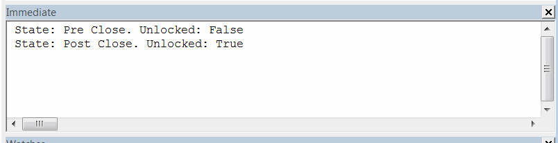

在关闭零件、装配体和图纸等文件时，会触发文件关闭（销毁）通知（例如[DestroyNotify2](https://help.solidworks.com/2017/english/api/sldworksapi/SOLIDWORKS.Interop.sldworks~SOLIDWORKS.Interop.sldworks.DAssemblyDocEvents_DestroyNotify2EventHandler.html)），这意味着文件仍未从内存中释放。

这对于像产品数据管理（PDM）这样的应用程序可能是一个阻塞因素，因为关闭文件应该解锁它，因为可能需要执行一些附加操作（例如从本地缓存中删除文件，移动到存档，对流进行后处理，清除资源）。

该示例演示了如何使用SOLIDWORKS API处理预关闭和后关闭通知。

* 打开任何SOLIDWORKS文件
* 从宏模块的主方法运行宏。将显示临时窗体
* 关闭SOLIDWORKS文件
* 在VBA的即时窗口中查看输出。会打印出2行：
    * 第一行 - 当文件即将关闭时
    * 第二行 - 当文件完全关闭时

在两个处理程序中，宏会检查文件是否解锁（即从内存中释放）。第一个处理程序中，文件被锁定，而在第二个处理程序中，文件被解锁，正如预期的那样。

**注意：IsFileUnlocked函数会以读写模式打开流，可能会损坏文件。强烈建议仅在示例模型上使用此宏**

要创建一个宏，请将另外两个模块添加到VBA编辑器中：

* 名为*FileWatcher*的类模块
* 名为*UserForm1*的用户窗体

{ width=250 }

将代码粘贴到相应的模块中，如下所示：

**FileWatcher类模块**
~~~ vb
Public Event ModelClosed(path As String)
Public Event ModelClosing(path As String)
                         
Dim WithEvents swApp As SldWorks.SldWorks

Dim WithEvents swPart As SldWorks.PartDoc
Dim WithEvents swAssy As SldWorks.AssemblyDoc
Dim WithEvents swDraw As SldWorks.DrawingDoc

Dim IsClosing As Boolean
Dim ModelPath As String

Sub WatchModelClose(model As SldWorks.ModelDoc2)
    
    IsClosing = False
        
    If Not model Is Nothing Then
        Select Case model.GetType()
            Case swDocumentTypes_e.swDocPART
                Set swPart = model
            Case swDocumentTypes_e.swDocASSEMBLY
                Set swAssy = model
            Case swDocumentTypes_e.swDocDRAWING
                Set swDraw = model
        End Select
    Else
        Err.Raise vbError, "", "Model is null"
    End If
    
    ModelPath = model.GetPathName()
    
End Sub

Private Sub Class_Initialize()
    Set swApp = Application.SldWorks
End Sub

Private Function swApp_OnIdleNotify() As Long
    
    If IsClosing Then
        IsClosing = False
        RaiseEvent ModelClosed(ModelPath)
    End If
    
    swApp_OnIdleNotify = 0
    
End Function

Private Function swPart_DestroyNotify2(ByVal DestroyType As Long) As Long
    swPart_DestroyNotify2 = HandleDestroyEvent(DestroyType)
End Function

Private Function swAssy_DestroyNotify2(ByVal DestroyType As Long) As Long
    swAssy_DestroyNotify2 = HandleDestroyEvent(DestroyType)
End Function

Private Function swDraw_DestroyNotify2(ByVal DestroyType As Long) As Long
    swDraw_DestroyNotify2 = HandleDestroyEvent(DestroyType)
End Function

Function HandleDestroyEvent(ByVal DestroyType As Long) As Long
    
    If DestroyType = swDestroyNotifyType_e.swDestroyNotifyDestroy Then
        
        RaiseEvent ModelClosing(ModelPath)
        IsClosing = True
                
    End If
    
    HandleDestroyEvent = 0
    
End Function
~~~

**UserForm1用户窗体**
~~~ vb
Dim WithEvents FileCloseWatcher As FileWatcher

Private Sub FileCloseWatcher_ModelClosed(path As String)
    CheckFileLockState "后关闭", path
    End
End Sub

Private Sub FileCloseWatcher_ModelClosing(path As String)
    CheckFileLockState "预关闭", path
End Sub

Private Sub UserForm_Initialize()
    
    Dim swApp As SldWorks.SldWorks
    
    Set swApp = Application.SldWorks

    Set FileCloseWatcher = New FileWatcher
    
    FileCloseWatcher.WatchModelClose swApp.ActiveDoc

End Sub

Sub CheckFileLockState(state As String, path As String)
    Debug.Print "状态: " & state & "。解锁: " & IsFileUnlocked(path)
End Sub

Function IsFileUnlocked(filePath As String) As Boolean
    
    IsFileUnlocked = False
    
    Dim fileNmb As Integer
    
    fileNmb = FreeFile
    
    On Error Resume Next
    
    Open filePath For Input Lock Read Write As #fileNmb
    
    If Err.Number = 0 Then
        IsFileUnlocked = True
    End If
    
    Close fileNmb
    
End Function
~~~

**宏模块**
~~~ vb
Dim swApp As SldWorks.SldWorks

Sub main()

    Set swApp = Application.SldWorks
    
    UserForm1.Show vbModeless
    
End Sub
~~~