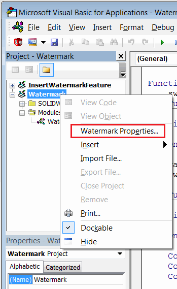
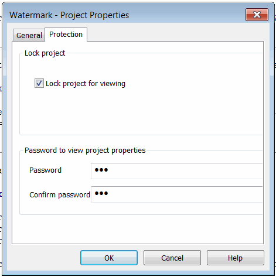
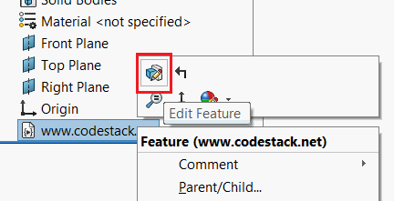
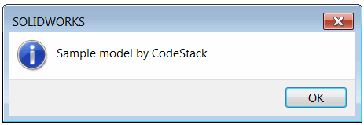
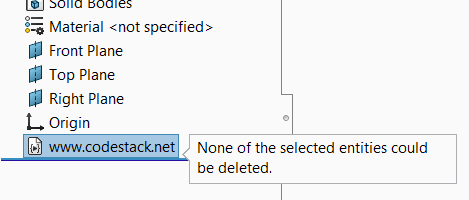
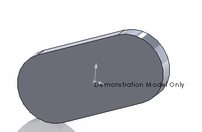

 使用SOLIDWORKS API在任何模型中嵌入水印特征以保护知识产权或指示模型在特殊条件下使用。如果需要将许可证嵌入到不能被第三方编辑的模型中，这将非常有用。
image: model-watermark.png
labels: [安全, 宏特征, 锁定]
group: 安全
---


本文将解释如何使用SOLIDWORKS API在任何模型中嵌入水印特征，以保护知识产权或指示模型在特殊条件下使用。如果需要将许可证嵌入到不能被第三方编辑的模型中，这将非常有用。

插入的特征无法通过用户界面或API删除、抑制、移除或更改。

该特征可以插入到任何SOLIDWORKS模型（零件、文档、绘图或模板）中。

特征完全嵌入到模型中。

解决方案由两部分组成：

* 作者宏。用于插入水印。此宏不会嵌入到模型中。
* 水印宏。此宏表示水印特征，并将直接嵌入到模型中。

## 设置作者宏

* 在SOLIDWORKS中创建新的宏（从SOLIDWORKS菜单中选择“工具”->“宏”->“新建...”命令）
* 指定要保存此文件的名称
* 将以下代码复制到宏中

~~~ vb
Const WATERMARK_MACRO_NAME As String = "Watermark.swp"
Const SECURITY_NOTE As String = "www.codestack.net"

Const BASE_NAME As String = "Watermark"

Sub main()

    Dim swApp As SldWorks.SldWorks
    Set swApp = Application.SldWorks
    
    Dim swModel As SldWorks.ModelDoc2
    
    Set swModel = swApp.ActiveDoc
    
    If Not swModel Is Nothing Then
        
        Dim watermarkMacroPath As String
        watermarkMacroPath = swApp.GetCurrentMacroPathFolder() & "\" & WATERMARK_MACRO_NAME
        Dim vMethods(8) As String
        Dim moduleName As String
        
        GetMacroEntryPoint swApp, watermarkMacroPath, moduleName
        
        vMethods(0) = watermarkMacroPath: vMethods(1) = moduleName: vMethods(2) = "swmRebuild"
        vMethods(3) = watermarkMacroPath: vMethods(4) = moduleName: vMethods(5) = "swmEditDefinition"
        vMethods(6) = watermarkMacroPath: vMethods(7) = moduleName: vMethods(8) = "swmSecurity"
        
        Dim iconsDir As String
        iconsDir = swApp.GetCurrentMacroPathFolder() & "\Icons\"
        
        Dim icons(8) As String
        icons(0) = iconsDir & "watermark_20x20.bmp"
        icons(1) = iconsDir & "watermark-suppressed_20x20.bmp"
        icons(2) = iconsDir & "watermark_20x20.bmp"
        
        icons(3) = iconsDir & "watermark_32x32.bmp"
        icons(4) = iconsDir & "watermark-suppressed_32x32.bmp"
        icons(5) = iconsDir & "watermark_32x32.bmp"
        
        icons(6) = iconsDir & "watermark_40x40.bmp"
        icons(7) = iconsDir & "watermark-suppressed_40x40.bmp"
        icons(8) = iconsDir & "watermark_40x40.bmp"

        Dim swFeat As SldWorks.Feature
        
        Set swFeat = swModel.FeatureManager.InsertMacroFeature3(BASE_NAME, "", vMethods, _
            Empty, Empty, Empty, Empty, Empty, Empty, _
            icons, swMacroFeatureOptions_e.swMacroFeatureEmbedMacroFile + swMacroFeatureOptions_e.swMacroFeatureAlwaysAtEnd)
        
        If Not swFeat Is Nothing Then
            Dim swSecNote As SldWorks.note
            If SECURITY_NOTE <> "" Then
                Set swSecNote = swModel.FeatureManager.InsertSecurityNote(SECURITY_NOTE, swFeat)
            End If
        Else
            MsgBox "Failed to create watermark feature"
        End If
        
    Else
        MsgBox "Please open model"
    End If
    
End Sub

Sub GetMacroEntryPoint(app As SldWorks.SldWorks, macroPath As String, ByRef moduleName As String)
        
    Dim vMethods As Variant
    vMethods = app.GetMacroMethods(macroPath, swMacroMethods_e.swAllMethods)
    
    Dim i As Integer
    
    If Not IsEmpty(vMethods) Then
    
        For i = 0 To UBound(vMethods)
            Dim vData As Variant
            vData = Split(vMethods(i), ".")
            
            If i = 0 Or LCase(vData(1)) = "swmRebuild" Then
                moduleName = vData(0)
            End If
        Next
        
    End If
    
End Sub
~~~

为了添加自定义图标，请下载[Icons](Icons.zip)文件并解压缩到宏特征文件旁边的**Icons**子文件夹中。

## 设置水印宏

* 创建另一个新的宏
* 将此宏的名称指定为*Watermark.swp*，并将其保存到与之前的作者宏相同的文件夹中

> 如果使用不同的名称，则需要在作者宏的以下常量中修改此名称

~~~ vb
Const WATERMARK_MACRO_NAME = "Watermark.swp"
~~~

* 在常量中更改安全说明以显示为只读的不可修改的说明。

~~~ vb
Const SECURITY_NOTE = "www.codestack.net"
~~~

* 将以下代码复制到宏中

~~~ vb
Const MESSAGE As String = "Sample model by CodeStack"
Const FEATURE_NAME As String = "www.codestack.net"

Function swmRebuild(varApp As Variant, varDoc As Variant, varFeat As Variant) As Variant
    swmRebuild = True
End Function

Function swmEditDefinition(varApp As Variant, varDoc As Variant, varFeat As Variant) As Variant
    
    On Error Resume Next
    
    varApp.SendMsgToUser2 MESSAGE, swMessageBoxIcon_e.swMbInformation, swMessageBoxBtn_e.swMbOk
    swmEditDefinition = True
    
End Function

Function swmSecurity(varApp As Variant, varDoc As Variant, varFeat As Variant) As Variant
    
    On Error Resume Next
    
    Const swMacroFeatureSecurityCannotBeDeleted As Long = 1
    Const swMacroFeatureSecurityCannotBeSuppressed As Long = 4
    Const swMacroFeatureSecurityCannotBeReplaced As Long = 8
    Const swMacroFeatureSecurityEnableNote As Long = 16
    
    swmSecurity = swMacroFeatureSecurityCannotBeDeleted + swMacroFeatureSecurityCannotBeReplaced + swMacroFeatureSecurityCannotBeSuppressed + swMacroFeatureSecurityEnableNote

    If varFeat.Name <> FEATURE_NAME Then
        varFeat.Name = FEATURE_NAME
    End If
    
End Function

~~~

### 修改参数

宏中有几个参数可以修改，这些参数在宏的顶部定义为常量。

~~~ vb
Const MESSAGE As String = "Watermark Feature by CodeStack"
Const FEATURE_NAME As String = "www.codestack.net"
~~~

* *MESSAGE* 是用户编辑水印特征时显示的自定义消息
* *FEATURE_NAME* 是特征管理器树中水印特征的名称

### 设置宏密码

为水印宏分配密码，以防止用户更改它。

* 从水印宏的上下文菜单中选择“属性”命令

{ width=200 }

* 选择“保护”选项卡
* 选中“锁定项目以供查看”选项
* 在密码框中指定密码

{ width=250 }

* 保存宏并关闭

## 插入水印

* 要插入水印，只需打开模型并运行[作者宏](#设置作者宏)
* 保存模型

## 水印行为

* 水印特征将始终移动到特征树的底部
* 当编辑水印特征的定义时

{ width=250 }

将显示自定义消息

{ width=250 }

* 在尝试删除该特征时，将显示以下消息

{ width=250 }

* 在模型的原点处添加了不可编辑的安全说明

{ width=250 }

* 无法更改特征名称。可以对其重命名，但在状态更新（例如选择、重建、打开模型等）时，名称将被恢复。