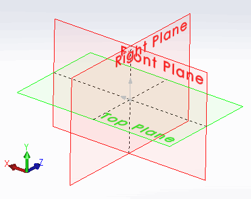

{ width=250 }

This example demonstrates how to compare two model views in part or assembly using SOLIDWORKS API.

Macro will identify the changes and display the result if

* Views are the same
* Views are of different orientation (i.e. rotated)
* Views are of different translation (i.e. moved)
* Views are of different scale

Macro is using [user defined type](/docs/codestack/visual-basic/data-structures/types/) **ViewData** to store the orientation, translation and scale of the view. This structure is not linked to the view and represents the snapshot of view transformation.

Result of the **CompareViewData** function is defined as *CompareViewResult_e* [flag enumerator](/docs/codestack/visual-basic/data-structures/enumerators#flag-enumerator-multiple-options). This allows to return specific change in the view orientation or combination of changes.

* Open the model and start the macro.
* Macro will pause the execution once the data from the first view is read.
* Change the view and continue the execution of the macro.
* Result is displayed in the message box.

~~~ vb
Type ViewData
    ViewScale As Double
    Orientation As SldWorks.MathTransform
    Translation As SldWorks.MathVector
End Type

Enum CompareViewResult_e
    Same = 0
    DiffOrientation = 2 ^ 0
    DiffTranslation = 2 ^ 1
    DiffScale = 2 ^ 2
End Enum

Dim swApp As SldWorks.SldWorks

Sub main()

    Set swApp = Application.SldWorks
    
    Dim swModel As SldWorks.ModelDoc2
    
    Set swModel = swApp.ActiveDoc
    
    If Not swModel Is Nothing Then
        
        Dim swView As SldWorks.ModelView
        Set swView = swModel.ActiveView
        
        If Not swView Is Nothing Then
            
            Dim origViewData As ViewData
            origViewData = GetViewData(swView)
            
            Stop 'move the view now
            
            Dim newViewData As ViewData
            newViewData = GetViewData(swView)
            
            Dim compRes As CompareViewResult_e
            compRes = CompareViewData(origViewData, newViewData)
            
            If compRes = Same Then
                MsgBox "Views are the same"
            Else
                Dim msg As String
                
                If compRes And DiffOrientation Then
                    msg = msg & vbLf & "Orientation"
                End If
                
                If compRes And DiffTranslation Then
                    msg = msg & vbLf & "Translation"
                End If
                
                If compRes And DiffScale Then
                    msg = msg & vbLf & "Scale"
                End If
                
                MsgBox "Views are not the same. Differences:" & msg
                
            End If
            
        Else
            MsgBox "Please open part or assembly"
        End If
        
    Else
        MsgBox "Please open the model"
    End If
    
End Sub

Function GetViewData(view As SldWorks.ModelView) As ViewData
    
    Dim data As ViewData
    
    Set data.Orientation = view.Orientation3
    Set data.Translation = view.Translation3
    data.ViewScale = view.Scale2
    
    GetViewData = data
    
End Function

Function CompareViewData(firstViewData As ViewData, secondViewData As ViewData) As CompareViewResult_e
    
    Dim res As CompareViewResult_e
    res = Same
    
    If Not CompareArrays(firstViewData.Orientation.ArrayData, secondViewData.Orientation.ArrayData) Then
        res = res + DiffOrientation
    End If
    
    If Not CompareArrays(firstViewData.Translation.ArrayData, secondViewData.Translation.ArrayData) Then
        res = res + DiffTranslation
    End If
    
    If firstViewData.ViewScale <> secondViewData.ViewScale Then
        res = res + DiffScale
    End If
    
    CompareViewData = res
    
End Function

Function CompareArrays(firstArr As Variant, secondArr As Variant) As Boolean
    
    If UBound(firstArr) = UBound(secondArr) Then
        
        Dim i As Integer
        
        For i = 0 To UBound(firstArr)
            If firstArr(i) <> secondArr(i) Then
                CompareArrays = False
                Exit Function
            End If
        Next
        
        CompareArrays = True
    Else
        CompareArrays = False
    End If
    
End Function
~~~

