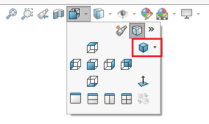
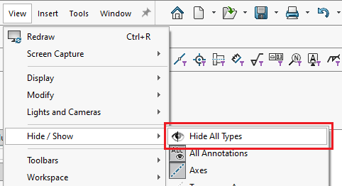
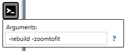

这个VBA宏允许执行通常需要升级到新版本SOLIDWORKS的模型的操作。它可以：

* 强制重建模型（ctrl+Q）

* 将模型设置为等轴测方向

* 隐藏所有视图类型

通过设置相应常量的值来配置宏操作

~~~ vb
Const DEFAULT_VIEWZOOMTOFIT As Boolean = True
Const DEFAULT_REBUILD As Boolean = True
Const DEFAULT_HIDE_ALL_TYPES As Boolean = True
~~~

该宏还支持[宏参数](https://cadplus.xarial.com/macro-arguments/)：**-zoomtofit**，**-rebuild**，**-hidealltypes**

~~~ vb
Const DEFAULT_VIEWZOOMTOFIT As Boolean = True
Const DEFAULT_REBUILD As Boolean = True
Const DEFAULT_HIDE_ALL_TYPES As Boolean = True

Const ARG_VIEWZOOMTOFIT As String = "-zoomtofit"
Const ARG_REBUILD As String = "-rebuild"
Const ARG_HIDE_ALL_TYPES As String = "-hidealltypes"

Dim swApp As SldWorks.SldWorks

Sub main()

    Set swApp = Application.SldWorks
    
    Dim swModel As SldWorks.ModelDoc2
    
    Set swModel = swApp.ActiveDoc
    
    If Not swModel Is Nothing Then
    
        Dim vArgs As Variant
        vArgs = GetArguments()
        
        If IsEmpty(vArgs) Then
            Err.Raise vbError, "", "参数为空"
        End If
        
        If ContainsArguments(vArgs, ARG_VIEWZOOMTOFIT) Then
            swModel.ShowNamedView2 "", swStandardViews_e.swIsometricView
            swModel.ViewZoomtofit2
        End If
        
        If ContainsArguments(vArgs, ARG_HIDE_ALL_TYPES) Then
            swModel.SetUserPreferenceToggle swUserPreferenceToggle_e.swViewDisplayHideAllTypes, True
        End If
        
        If ContainsArguments(vArgs, ARG_REBUILD) Then
        
            swModel.ForceRebuild3 False
            
            Dim isSw2017OrNewer As Boolean
            isSw2017OrNewer = (CInt(Split(swApp.RevisionNumber(), ".")(0))) >= 25
            
            If isSw2017OrNewer Then
                swModel.Extension.ForceRebuildAll
            End If
            
        End If
    
    Else
        Err.Raise vbError, "", "没有活动模型"
    End If
    
End Sub

Function GetArguments() As Variant
    
    Dim vArgs As Variant
    
    On Error GoTo catch_
    
try_:
    Dim macroRunner As Object
    Set macroRunner = CreateObject("CadPlus.MacroRunner.Sw")
    
    Dim param As Object
    Set param = macroRunner.PopParameter(swApp)
        
    vArgs = param.Get("Args")
        
    If IsEmpty(vArgs) Then
        Err.Raise vbError, "", "未指定参数"
    End If
    
    GoTo finally_
    
catch_:
    
    Dim sArgs() As String
    Dim isInit As Boolean
    isInit = False
    
    If DEFAULT_REBUILD Then
        If Not isInit Then
            ReDim sArgs(0)
            isInit = True
        Else
            ReDim Preserve sArgs(UBound(sArgs) + 1)
        End If
        sArgs(UBound(sArgs)) = ARG_REBUILD
    End If
    
    If DEFAULT_VIEWZOOMTOFIT Then
        If Not isInit Then
            ReDim sArgs(0)
            isInit = True
        Else
            ReDim Preserve sArgs(UBound(sArgs) + 1)
        End If
        sArgs(UBound(sArgs)) = ARG_VIEWZOOMTOFIT
    End If
    
    If DEFAULT_HIDE_ALL_TYPES Then
        If Not isInit Then
            ReDim sArgs(0)
            isInit = True
        Else
            ReDim Preserve sArgs(UBound(sArgs) + 1)
        End If
        sArgs(UBound(sArgs)) = ARG_HIDE_ALL_TYPES
    End If
    
    If isInit Then
        vArgs = sArgs
    Else
        vArgs = Empty
    End If
    
finally_:

    GetArguments = vArgs
    
End Function

Function ContainsArguments(args As Variant, arg As String) As Boolean

    Dim i As Integer
    
    For i = 0 To UBound(args)
        If LCase(args(i)) = LCase(arg) Then
            ContainsArguments = True
            Exit Function
        End If
    Next
    
    ContainsArguments = False
    
End Function
~~~