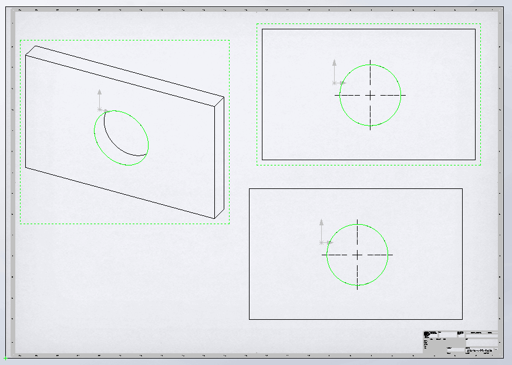
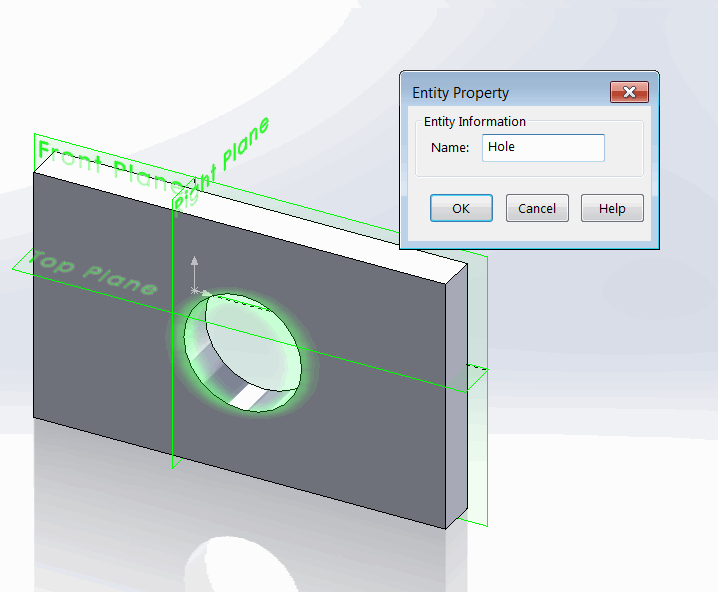

 该示例演示了使用SOLIDWORKS API在绘图视图中选择实体（例如边、面、顶点）的不同方法。
image: circular-edge-selected-in-views.png
---
{ width=300 }

该示例演示了使用SOLIDWORKS API在绘图视图中选择实体（例如边、面、顶点）的不同方法。

1. 通过直接使用[IView:SelectEntity](https://help.solidworks.com/2012/english/api/sldworksapi/SolidWorks.Interop.sldworks~SolidWorks.Interop.sldworks.IView~SelectEntity.html)方法在目标视图中选择实体。当需要选择实体而不需要传递任何附加数据（例如选择标记或标注）时，此方法非常有用。
2. 通过在选择数据中指定视图，使用[ISelectData::View](https://help.solidworks.com/2012/english/api/sldworksapi/SolidWorks.Interop.sldworks~SolidWorks.Interop.sldworks.ISelectData~View.html) SOLIDWORKS API属性选择实体。与前一种方法相比，这种方法更加灵活，因为可以提供更多的选择信息。
3. 选择可见实体。此方法允许在绘图视图的上下文中查找实体。其主要优点是，它只会尝试选择当前视图方向中可见的实体，而前两种方法不考虑实体被其他实体遮挡的情况。

* 要运行宏，请下载[示例模型和绘图](plate-with-hole.zip)。
* 在零件文档中，圆形边缘被命名为*Hole*。

{ width=300 }

* 运行宏后，此边缘将在3个视图中使用上述3种不同的方法被选择。

~~~ vb
Const ENT_NAME As String = "Hole"

Dim swApp As SldWorks.SldWorks
Dim swDraw As SldWorks.DrawingDoc

Sub main()

    Set swApp = Application.SldWorks
    
    Set swDraw = swApp.ActiveDoc
    
    Dim swView1 As SldWorks.view
    Dim swView2 As SldWorks.view
    Dim swView3 As SldWorks.view
    
    Set swView1 = swDraw.FeatureByName("Drawing View1").GetSpecificFeature()
    Set swView2 = swDraw.FeatureByName("Drawing View2").GetSpecificFeature()
    Set swView3 = swDraw.FeatureByName("Drawing View3").GetSpecificFeature()
    
    Dim swRefDoc As SldWorks.PartDoc
    Set swRefDoc = swView1.ReferencedDocument
    
    Dim swEdge As SldWorks.Edge
    Set swEdge = swRefDoc.GetEntityByName(ENT_NAME, swSelectType_e.swSelEDGES)
    
    swDraw.ClearSelection2 True
    
    SelectInView swView1, swEdge
    SelectInViewBySelData swView2, swEdge
    SelectFromVisibleEntities swView3
    
End Sub

Sub SelectInView(view As SldWorks.view, ent As SldWorks.Entity)
    view.SelectEntity ent, True
End Sub

Sub SelectInViewBySelData(view As SldWorks.view, ent As SldWorks.Entity)
    
    Dim swSelMgr As SldWorks.SelectionMgr
    Dim swSelData As SldWorks.SelectData
    
    Set swSelMgr = swDraw.SelectionManager
    
    Set swSelData = swSelMgr.CreateSelectData
    swSelData.view = view 'specify the view to select entity in
    
    ent.Select4 True, swSelData
    
End Sub

Sub SelectFromVisibleEntities(view As SldWorks.view)
    
    Dim vVisComps As Variant
    vVisComps = view.GetVisibleComponents()
    
    Dim vVisEnts As Variant
    vVisEnts = view.GetVisibleEntities2(vVisComps(0), swViewEntityType_e.swViewEntityType_Edge)
    
    Dim i As Integer
    
    For i = 0 To UBound(vVisEnts)
        Dim swEdge As SldWorks.Entity
        Set swEdge = vVisEnts(i)
        If swEdge.ModelName = ENT_NAME Then
            swEdge.Select4 True, Nothing 'no need to explicitly specify the view to select in as pointer to the entity already belongs to the view
            Exit Sub
        End If
    Next
    
End Sub
~~~