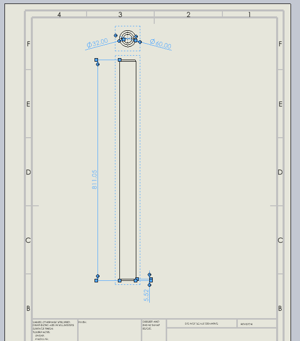

---
caption: 选择所有绘图尺寸
title: 宏以批处理模式选择SOLIDWORKS绘图活动工作表中的所有绘图视图的尺寸
description: 此VBA宏演示了如何在SOLIDWORKS绘图活动工作表中查找所有绘图视图的尺寸。
所有尺寸都以批处理模式进行选择。

{ width=400 }

此VBA宏演示了如何在SOLIDWORKS绘图活动工作表中查找所有绘图视图的尺寸。

所有尺寸都以批处理模式进行选择。

~~~ vb
Dim swApp As SldWorks.SldWorks

Sub main()

    Set swApp = Application.SldWorks
    
    Dim swModel As SldWorks.ModelDoc2
    
    Dim swDraw As SldWorks.DrawingDoc
    
    Set swModel = swApp.ActiveDoc
    
    Set swDraw = swModel
    
    Dim swSheet As SldWorks.Sheet
    
    Set swSheet = swDraw.GetCurrentSheet
    
    Dim vViews As Variant
    
    vViews = swSheet.GetViews
    
    Dim swDispDims() As SldWorks.DisplayDimension
    
    Dim i As Integer
    
    For i = 0 To UBound(vViews)
        
        Dim swView As SldWorks.View
        Set swView = vViews(i)
        
        Dim swDispDim As SldWorks.DisplayDimension
        Set swDispDim = swView.GetFirstDisplayDimension5()
        
        While Not swDispDim Is Nothing
        
            If (Not swDispDims) = -1 Then
                ReDim swDispDims(0)
            Else
                ReDim Preserve swDispDims(UBound(swDispDims) + 1)
            End If
            
            Debug.Print swDispDim.GetDimension2(0).FullName
            
            Set swDispDims(UBound(swDispDims)) = swDispDim
            
            Set swDispDim = swDispDim.GetNext5
        
        Wend
        
    Next
    
    Dim selCount As Long
    selCount = swModel.Extension.MultiSelect2(swDispDims, False, Nothing)
    
    If selCount <> UBound(swDispDims) + 1 Then
        Err.Raise vbError, "", "无法选择尺寸"
    End If
    
End Sub
~~~